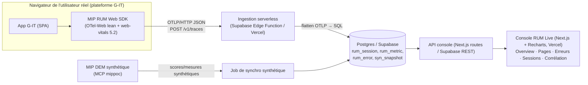

# MIP RUM — Plan de développement du POC

**De :** Julian Talou
**Objet :** Plan ultra-détaillé pour développer, déployer et tester un POC RUM (Real User Monitoring) OpenTelemetry-native, à instrumenter sur `https://plateforme.groupement-it.com`, puis à présenter au client.
**Statut :** Plan de build (le code vient après, en Claude Code, avec le modèle **fable**).
**Version :** v1 — Juin 2026
**Décisions de cadrage actées :** stack **hybride** · focus **« les deux »** (flux RUM bout-en-bout **+** corrélation synthétique↔RUM) · pas de plan d'usage Cowork séparé (Cowork/Claude Code = véhicule de dev & test).

---

## 0. Comment utiliser ce plan (pour fable / Claude Code)

Ce document est la **source de vérité unique** du POC. Il est écrit pour être lu intégralement par un agent de code (fable) au démarrage, puis suivi étape par étape.

- Chaque étape de la **Partie 10 (build pas-à-pas)** a : un *objectif*, les *fichiers à créer*, les *commandes*, et un *critère de validation* binaire. Ne pas passer à l'étape suivante tant que le critère n'est pas vert.
- Le **périmètre** (Partie 2) est contraignant : tout ce qui est listé « hors-périmètre » ne doit PAS être codé dans ce POC, même si c'est techniquement tentant.
- Les **versions de packages** (Partie 4) ont été vérifiées en juin 2026. Si une version a bougé, garder la même *majeure* sauf décision explicite.
- Convention : langue de travail = français pour la doc/le rapport ; anglais toléré pour le code et les identifiants techniques.

---

## 1. Rappel produit — qu'est-ce que le RUM chez MIP

### 1.1 Définition

**RUM (Real User Monitoring)** = mesurer la performance et les erreurs **telles que les vrais utilisateurs les subissent**, depuis leur propre navigateur, sur le trafic de production réel. On instrumente la page web (un snippet JS) qui remonte en continu : Core Web Vitals, erreurs JS, temps de chargement des ressources, parcours/sessions.

C'est l'opposé complémentaire du **monitoring synthétique (DEM)** — le cœur historique de MIP — où des **robots scriptés** rejouent des scénarios UX à intervalles réguliers. Le synthétique répond à *« le service est-il debout et conforme au SLA ? »* ; le RUM répond à *« qu'est-ce que mes utilisateurs vivent réellement, là, maintenant, sur leurs vrais appareils et réseaux ? »*.

### 1.2 Pourquoi MIP en a besoin (le moat)

MIP mesure aujourd'hui ce que des robots observent, pas ce que les vrais utilisateurs subissent. Tous les concurrents directs ont une offre RUM intégrée (Datadog, Dynatrace, New Relic, IP Label). Le marché s'est consolidé sur la promesse « observabilité 360° » qui exige le RUM comme **brique de base**, plus comme bonus.

Les 4 atouts qui rendent le RUM MIP défendable (rappel du rapport stratégique v1) :

1. **Certification CSPN / ANSSI** — éliminatoire dans les AO souverains. Ni Datadog, ni Dynatrace, ni New Relic ne l'ont.
2. **Base installée NPM/DEM** — 8-10 grands comptes déjà clients (Carrefour, France TV, Total, Lafarge…). Vendre du RUM = extension d'usage, pas un nouveau deal.
3. **On-premise natif** — DEM/NPM déployables on-prem depuis l'origine. Les grands comptes FR refusent les SaaS US.
4. **Console unifiée** — la **corrélation synthétique × RUM × NPM** est le différenciateur que personne d'autre n'a sur le marché FR.

### 1.3 Décision technique déjà actée

Le rapport v1 a tranché : **Option E — Hybride OTel-native** (score 34/40). Snippet JS basé sur OpenTelemetry-Web en Phase 1, agent serveur OTel en Phase 2, moteur de corrélation propriétaire MIP comme valeur ajoutée. Stockage cible **ClickHouse**. Console = extension de l'existant (Angular 20).

**Ce POC implémente l'amorce de la Phase 1** : le SDK Web + l'ingestion + une console RUM Live + une **ébauche de corrélation synthétique↔RUM**, dans une variante **hybride** assumée (voir Partie 3) pour aller vite et prouver la valeur sans monter toute l'infra on-prem.

### 1.4 Mises à jour 2026 vérifiées (ce qui change vs le rapport v1)

> Vérifié par recherche web en juin 2026. Ces points **corrigent** ou **précisent** des hypothèses du rapport v1.

| Sujet | État 2026 vérifié | Impact sur le POC |
|---|---|---|
| **OpenTelemetry JS** | SDK **2.0** (sorti mars 2025). Le cœur `sdk-trace-web` est stable, mais **l'instrumentation navigateur reste *experimental*** (conventions sémantiques RUM non figées upstream). | On assume l'instabilité : wrapper MIP fin par-dessus, on épingle les versions, on ne dépend pas de conventions non figées. |
| **Taille de bundle** | Full `auto-instrumentations-web` ≈ **60 KB gzip**. `ZoneContextManager` (zone.js) ajoute ~80-90 KB non compressé. Setup *lean* (StackContextManager, imports sélectifs) ≈ **25 KB gzip**. **< 10 KB** = impossible sans approche manuelle (spans à la main, sans contrib). | **La cible « < 10 KB » du rapport v1 est abandonnée pour le SDK complet.** Reco POC : setup lean ~25-30 KB, OU chemin « web-vitals seul » ~2-5 KB pour la voie métriques (voir 3.3). |
| **Core Web Vitals** | `web-vitals` **5.2.0** (mars 2026). **FID supprimé**, remplacé par **INP**. Métriques : LCP, INP, CLS, FCP, TTFB. Build *attribution* dispo (debug : inputDelay, processingTime, LoAF). | Le SDK capte **LCP/INP/CLS/FCP/TTFB** via `web-vitals` 5.2 (build attribution). Plus aucune référence à FID. |
| **Seuils CWV (mars 2026)** | **LCP « good » resserré à < 2,0 s** (était 2,5 s). INP < 200 ms. CLS < 0,1. Mesure au **p75**. | Les seuils de notation dans la console = ceux ci-contre. Calcul des agrégats au **p75** (pas la moyenne). |
| **ClickHouse** | Confirmé comme store de facto de l'observabilité moderne : SigNoz, Highlight.io, Uptrace, ClickStack (HyperDX racheté par ClickHouse Inc.). Licence **Apache-2.0**. Postgres/TimescaleDB = alternative raisonnable à l'échelle POC. | **POC = Postgres (Supabase)**, **cible prod = ClickHouse**. Justifié en 3.2. |
| **Concurrence FR** | **IP Label / Ekara racheté par ITRS Group (janv. 2026)**. Reste synthétique-first, pas d'OTel-native GA confirmé. | Renforce l'argument MIP « OTel-native + CSPN + on-prem » comme différenciateur FR. À mentionner dans le rapport client. |
| **Ingestion OTLP serverless** | OTLP/HTTP **JSON** (`Content-Type: application/json`) est spec-compliant et envoyable depuis `fetch`. Recevable par une **Vercel Function** ou une **Supabase Edge Function (Deno)**. Endpoint standard `POST /v1/traces`. **Piège n°1 = CORS** (preflight OPTIONS + headers). | Valide la voie hybride : SDK → OTLP/HTTP JSON → fonction serverless → Postgres. Gérer CORS explicitement (Partie 7). |

---

## 2. Objectifs et périmètre du POC

### 2.1 Objectif

Prouver, sur une application web réelle (`plateforme.groupement-it.com`), que **MIP sait faire du RUM OTel-native** et qu'il peut **corréler la vue synthétique et la vue utilisateur réel** — le différenciateur commercial central.

### 2.2 Définition of Done (critères de preuve pour le client)

Le POC est « réussi » si, en démo live, on peut montrer :

1. **Flux bout-en-bout** : j'ouvre la plateforme G-IT dans un navigateur → quelques secondes plus tard, mes Core Web Vitals **réels**, mes erreurs JS et ma session apparaissent dans la console RUM Live.
2. **Agrégats corrects** : LCP/INP/CLS au **p75** par route, notés selon les seuils 2026 (good / à améliorer / mauvais), top des pages lentes, top des erreurs JS.
3. **Corrélation synthétique↔RUM** : pour une même application/route, une vue **côte à côte** « ce que le robot MIP voit (synthétique/DEM) » vs « ce que l'utilisateur réel subit (RUM) », avec l'écart mis en évidence.
4. **OTel-native sur le fil** : démontrer (onglet réseau / payload) que la donnée part en **OTLP/HTTP** — donc portable, non-propriétaire, migrable vers un Collector + ClickHouse sans toucher au SDK.
5. **On-prem-ready (narratif)** : expliquer que la même chaîne se déploie chez le client (Collector + ClickHouse on-prem), argument CSPN/souveraineté.

### 2.3 Hors-périmètre (NE PAS coder dans ce POC)

- SDK mobile natif iOS/Android (Phase 3).
- Agent serveur OTel multi-langage / instrumentation backend (Phase 2).
- Détection d'anomalies ML (Phase 3).
- Session replay vidéo complet (éventuellement une ébauche « breadcrumbs » uniquement, pas de replay pixel).
- Moteur de corrélation industrialisé — on fait une **ébauche** de corrélation, pas le moteur prod.
- Stockage ClickHouse — **Postgres pour le POC** ; ClickHouse documenté comme cible.
- Multi-tenant / facturation / RBAC fin.

### 2.4 Contraintes

- Effort tech limité → on s'appuie au maximum sur l'open source mature (OTel, web-vitals) et le code est délégué à **fable**.
- RGPD : anonymisation/pseudonymisation dès la collecte (Partie 14).
- Coût : stack POC à coût quasi nul (Supabase free tier + Vercel hobby). Pas d'Opus pour le build : **fable** pour le code, sous-agents ciblés.

---

## 3. Architecture cible du POC (hybride, justifiée)

### 3.1 Vue en couches



Diagramme ASCII de secours :

```
[App G-IT] -> [MIP RUM SDK] --OTLP/HTTP JSON--> [Ingestion serverless] --> [Postgres/Supabase]
                                                                              ^            |
[MCP mippoc: synthétique DEM] --> [Job synchro synthétique] --------------- /             v
                                                                                   [Console RUM Live (Vercel)]
```

### 3.2 Les 5 couches

1. **Collecte (fidèle OTel)** — *MIP RUM Web SDK* : wrapper léger autour de `@opentelemetry/sdk-trace-web` + `web-vitals` 5.2 (build attribution). Capte CWV, erreurs JS, ressources, navigations ; ajoute le contexte métier MIP (session id, fingerprint anonymisé, app/client id, route). Émet en **OTLP/HTTP JSON**.
2. **Ingestion (simplifiée cloud)** — fonction serverless qui expose `POST /v1/traces` (+ `OPTIONS` pour CORS), parse l'OTLP JSON, aplatit en lignes SQL, écrit dans Postgres.
3. **Stockage** — Postgres (Supabase) avec schéma RUM + table de snapshots synthétiques. **ClickHouse = cible prod**, hors POC.
4. **Corrélation** — job qui pull les scores/mesures synthétiques via le **MCP mippoc** et les range dans `syn_snapshot` ; vues SQL qui joignent RUM (réel) et synthétique (robot) par application/route + fenêtre temps.
5. **Présentation** — console RUM Live (Next.js + Recharts) déployée sur Vercel : Overview, Pages lentes, Erreurs JS, Sessions, **Vue corrélation**.

### 3.3 Décisions d'architecture — et pourquoi (le « hybride » assumé)

> Le mot « hybride » que tu as choisi désigne précisément ces arbitrages : **fidèle là où ça compte pour le pitch (le fil OTel), simplifié là où ça ne change pas la preuve (le backend).**

- **Fil OTel-native, backend simplifié.** Le SDK parle **OTLP/HTTP JSON** réel. C'est *l'argument commercial vérifiable* (« votre data est portable, non-propriétaire »). En face, le backend POC est un simple Postgres : migrer vers un **OTel Collector + ClickHouse** plus tard = **remplacer le receiver, sans toucher au SDK ni à l'app client**. C'est tout l'intérêt d'être OTel sur le fil. *Justification : capter la défensibilité « OTel jusqu'à la base » du rapport v1 sans payer le coût infra ClickHouse on-prem pour une démo.*
- **Postgres (Supabase) plutôt que ClickHouse pour le POC.** À l'échelle d'une démo (quelques milliers d'events), Postgres tient large (benchmarks : ~14k inserts/s, p95 ~50 ms à 30 M lignes). Supabase donne en plus REST + Realtime + hébergement managé gratuit + **MCP dispo dans Cowork** (création projet, migrations, edge functions). *Justification : zéro infra à monter, et un chemin de migration ClickHouse propre car on est OTLP-natif.*
- **SDK lean, pas full auto-instrumentation.** Vu le bundle réel (~60 KB gzip en full), on part sur un setup **lean** (`StackContextManager`, instrumentations sélectives : document-load + fetch/xhr + user-interaction) visant ~25-30 KB, **plus** la voie `web-vitals` (2-5 KB) qui porte l'essentiel de la valeur CWV. *Justification : honnêteté technique vs la cible irréaliste « <10 KB » du rapport v1 ; on documente le compromis taille/fidélité.*
- **Corrélation via MCP mippoc, avec fallback seed.** La source synthétique réelle = l'API DEM de MIP exposée par le **MCP mippoc** (`get_site_score`, `get_measure_score`, `list_applications_by_state`, `get_current_incident_by_site`, `get_site_state`…). Si le mapping route↔mesure n'est pas exploitable au build, on **seed** des runs synthétiques réalistes pour la même app. *Justification : la corrélation est la moitié de la preuve ; on la rend démontrable quoi qu'il arrive.*
- **Console neuve (Next.js) plutôt qu'extension Angular 20.** En prod, la console RUM Live sera un module de la console MIP existante (Angular 20). Pour le POC, une petite app **Next.js** autonome est plus rapide à déployer sur Vercel et n'exige pas l'environnement console MIP. *Justification : découpler la preuve RUM de la complexité d'intégration console ; l'UX/les vues sont transférables.*

---

## 4. Stack technique détaillée (versions vérifiées juin 2026)

**Monorepo** (1 repo `mip-rum`, géré pnpm workspaces) :

| Composant | Choix | Version | Notes |
|---|---|---|---|
| Langage | TypeScript | 5.x | Tout le repo |
| Package manager | pnpm | 9.x | workspaces |
| **SDK Web** | `@opentelemetry/sdk-trace-web` | ^2.x | cœur stable |
| | `@opentelemetry/exporter-trace-otlp-http` | ^0.2xx | OTLP/HTTP, JSON |
| | `@opentelemetry/context-zone` → **éviter** ; utiliser `StackContextManager` | core | gain de ~80 KB |
| | `@opentelemetry/instrumentation-document-load` / `-fetch` / `-xml-http-request` / `-user-interaction` | contrib 0.x | *experimental*, sélectif |
| | `web-vitals` | **5.2.0** | build **attribution** (`web-vitals/attribution`) |
| | `esbuild` | ^0.2x | bundle IIFE (snippet `<script>`) + ESM |
| **Ingestion** | Supabase Edge Functions (Deno) **ou** Vercel Functions (Node 20) | — | reco : Supabase Edge (même plateforme que la DB) |
| **DB** | Supabase Postgres | 15 | RLS off pour le POC (clé service côté ingestion) |
| **Console** | Next.js (App Router) | 15 | React 19 |
| | Recharts | ^2.x | graphes CWV/séries |
| | Tailwind | ^3.x | style |
| **Déploiement** | Vercel (console) + Supabase (DB + edge) | — | via MCP Cowork |
| **Tests** | Playwright | ^1.4x | E2E navigateur, vérif beacons |
| | Vitest | ^1.x | unitaires SDK/parser |
| **Synthétique** | MCP `mippoc` | — | source DEM ; sondé au build |

> ⚠️ Au build, **épingler** les versions exactes dans `package.json` et committer le lockfile. Les packages OTel *experimental* (0.x) cassent entre mineures.

### 4.1 Structure du monorepo

```
mip-rum/
├─ package.json                 # workspaces pnpm
├─ pnpm-workspace.yaml
├─ README.md
├─ PLAN.md                      # ce document (copié dans le repo)
├─ packages/
│  └─ rum-sdk/                  # le MIP RUM Web SDK
│     ├─ src/
│     │  ├─ index.ts            # API publique MIPRum.init()
│     │  ├─ session.ts          # session id, fingerprint anonymisé
│     │  ├─ vitals.ts           # web-vitals -> events
│     │  ├─ errors.ts           # window.onerror / unhandledrejection
│     │  ├─ otel.ts             # tracer web + exporter OTLP/HTTP JSON
│     │  ├─ context.ts          # app_id, client_id, route, enrichissement
│     │  └─ types.ts
│     ├─ build.mjs              # esbuild -> dist/mip-rum.js (IIFE) + esm
│     └─ package.json
├─ apps/
│  ├─ ingest/                   # fonction serverless OTLP receiver
│  │  ├─ supabase/functions/v1-traces/index.ts   # Deno
│  │  └─ sql/schema.sql         # tables Postgres
│  ├─ sync-synthetic/           # job de synchro mippoc -> syn_snapshot
│  │  └─ src/sync.ts
│  └─ console/                  # Next.js RUM Live
│     ├─ app/
│     │  ├─ page.tsx            # Overview
│     │  ├─ pages/page.tsx      # Pages lentes
│     │  ├─ errors/page.tsx     # Erreurs JS
│     │  ├─ sessions/page.tsx   # Sessions
│     │  └─ correlation/page.tsx# Vue corrélation synthétique↔RUM
│     ├─ lib/db.ts              # client Supabase
│     └─ components/charts/*
├─ infra/
│  ├─ otel-collector.example.yaml  # config Collector (chemin de migration prod)
│  └─ clickhouse.notes.md          # schéma ClickHouse cible (doc)
├─ demo/
│  └─ index.html               # mini-site de démo pour tester le SDK hors G-IT
└─ tests/
   ├─ e2e/*.spec.ts            # Playwright
   └─ unit/*.test.ts           # Vitest
```

---

## 5. Schéma de données (Postgres / Supabase)

`apps/ingest/sql/schema.sql` (extrait directeur — à compléter au build) :

```sql
-- Session = un utilisateur réel, une visite
create table rum_session (
  session_id    text primary key,
  app_id        text not null,          -- ex: 'gip-plateforme'
  client_id     text,                   -- ex: 'groupement-it'
  user_hash     text,                   -- fingerprint ANONYMISÉ (pas de PII)
  user_agent    text,
  device_type   text,                   -- mobile/desktop/tablet
  geo_country   text,
  started_at    timestamptz not null default now(),
  last_seen_at  timestamptz not null default now(),
  page_count    int not null default 0
);

create table rum_pageview (
  id          bigserial primary key,
  session_id  text references rum_session(session_id),
  route       text not null,            -- normalisé: '/partners/:id'
  url         text,
  referrer    text,
  nav_type    text,                     -- navigate/reload/back_forward
  started_at  timestamptz not null default now()
);

create table rum_metric (
  id           bigserial primary key,
  session_id   text references rum_session(session_id),
  pageview_id  bigint references rum_pageview(id),
  name         text not null,           -- LCP|INP|CLS|FCP|TTFB
  value        double precision not null,
  rating       text,                    -- good|needs-improvement|poor (seuils 2026)
  attribution  jsonb,                   -- web-vitals attribution (debug)
  ts           timestamptz not null default now()
);

create table rum_error (
  id           bigserial primary key,
  session_id   text references rum_session(session_id),
  pageview_id  bigint references rum_pageview(id),
  kind         text,                    -- error|unhandledrejection
  message      text,
  error_type   text,
  stack        text,
  source       text, lineno int, colno int,
  ts           timestamptz not null default now()
);

-- Snapshot synthétique (robot DEM MIP via mippoc)
create table syn_snapshot (
  id            bigserial primary key,
  app_id        text not null,          -- même clé que rum_session.app_id
  site          text,
  measure_id    text,
  measure_name  text,                   -- ex: 'Login scenario'
  route_hint    text,                   -- mapping vers route RUM si possible
  score         double precision,       -- score MIP
  state         text,                   -- ok/warn/incident
  latency_ms    double precision,
  captured_at   timestamptz not null
);

-- Vue de corrélation : robot vs réel, par app/route/heure
create view v_correlation as
select
  coalesce(r.app_id, s.app_id)             as app_id,
  coalesce(r.route, s.route_hint)          as route,
  date_trunc('hour', coalesce(r.ts, s.captured_at)) as bucket,
  percentile_cont(0.75) within group (order by r.value)
      filter (where r.name = 'LCP')        as rum_lcp_p75,
  avg(s.latency_ms) filter (where s.measure_id is not null) as syn_latency_avg,
  max(s.state)                              as syn_state
from rum_metric r
full outer join syn_snapshot s
  on s.app_id = r.app_id and s.route_hint = r.route
group by 1,2,3;
```

> Le mapping `route ↔ measure` est le point délicat : à confirmer au build en sondant le MCP `mippoc` (quels champs identifient une mesure/app). Fallback : `route_hint` renseigné manuellement pour 2-3 routes clés de la plateforme G-IT.

---

## 6. Le SDK Web MIP-RUM (spécification)

### 6.1 API publique

Un seul point d'entrée, configurable, injectable en une ligne :

```html
<!-- À placer dans le <head> de plateforme.groupement-it.com -->
<script src="https://<console-vercel>/mip-rum.js"></script>
<script>
  MIPRum.init({
    endpoint: "https://<ingest>/v1/traces",   // OTLP/HTTP JSON
    appId: "gip-plateforme",
    clientId: "groupement-it",
    sampleRate: 1.0,                            // 100% pour le POC
    env: "prod",
    // hooks optionnels
    beforeSend: (payload) => payload,          // filtrage PII custom
  });
  // événements métier optionnels :
  // MIPRum.track("partner_search", { results: 12 });
</script>
```

### 6.2 Ce que le SDK capte (et comment)

| Donnée | Source technique | Détail |
|---|---|---|
| **Core Web Vitals** | `web-vitals` 5.2 (`onLCP/onINP/onCLS/onFCP/onTTFB`), build **attribution** | valeur + rating (seuils 2026) + attribution (debug). Envoi `onINP/onCLS` au `visibilitychange`/`pagehide` (valeurs finales). |
| **Erreurs JS** | `window.addEventListener('error')` + `'unhandledrejection'` | message, type, stack tronquée, source/lineno/colno. |
| **Navigations / routes** | History API patch + `document-load` | route normalisée (paramètres → `:id`), nav_type. |
| **Ressources lentes** *(léger)* | `PerformanceObserver('resource')` ou instrumentation-fetch/xhr | top ressources > seuil ; optionnel pour le POC. |
| **Session** | généré côté client | `session_id` (uuid, TTL inactivité 30 min), `user_hash` anonymisé. |
| **Contexte** | config init | app_id, client_id, env, device, route. |

### 6.3 Émission OTLP (le point « fidèle »)

- Le SDK construit des **spans OTLP** via `sdk-trace-web` + exporte en **OTLP/HTTP JSON** sur `POST {endpoint}` (`/v1/traces`).
- **Web Vitals & erreurs** = portés comme **span events** (ou spans dédiés `webvital.LCP`, `exception`) avec attributs (`mip.session_id`, `mip.app_id`, `mip.route`, `webvital.value`, `webvital.rating`, `exception.message`…). Convention de nommage préfixée `mip.*` pour le métier (l'OTel ne couvre pas encore le RUM sémantiquement).
- **Batching** : `BatchSpanProcessor` (flush par taille/temps) + flush forcé sur `pagehide`/`visibilitychange:hidden`. Transport `navigator.sendBeacon` quand possible (survie au unload), sinon `fetch(keepalive:true)`.
- **Échantillonnage** : `sampleRate` (1.0 pour le POC).

> Décision : on reste **OTLP sur le fil** même si le backend POC est un simple parseur. C'est ce qui rend la démo « OTel-native » vérifiable dans l'onglet réseau et garantit la portabilité (argument anti-lock-in du rapport v1).

### 6.4 Build

- `esbuild` → 2 cibles : `dist/mip-rum.js` (IIFE, global `MIPRum`, pour le `<script>`) + `dist/index.mjs` (ESM, pour `import`).
- Mesurer la taille gzip à chaque build (script `size-check`), cible **≤ 30 KB gzip** (lean) ; documenter la valeur réelle.
- Pas de `ZoneContextManager` (zone.js) → `StackContextManager`.

### 6.5 Injection sur `plateforme.groupement-it.com`

La plateforme est une **SPA** (« G-IT — Plateforme Partenaires ») que tu contrôles. Trois voies, par ordre de préférence :

1. **Tag `<script>` dans le `<head>`** du template HTML (le plus simple, recommandé) — tu as accès au code.
2. **Tag manager** si un GTM est déjà en place.
3. **Pour tester AVANT de toucher la prod** : un *bookmarklet* ou un proxy local qui injecte le snippet, ou le `demo/index.html` du repo. Utile pour valider la chaîne sans déployer sur le vrai site.

⚠️ **CORS** : l'endpoint d'ingestion (autre origine que la plateforme) doit répondre aux préflights `OPTIONS` et renvoyer `Access-Control-Allow-Origin` (l'origine G-IT) + `Access-Control-Allow-Headers: content-type`. C'est le piège n°1 (voir 7.2).

---

## 7. Couche ingestion (serverless OTLP receiver)

### 7.1 Rôle

Exposer `POST /v1/traces`, parser l'OTLP/HTTP **JSON** (`resourceSpans[].scopeSpans[].spans[]` + leurs `events`/`attributes`), aplatir en lignes SQL, écrire dans Postgres. Pas besoin d'un OTel Collector pour le POC.

**Reco : Supabase Edge Function (Deno)** — même plateforme que la DB, accès direct à Postgres via la clé service, déployable par MCP. (Alternative : Vercel Function Node 20.)

### 7.2 Points durs

- **CORS** : gérer `OPTIONS` (preflight) + headers sur la réponse `POST`. Lister l'origine `https://plateforme.groupement-it.com` (+ `localhost` en dev).
- **JSON OTLP** : accepter `application/json` ; mapper les `KeyValue` d'attributs OTel (`{key, value:{stringValue|doubleValue|intValue}}`) — penser à la déstructuration des types.
- **Idempotence légère** : clé naturelle (span_id) pour éviter les doublons si retry.
- **Validation** : rejeter payloads sans `mip.app_id` ; logguer les rejets.
- **Upsert session** : `insert ... on conflict (session_id) do update set last_seen_at, page_count`.
- **Rating CWV** : calculé à l'ingestion ou à la lecture, selon seuils 2026 (LCP<2.0s, INP<200ms, CLS<0.1).

### 7.3 Pseudo-code (Deno)

```ts
Deno.serve(async (req) => {
  if (req.method === "OPTIONS") return cors(new Response(null, {status:204}));
  if (req.method !== "POST")   return cors(new Response("method", {status:405}));
  const body = await req.json();                 // OTLP/HTTP JSON
  const rows = flattenOtlp(body);                // -> {sessions, pageviews, metrics, errors}
  await writeToPostgres(rows);                    // upserts
  return cors(new Response(JSON.stringify({partialSuccess:{}}), {status:200}));
});
```

---

## 8. Couche corrélation synthétique ↔ RUM (le différenciateur)

C'est la moitié « les deux » du POC : montrer **« ce que le robot voit »** (synthétique/DEM) face à **« ce que l'utilisateur subit »** (RUM).

### 8.1 Source des données synthétiques = MCP `mippoc`

Le serveur MCP **`mippoc`** expose l'API de monitoring MIP. Outils pertinents (à sonder au build) :

- `list_applications_by_state` — inventaire des applications + état.
- `get_site_score` / `get_site_state` — score/état au niveau site.
- `get_measure_score` / `get_measures_state` — score/état d'une **mesure** (= scénario synthétique scripté).
- `get_measure_execution_info` — détail d'exécution d'une mesure (timings).
- `get_current_incident_by_site` — incidents en cours.
- `list_host_on_site` — hôtes/infra.

**Étape build obligatoire** : appeler 1-2 de ces outils (ex. `list_applications_by_state`, puis `get_measure_score` sur une mesure) pour **constater le schéma réel** (quels champs identifient app/site/mesure, quelles métriques de latence). Construire le parser de `syn_snapshot` sur ce qu'on observe, pas sur des suppositions.

### 8.2 Job de synchro

`apps/sync-synthetic/` : un script (lancé à la main ou en cron léger) qui pull les mesures synthétiques via mippoc et insère dans `syn_snapshot` avec `app_id` aligné sur celui du RUM (`gip-plateforme`). Cadence POC : toutes les 5-15 min, ou one-shot avant la démo.

### 8.3 Modèle de jointure

- Clé : `app_id` (+ `route ↔ route_hint` si mappable, sinon au niveau app).
- Fenêtre : bucket horaire (`date_trunc('hour', ...)`).
- Métrique comparée : **latence synthétique (robot)** vs **LCP/INP p75 réel (utilisateurs)**. L'écart = le message (« le robot voit 1,2 s, vos utilisateurs subissent 3,4 s au p75 »).

### 8.4 Fallback (si mapping route↔mesure non exploitable)

**Seed** de 2-3 runs synthétiques réalistes pour les routes clés de la plateforme G-IT (login, liste partenaires, détail) dans `syn_snapshot`. La vue corrélation fonctionne pareil ; on note dans le rapport que la source synthétique réelle (mippoc) est branchable d'un cran. **La preuve de la corrélation ne dépend pas du fallback.**

---

## 9. Console RUM Live (dashboard)

### 9.1 Vues

| Page | Contenu | Preuve apportée |
|---|---|---|
| **Overview** | LCP/INP/CLS au **p75** (jauges + séries), notées seuils 2026 ; volume de sessions ; taux d'erreur. | « le flux marche, les chiffres sont justes ». |
| **Pages lentes** | Top routes par LCP/INP p75, nb de vues. | priorisation produit. |
| **Erreurs JS** | Top erreurs (message/type), occurrences, dernière vue, navigateur. | détection de bugs réels. |
| **Sessions** | Liste sessions récentes, device, pays, parcours (breadcrumbs). | granularité utilisateur. |
| **Corrélation** | Vue **côte à côte synthétique vs RUM** par route : robot (latence/score) ↔ réel (p75), écart surligné, état incident. | **le différenciateur MIP**. |

### 9.2 Stack & déploiement

- **Next.js 15** (App Router, React 19) + **Recharts** + **Tailwind**. Lecture data via client **Supabase** (REST/SQL) — pas d'API custom lourde pour le POC.
- Realtime optionnel (Supabase channels) pour l'effet « live » en démo ; sinon poll 5 s.
- **Déploiement Vercel via MCP** (`deploy_to_vercel`) ; variables d'env = URL/clé Supabase (clé *anon* lecture seule pour la console).
- Le SDK buildé (`mip-rum.js`) est servi par la console (dossier `public/`) pour fournir une URL CDN simple au `<script>`.

---

## 10. Plan de build pas-à-pas (exécutable en Claude Code avec fable)

> Chaque étape : **Objectif → Fichiers → Commandes → Critère de validation (binaire)**. Sprints courts, on ne passe pas à la suite tant que le critère n'est pas vert. Tout le code est écrit par **fable** (voir Partie 11 pour la délégation).

### S0 — Scaffolding (0,5 j)
- **Objectif** : monorepo prêt.
- **Fichiers** : `package.json` (workspaces), `pnpm-workspace.yaml`, arbo Partie 4.1, `README.md`, copie de ce `PLAN.md`.
- **Commandes** : `pnpm init`, créer les workspaces, `git init`, premier commit.
- **Validation** : `pnpm -r ls` liste sdk/ingest/console ; repo committé.

### S1 — SDK « Hello Web Vital » (1 j)
- **Objectif** : capter **1** Web Vital réel et l'envoyer en OTLP/HTTP JSON vers un endpoint local.
- **Fichiers** : `packages/rum-sdk/src/{index,otel,vitals,session}.ts`, `build.mjs`, `demo/index.html`.
- **Commandes** : `pnpm --filter rum-sdk build` ; ouvrir `demo/index.html` ; endpoint local (un petit serveur Deno/Node qui log le payload).
- **Validation** : en ouvrant la démo, un payload **OTLP JSON** contenant un LCP arrive sur l'endpoint (visible onglet réseau + log serveur).

### S2 — Ingestion + stockage (1 j)
- **Objectif** : persister le flux en Postgres.
- **Fichiers** : `apps/ingest/sql/schema.sql`, `apps/ingest/supabase/functions/v1-traces/index.ts`.
- **Commandes** : créer projet **Supabase** (MCP `create_project`), `apply_migration` (schema), déployer l'edge function (MCP `deploy_edge_function`).
- **Validation** : la démo envoie → une ligne apparaît dans `rum_metric` (vérif via MCP `execute_sql`). **CORS OK** (pas d'erreur préflight).

### S3 — SDK complet (1,5 j)
- **Objectif** : CWV (5 métriques, attribution), erreurs JS, sessions, routes, contexte, batching/beacon.
- **Fichiers** : `src/{vitals,errors,context}.ts` complétés, normalisation des routes, flush `pagehide`.
- **Commandes** : build + `size-check` (gzip).
- **Validation** : sur la démo, LCP/INP/CLS/FCP/TTFB + une erreur JS provoquée + session_id stable arrivent en base ; bundle ≤ ~30 KB gzip (valeur notée).

### S4 — Console RUM Live (2 j)
- **Objectif** : Overview + Pages + Erreurs + Sessions.
- **Fichiers** : `apps/console/app/*`, `lib/db.ts`, `components/charts/*`.
- **Commandes** : `pnpm --filter console dev` ; déploiement **Vercel** (MCP `deploy_to_vercel`).
- **Validation** : les vues affichent les vraies données de la démo, p75 correct, ratings seuils 2026 corrects.

### S5 — Corrélation synthétique↔RUM (1,5 j)
- **Objectif** : la vue différenciateur.
- **Fichiers** : `apps/sync-synthetic/src/sync.ts` (pull mippoc), vue SQL `v_correlation`, `app/correlation/page.tsx`.
- **Commandes** : sonder mippoc (schéma) ; remplir `syn_snapshot` (réel ou seed) ; build console.
- **Validation** : la vue corrélation montre, pour ≥1 route, robot vs réel côte à côte avec l'écart.

### S6 — Déploiement + test sur la plateforme réelle (1 j)
- **Objectif** : RUM réel depuis `plateforme.groupement-it.com`.
- **Fichiers** : snippet `<script>` ; ajouter l'origine G-IT au CORS.
- **Commandes** : injecter le snippet (head ou bookmarklet de test) ; naviguer sur la plateforme ; vérifier la base + la console.
- **Validation** : **DoD 1-4** (Partie 2.2) vérifiés en live depuis le vrai site.

### S7 — Hardening + matière pour le rapport (1 j)
- **Objectif** : robustesse démo + collecte des éléments du rapport client.
- **Fichiers** : tests Playwright/Vitest, `infra/otel-collector.example.yaml` + `clickhouse.notes.md` (chemin migration), captures/metrics pour le rapport.
- **Validation** : E2E vert ; checklist DoD complète ; notes « ce qui a marché / pas marché » prêtes.

**Charge indicative totale : ~10 jours-homme** (hors aléas), entièrement délégable à fable, avec toi en validation à chaque critère.

---

## 11. Workflow de développement — Cowork / Claude Code / fable

> Décision actée : **pas de plan d'usage Cowork séparé**. Cowork **et** Claude Code sont le véhicule de dev & test. Le code est écrit par **fable**.

### 11.1 Qui fait quoi

| Outil | Rôle |
|---|---|
| **Claude Code + fable** | Le build : repo, SDK, ingestion, console, tests. Terminal, git, `pnpm`, serveurs de dev, Playwright. fable = modèle de codage (rapide/économique, conforme à ta contrainte « pas d'Opus pour le répétitif »). |
| **Cowork** | Cette recherche + ce plan ; le **déploiement** via MCP (Vercel, Supabase) ; le sondage du **MCP mippoc** ; le **rapport client** final. |
| **MCP Supabase** | `create_project`, `apply_migration`, `deploy_edge_function`, `execute_sql` — toute la DB + ingestion. |
| **MCP Vercel** | `deploy_to_vercel`, logs, domaine — la console. |
| **MCP mippoc** | source synthétique pour la corrélation. |

### 11.2 Modèle de délégation à fable (sous-agents par module)

Lancer fable par **module isolé**, avec ce `PLAN.md` en contexte, un module à la fois pour garder des diffs revus :
1. `rum-sdk` (S1+S3) — le plus technique (OTel + web-vitals + bundling).
2. `ingest` (S2) — parser OTLP + SQL + CORS.
3. `console` (S4) — Next.js + Recharts.
4. `sync-synthetic` + corrélation (S5).
Chaque sous-agent rend **uniquement les fichiers changés** (ta préférence), avec le critère de validation de l'étape comme « definition of done ».

### 11.3 Boucle de test

1. **Local** : `demo/index.html` + `pnpm dev` → vérifier le payload OTLP (réseau) et les lignes en base (`execute_sql`).
2. **Playwright** : ouvrir la démo, provoquer une erreur, attendre le flush, asserter la présence en base et l'affichage console.
3. **Sur la plateforme réelle** : injecter le snippet (head ou bookmarklet), naviguer, vérifier base + console. **Tester le CORS en premier** (c'est ce qui casse en général).
4. **Vérif des chiffres** : recalculer un p75 à la main sur un petit échantillon et comparer à la console (évite un bug d'agrégation silencieux).

### 11.4 Test sur `plateforme.groupement-it.com` — détail

- Ajouter l'origine `https://plateforme.groupement-it.com` à la whitelist CORS de l'ingestion **avant** d'injecter.
- Injection : idéalement `<script>` dans le `<head>` (tu as le code). Pour un test non-intrusif d'abord : bookmarklet qui `appendChild` le script + `MIPRum.init(...)`.
- Vérifier : `navigator.sendBeacon` part bien au `pagehide` (naviguer entre 2 pages, fermer l'onglet) ; les routes SPA sont bien captées (patch History API).

---

## 12. Tests & critères d'acceptation (preuve client)

- **Unitaires (Vitest)** : parser OTLP (mapping attributs/types), normalisation des routes, calcul du rating CWV (seuils 2026), génération/persistance session.
- **E2E (Playwright)** : démo → erreur → flush → présence en base → rendu console. Test CORS (préflight OPTIONS = 204 + headers).
- **Acceptation = la DoD (2.2)** : flux bout-en-bout, agrégats p75 corrects, corrélation côte à côte, OTLP vérifiable sur le fil, narratif on-prem.
- **Charge légère** : envoyer ~1 000 events scriptés, vérifier que l'ingestion et la console tiennent (sanity, pas un bench).

---

## 13. Risques & mitigations (spécifiques POC)

| Risque | Prob. | Mitigation |
|---|---|---|
| **CORS** bloque les beacons depuis la plateforme | Élevée | Gérer OPTIONS + headers dès S2 ; tester CORS en premier à S6 ; whitelister l'origine G-IT. |
| **Bundle trop gros** (OTel-web ~60 KB) | Moyenne | Setup lean (StackContextManager, instrumentations sélectives) ; voie web-vitals seule si besoin ; mesurer à chaque build. |
| **Packages OTel *experimental* (0.x)** cassent | Moyenne | Épingler versions + lockfile ; wrapper MIP fin pour isoler les ruptures. |
| **Mapping route↔mesure synthétique** non exploitable | Moyenne | Sonder mippoc tôt (S5) ; fallback seed pour 2-3 routes. |
| **`sendBeacon` perd des events au unload** | Faible | `keepalive:true` + flush sur `visibilitychange`. |
| **PII fuite** dans erreurs/URLs | Moyenne | Filtrage à la collecte + à l'ingestion (Partie 14). |
| **Données synthétiques live indisponibles** (mippoc) en démo | Faible | Snapshot pré-démo en base ; ne pas dépendre d'un appel live pendant la présentation. |

---

## 14. Sécurité & RGPD

- **Pas de PII brute** : `user_hash` = empreinte anonymisée (pas d'email/IP en clair ; IP éventuellement tronquée côté ingestion pour la géo, puis jetée).
- **Scrub** des messages d'erreur et des URLs (retirer tokens/query sensibles) à la collecte (`beforeSend`) **et** à l'ingestion (défense en profondeur).
- **Rétention** courte pour le POC (ex. 30 j, TTL).
- **Narratif CSPN/on-prem** : pour le client, rappeler que la chaîne se déploie **on-premise** (Collector + ClickHouse chez lui), donnée souveraine — l'argument qui distingue MIP de Datadog/New Relic. Le POC cloud (Supabase/Vercel) est un **véhicule de démonstration**, pas la cible de déploiement client.

---

## 15. Trame du rapport client final (à remplir après le build)

Document à produire en fin de POC (skill `redaction-synthese` ou `poc-redaction`), structure :

1. **Résumé exécutif** — ce que le POC prouve en 5 lignes.
2. **Rappel du besoin** — le RUM, la pièce manquante, le moat MIP.
3. **Ce qui a été construit** — SDK OTel-native, ingestion, console, corrélation ; schéma d'archi.
4. **Démonstration** — captures : flux bout-en-bout, CWV p75, erreurs, **vue corrélation synthétique↔RUM**.
5. **Ce qui a fonctionné** — (à remplir : ex. OTLP de bout en bout, CWV réels captés, corrélation lisible).
6. **Ce qui n'a pas / partiellement fonctionné** — (à remplir : ex. bundle > 10 KB, mapping synthétique partiel, CORS à régler, maturité OTel-web).
7. **Écarts vs cible prod** — Postgres→ClickHouse, console autonome→module Angular 20, agent serveur Phase 2, mobile Phase 3.
8. **Recommandation & next steps** — passage Phase 1 réelle, client pilote, chiffrage.
9. **Annexes** — stack, sources, captures.

> Garder une **checklist « marché / pas marché »** à jour pendant le build (S7) pour remplir 5 et 6 sans reconstituer après coup.

---

## 16. Annexes

### A. Exemple de payload OTLP/HTTP JSON (Web Vital)

```json
{
  "resourceSpans": [{
    "resource": { "attributes": [
      {"key":"service.name","value":{"stringValue":"mip-rum-web"}},
      {"key":"mip.app_id","value":{"stringValue":"gip-plateforme"}},
      {"key":"mip.client_id","value":{"stringValue":"groupement-it"}}
    ]},
    "scopeSpans": [{
      "scope": {"name":"@mip/rum-sdk","version":"0.1.0"},
      "spans": [{
        "name":"webvital.LCP",
        "traceId":"...", "spanId":"...",
        "startTimeUnixNano":"...", "endTimeUnixNano":"...",
        "attributes":[
          {"key":"mip.session_id","value":{"stringValue":"a1b2..."}},
          {"key":"mip.route","value":{"stringValue":"/partners"}},
          {"key":"webvital.name","value":{"stringValue":"LCP"}},
          {"key":"webvital.value","value":{"doubleValue":3412.0}},
          {"key":"webvital.rating","value":{"stringValue":"poor"}}
        ]
      }]
    }]
  }]
}
```

### B. Seuils Core Web Vitals (mars 2026, mesure p75)

| Métrique | Good | À améliorer | Mauvais |
|---|---|---|---|
| LCP | < 2,0 s | 2,0–2,5 s | > 2,5 s |
| INP | < 200 ms | 200–500 ms | > 500 ms |
| CLS | < 0,1 | 0,1–0,25 | > 0,25 |

### C. Sources (vérifiées juin 2026)

- OpenTelemetry JS SDK 2.0 — opentelemetry.io/blog/2025/otel-js-sdk-2-0 · status : opentelemetry.io/status
- `web-vitals` 5.2 — npmjs.com/package/web-vitals · github.com/GoogleChrome/web-vitals/blob/main/CHANGELOG.md
- Core Web Vitals — developers.google.com/search/docs/appearance/core-web-vitals · corewebvitals.io
- Bundle OTel-web — newsletter.signoz.io/p/reducing-opentelemetry-bundle-size
- OTLP spec 1.10 — opentelemetry.io/docs/specs/otlp · receiver CORS : github.com/open-telemetry/opentelemetry-collector/blob/main/receiver/otlpreceiver/README.md
- ClickHouse observabilité — clickhouse.com/blog/overview-of-highlightio · signoz.io/blog/clickhouse-storage-monitoring · clickhouse.com/clickstack
- IP Label/Ekara racheté par ITRS (janv. 2026) — itrsgroup.com/blog/itrs-acquires-ip-label
- Vercel + OTel serverless — oneuptime.com/blog/post/2026-02-06-opentelemetry-vercel-serverless-functions/view

### D. Rappel des décisions de cadrage

- Stack : **hybride** (fil OTel fidèle + backend cloud simplifié).
- Focus : **les deux** (flux RUM + corrélation synthétique↔RUM).
- Cible de test : `https://plateforme.groupement-it.com`.
- Build : **Claude Code + fable**, déploiement via MCP Cowork (Vercel + Supabase).
- Stockage POC : **Postgres/Supabase** ; cible prod : **ClickHouse**.

---

*Fin du plan. Prochaine étape : sur ton « go », on attaque S0→S1 en Claude Code avec fable (ou je peux scaffolder S0 ici dans Cowork).*
