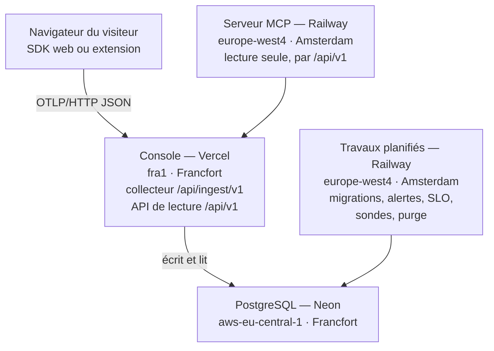

# MIP RUM

[](https://github.com/jt33120/mip-rum/actions/workflows/ci.yml)

**Real User Monitoring OpenTelemetry-native et souverain**, avec corrélation **synthétique ↔ réel** — le créneau MIP : croiser ce que voient les robots (monitoring synthétique DEM) avec ce que vivent les vrais utilisateurs.

Démontré en production le 10/06/2026 sur `plateforme.groupement-it.com` : sur `/login`, le robot mesure **1,14 s (état « ok »)** pendant que le LCP p75 réel est à **4,04 s (« poor »)** — un écart de **+254 %** invisible au synthétique seul. C'est exactement le problème que ce produit rend visible.

## Pourquoi celui-là

- **OTel-native, vérifiable sur le fil** : le SDK émet de l'OTLP/HTTP JSON standard (`POST /v1/traces`). Aucun format propriétaire — le backend est remplaçable par un Collector OTel + ClickHouse sans toucher au SDK (chemin documenté dans `infra/`).
- **Hébergement** : Données hébergées en UE ; hébergeurs de droit américain ; ce POC n'est pas une offre souveraine. Aucune adresse IP n'est stockée, sous aucune forme (`docs/RUM_PARITY_STATUS.md`, § 6.4). Détail dans la section [Architecture](#architecture), lu dans `apps/console/lib/legal.ts`.
- **Corrélation synthétique↔RUM** : le différenciateur MIP. Vue côte à côte robot vs réel par route, écarts surlignés, détection d'« angles morts » (robot ok / utilisateurs en souffrance).

## Architecture

<!-- genere:readme-architecture -->
<!-- Zone écrite par `node scripts/readme-sections.mjs` depuis apps/console/lib/presentation-topologie.ts, qui lit les hébergeurs dans apps/console/lib/legal.ts. Ne pas la modifier à la main : tests/unit/readme.test.ts la régénère et compare. -->

Le chemin de la mesure, tel que le dessine la vitrine de la console (`/presentation`) :



| Pièce | Hébergeur | Région | Rôle |
|---|---|---|---|
| Navigateur du visiteur | poste du visiteur | — | mesure et envoie en OTLP/HTTP JSON |
| Console — Vercel | Vercel Inc. | fra1 — Francfort, Allemagne | reçoit les mesures, sert la console et l'API |
| PostgreSQL — Neon | Neon (sur AWS) | aws-eu-central-1 — Francfort, Allemagne | stocke les mesures |
| Travaux planifiés — Railway | Railway Corp. | europe-west4 — Amsterdam, Pays-Bas | migrations au pré-déploiement, alertes, SLO, sondes, purge |
| Serveur MCP — Railway | Railway Corp. | europe-west4 — Amsterdam, Pays-Bas | lit par l'API /api/v1, sans accès à la base |

- Régions : Francfort, Allemagne ; Amsterdam, Pays-Bas. Droit des trois hébergeurs (Neon, Vercel Inc. et Railway Corp.) : américain.
- Le collecteur est une route de la console : c'est l'adresse que visent les SDK. Le même parseur existe en service Node autonome (`services/ingest/server.mjs`), construit et démarré par la CI (`docker-smoke`), pour un hébergement chez le client ; en production, il ne tourne nulle part : le service Railway `ingest`, qui l'exécutait sans domaine public, a été supprimé le 21/09/2026.
- Le `scheduler` applique les migrations au pré-déploiement : constaté le 18/09/2026 dans les journaux du déploiement `03850b30`.
- Topologie relevée par les API Railway et Vercel le 18/09/2026, puis par l'API Railway le 21/09/2026 : [docs/TOPOLOGIE_BACKEND.md](docs/TOPOLOGIE_BACKEND.md).
<!-- /genere -->

## Démarrage local (100 % local, aucun secret)

```bash
pnpm install
docker compose -f apps/ingest/docker-compose.yml up -d     # Postgres :5433 + schéma
docker exec -i mip-rum-db psql -U postgres -d mip_rum \
  < apps/ingest/sql/migration-v02.sql                      # migration v0.2 (idempotente)
pnpm --filter @mip/rum-sdk build                           # SDK -> dist/mip-rum.js
node apps/ingest/dev-server.mjs                            # ingestion locale :4318
node demo/serve.mjs                                        # mini-site de démo :8080
pnpm --filter console dev                                  # console :3000
node apps/sync-synthetic/src/sync.mjs seed                 # runs robot pour /correlation
```

## Outillage IA (BMAD + graft)

Le dépôt est câblé pour deux outils d'assistance, versionnés mais **non installés par le clone** :

```bash
npm install -g @nanonets/graft   # requis : .mcp.json et les hooks appellent le binaire `graft`
graft build                      # (re)génère le graphe de code dans graft/ — local, gitignoré, ~30 s
```

- **[graft](https://github.com/trailhq/Graft)** indexe le monorepo en un graphe de code (`graft ask`, `graft callers`,
  `graft skeleton`, `graft blast`) que l'agent interroge au lieu de tout relire. Le graphe vit dans `graft/`,
  **jamais commité** : chaque poste régénère le sien. `.ignore` le garde greppable malgré le gitignore.
  Sans l'installation globale ci-dessus, le serveur MCP déclaré dans `.mcp.json` ne démarre pas.
- **[BMAD](https://github.com/bmad-code-org/bmad-method)** (module `bmm`) fournit les skills `bmad-*` de
  `.claude/skills/` — configuration dans `_bmad/`, artefacts produits dans `_bmad-output/`. Nécessite
  [`uv`](https://docs.astral.sh/uv/) : les skills lancent leurs scripts Python via `uv run`.
  Point d'entrée : le skill `bmad-help`.

## Tests

```bash
pnpm test:unit          # vitest (parser OTLP, routes, sessions, ratings)
pnpm test:e2e           # playwright — lance lui-même ingest/démo/console (Postgres requis)
```

La CI GitHub Actions ([`.github/workflows/ci.yml`](.github/workflows/ci.yml)) rejoue tout ça sur un Postgres de service : build SDK + unitaires, puis E2E Chromium avec schéma + migration appliqués au démarrage.

Les zones générées de ce README se régénèrent par `node scripts/readme-sections.mjs` ; `tests/unit/readme.test.ts` échoue si elles ne sont plus à jour.

## Workspaces

| Workspace | Rôle |
|---|---|
| `packages/rum-sdk` | SDK Web (émetteur OTLP maison + web-vitals, 22,0 Ko gzip), build esbuild IIFE `mip-rum.js` |
| `packages/agent-node` | Agent backend **zéro-config** Node.js (`node -r @mip/agent-node/register`) : span `http.server` sans changement de code, plus une API publique (`track`, `captureException`, `withContext`, `flush`) qui réutilise la même instrumentation |
| `packages/rum-mobile` | SDK **React Native** : crashes, écrans, réseau (traceparent), événements → mêmes tables (`device_type=mobile`) |
| `apps/ingest` | Receiver OTLP `/v1/traces`, `/v1/logs`, `/v1/replay`, upload de source maps `/v1/sourcemaps` + SQL (schéma, migrations). **En production, le collecteur actif est la route Next de la console** ; le receveur autonome sert l'auto-hébergement (voir [infra/docker/](infra/docker/)) et [docs/TOPOLOGIE_BACKEND.md](docs/TOPOLOGIE_BACKEND.md) |
| `apps/sync-synthetic` | Synchro synthétique → `syn_snapshot` (interface `SyntheticSource` : seed ou export mippoc) |
| `apps/extension` | Extension navigateur MV3 (injection du SDK par domaine enregistré) |
| `apps/console` | Console RUM Live (Next.js 15) : Overview, Pages, Erreurs, Sessions, Tracing (waterfall), Corrélation, Logs, IA… |

## Documentation

| Document | Contenu |
|---|---|
| [docs/context/](docs/context/) | **Contexte produit** : maturité par service (RUM, supervision IA, Logs), grille d'évaluation, écarts et critères de sortie |
| [docs/INTEGRATION.md](docs/INTEGRATION.md) | Guide d'intégration client : snippet, options, consent mode, CSP, RGPD, dépannage |
| [packages/agent-node/README.md](packages/agent-node/README.md) | Agent backend Node.js zéro-config (`node -r @mip/agent-node/register`) |
| [packages/rum-mobile/README.md](packages/rum-mobile/README.md) | SDK React Native (crashes, écrans, réseau, événements) |
| [docs/API_CONSOLE.md](docs/API_CONSOLE.md) · [docs/RUM_READ_API.md](docs/RUM_READ_API.md) | API de lecture v1 (ITSM/CI-CD) + résumé partenaire |
| [docs/MULTITENANT.md](docs/MULTITENANT.md) · [docs/ALERTING.md](docs/ALERTING.md) | Multi-tenant / RBAC · alerting (webhook/Slack ; e-mail à brancher) |
| [docs/CONFORMITE.md](docs/CONFORMITE.md) · [docs/DPA.md](docs/DPA.md) | Conformité RGPD (résidence UE, DSAR, scrub PII) · modèle de DPA (art. 28) |
| [docs/OFFRE.md](docs/OFFRE.md) | Positionnement commercial : comparatif marché honnête, arguments grands comptes FR, pricing indicatif |
| [docs/DEMO_SCRIPT.md](docs/DEMO_SCRIPT.md) | Déroulé de démo 10 min (DSI grand compte) : checklist, plan B hors-ligne, objections/réponses |
| [docs/LIMITES.md](docs/LIMITES.md) | Limites explicites du produit, ce que v0.2/v0.3 traitent, ce qui reste |
| [DEPLOY.md](DEPLOY.md) | Déploiement cloud (Supabase + Vercel) + snippet prod + recette |
| [BUILD_LOG.md](BUILD_LOG.md) | Journal factuel du build (valeurs réelles mesurées, pièges, décisions) |
| [CHANGELOG.md](CHANGELOG.md) | Historique des versions |
| [docs/archive/](docs/archive/) | Rapports de sprint & plans historiques (PLAN, ROADMAP_V02/V03, RAPPORT_NUIT/V04/V05) — non maintenus, valeur d'archive |

## Statut

<!-- genere:readme-statut -->
<!-- Zone écrite par `node scripts/readme-sections.mjs` depuis apps/console/lib/couverture.generated.json, l'extraction de docs/RUM_PARITY_STATUS.md. Ne pas la modifier à la main : tests/unit/readme.test.ts la régénère et compare. -->

État relevé le **23/09/2026** sur `8a5f3d1` par le document de couverture [docs/RUM_PARITY_STATUS.md](docs/RUM_PARITY_STATUS.md) : **49** capacités recensées, **35** déployées, **aucune** éprouvée sur des données réellement ingérées — le vocabulaire du document n'a pas de verdict au-dessus de `deploye_non_eprouve`.

| Verdict | Capacités |
|---|--:|
| `deploye_non_eprouve` | 35 |
| `livre_non_deploye` | 5 |
| `livre_avec_defaut_connu` | 2 |
| `en_revue` | 0 |
| `bloque_acces_externe` | 4 |
| `non_retenu` | 1 |
| `non_commence` | 2 |

Le document ne recense que les capacités des lots P5 à P8 : les écrans plus anciens de la console n'y ont pas de verdict, et ce README ne leur en donne pas. La vitrine (`/presentation`) reprend les mêmes verdicts, ligne par ligne.

Tests comptés au relevé, pas aujourd'hui : 3815 tests unitaires verts (266 fichiers) ; suite SQL verte, 637 tests (45 fichiers) dont 13 ignorés (2 fichiers).
<!-- /genere -->
