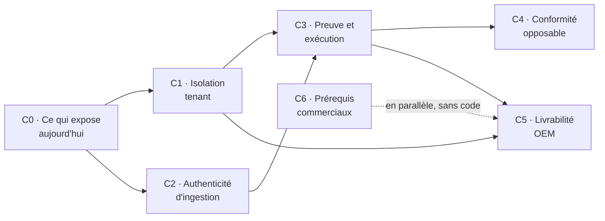

# MIP RUM — découpage en chantiers

> **Pourquoi ce document existe et pourquoi il ne dit pas « E1 ».**
> Deux documents du dépôt portent chacun un découpage `E1`–`E7`, et ils désignent des
> contenus différents dans un ordre différent : `docs/PRODUCT_REVIEW_BMAD.md` §4 et
> `docs/MARKET_SCAN_BMAD.md` §8. « On attaque E2 » est donc aujourd'hui une phrase ambiguë.
> Ce découpage utilise **`C0`–`C6`**, qui n'existe dans aucun des deux, et il remplace les
> deux pour l'exécution. Les deux documents d'origine restent des sources d'analyse ; ils ne
> sont plus des plans.

**Dérivé de** : [`architecture/architecture-poc-MIP_RUM-2026-08-25/ARCHITECTURE-SPINE.md`](architecture/architecture-poc-MIP_RUM-2026-08-25/ARCHITECTURE-SPINE.md) (23 invariants, `status: final`)
**Objectif directeur** : rendre le produit solide et intégrable/vendable dans un SaaS tiers.
**Date** : 25/08/2026

---

## Comment lire ce découpage

Chaque chantier dit **ce qu'il ferme** (les invariants), **ce qui le termine** — des conditions
de sortie vérifiables, jamais un pourcentage, conformément au corollaire d'AD-11 — et **ce qu'il
débloque commercialement**. L'ordre n'est pas une hiérarchie de valeur : c'est un ordre de
dépendance et d'exposition.

Aucune estimation en sprints ne figure ici. Le dépôt est mono-contributeur, aucune capacité
n'est déclarée, et les estimations du plan précédent se sont révélées fausses d'un facteur trois
sur le seul chantier qu'on a pu mesurer. Un chiffre sans méthode est pire que pas de chiffre.

---

## C0 — Ce qui expose aujourd'hui

*Quatre corrections indépendantes, petites, sans dépendance entre elles. Deux ferment une
exposition active. À traiter en jours, hors sprint.*

| # | Ce qu'il faut faire | Ferme | Pourquoi maintenant |
|---|---|---|---|
| **C0.1** | Corriger `lib/legal.ts` : hébergeur réel (Neon, `aws-eu-central-1`, Francfort) **et** ajout d'Anthropic aux sous-traitants | AD-7 | Les pages `/legal/*` sont publiques et publient aujourd'hui une déclaration art. 28 **inexacte sur deux points**. C'est le premier document qu'un DPO client demande. ~10 lignes. |
| **C0.2** | Passer l'hébergement sur un plan autorisant l'usage commercial | AD-13 | Le plan Hobby est restreint à un usage personnel non commercial, et la définition couvre explicitement « a paid employee or consultant writing the code ». État de violation actuel. Lève aussi la contrainte de cadence des tâches planifiées. |
| **C0.3** | Fonction unique de résolution de l'endpoint d'ingestion | AD-4 | Trois sites, trois replis, dont deux vers un host décommissionné : un client onboardé aujourd'hui n'ingère rien et ne reçoit aucune erreur exploitable. |
| **C0.4** | Supprimer la 4ᵉ copie périmée des seuils CWV (`scripts/validate-s4.mjs`) et dériver les trois autres d'une source unique | AD-12 | Un script de validation valide contre un barème que le produit n'utilise plus. |

**Conditions de sortie** — les pages légales nomment l'hébergeur et tous les tiers réellement
appelés ; le compte d'hébergement est sur un plan commercial ; `grep` ne trouve plus aucun host
d'ingestion écrit en dur ; les seuils n'existent qu'à un seul endroit.

---

## C1 — Isolation tenant

*Le plus gros chantier, et celui qu'un acheteur testera en premier.*

**Ferme** : AD-3 (voie d'accès unique), AD-15 (registre d'identité faisant autorité),
AD-16 (cross-tenant nommé), AD-21 (environnements isolés), AD-22 (identifiants scopés).

**Périmètre réel, mesuré** : 173 occurrences de lecture dans 48 fichiers d'`apps/console`, dont
**21 fichiers hors `lib/queries-*`** — server actions d'administration, callback OIDC, `logout`,
`goals`, cron tick — plus le chemin d'écriture d'`apps/ingest/lib/`. L'implémentation cible
(`withTenant`) existe déjà et compte **zéro appelant** : c'est une migration, pas une écriture.

**Séquence** — l'ordre compte, et il évite l'échec de juillet :

1. Unifier l'identité tenant : un registre fait foi, tout attribut (clé, origines, quota, jeton
   de lecture, portée d'extension) s'y rattache et hérite de son état.
2. Nommer et isoler le cross-tenant légitime — une portée vide ou nulle n'autorise **jamais** rien.
3. Rendre l'accès brut inaccessible pour une requête tenant, y compris l'import direct du pool.
   L'oubli devient une erreur de compilation.
4. Migrer les sites, y compris le chemin d'écriture.
5. Isoler les environnements : une base de prévisualisation distincte de la production.
6. **Alors seulement** basculer le rôle de connexion et activer la RLS en filet.

**Conditions de sortie** — désactiver un tenant coupe tous ses accès en un seul geste, vérifié
en lecture comme en écriture ; aucun accès tenant ne contourne la voie unique, garanti par le
compilateur et non par la revue ; un déploiement de prévisualisation ne peut pas atteindre la
base de production ; un test rejoue « un jeton du tenant A ne lit jamais B » **sous le rôle
réellement déployé** (AD-11).

**Débloque** : tout tenant payant, et le pentest d'isolation d'un audit acheteur.

---

## C2 — Authenticité d'ingestion

**Ferme** : AD-5 (quatre couches ordonnées), AD-6 (une seule implémentation, fail-closed),
AD-23 (déploiement par étapes observables).

**Point de départ à rectifier** : la clé d'API est publique par construction — injectée dans le
HTML du client. Elle identifie, elle n'authentifie pas. Un critère de recette « clé absente →
403 » passera au vert sans fermer le moindre scénario de data-poisoning.

**Séquence** :

1. Réduire le contrôle de clé à **une seule implémentation** — il en existe trois, dont deux
   rendent des verdicts opposés sur une app sans clé.
2. Fixer l'ordre d'évaluation, identique sur tout port entrant, **avant tout parsing du corps** ;
   déplacer la clé du corps vers un en-tête là où elle voyage encore dans le corps.
3. Allowlist d'origines **par app** — l'existante est une union du parc et ne compose que des
   en-têtes CORS, elle n'est pas un contrôle de refus.
4. Documenter l'ingestion via Collector serveur-à-serveur comme voie de première classe OEM.
5. Fermer les deux chemins fail-open connus : registre non chargé → 503 ; échec du contrôle de
   débit → refus.
6. Quotas, détection d'anomalie, et réversibilité par lot.

**Contrainte de déploiement (AD-23)** : chaque couche passe par inventaire → observation
(journaliser ce qui serait refusé, sans refuser, jusqu'à compteur nul pendant une durée déclarée)
→ activation, avec rollback documenté. Quatre couches de refus valent quatre occasions de couper
le client qui sert de preuve commerciale.

**Conditions de sortie** — un POST depuis une origine non déclarée avec une clé valide est
refusé ; le même contrôle rend le même verdict sur tout port entrant ; l'inventaire des beacons
qui seraient refusés est à zéro avant chaque activation ; un lot identifiable peut être purgé.

---

## C3 — Preuve et exécution

*Le chantier qui transforme « c'est vrai » en « c'est démontrable ».*

**Ferme** : AD-8 (exécution prouvable), AD-9 (supervision indépendante), AD-11 (testé en
configuration expédiée), AD-12 (conformité OTel prouvée).

**Séquence** :

1. Chaque tâche planifiée écrit une trace horodatée **dans une forme commune** ; l'absence
   d'exécution déclenche une alerte. Sans forme commune, l'alerte n'est pas constructible.
2. Battement de cœur externe, hébergé hors de la plateforme applicative et hors de la base :
   un beacon émis doit ressortir en lecture.
3. Parité des runtimes : déclarer `engines`, aligner Node et Postgres entre CI, image de
   conteneur et production. Aujourd'hui trois Node et deux majeures Postgres coexistent.
4. Test de conformité OTel de bout en bout contre un Collector standard.
5. Reprendre les tests qui fixent eux-mêmes leur rôle ou leur configuration — à commencer par
   le test d'isolation, qui prouve une propriété que la production ne porte pas.

**Conditions de sortie** — on peut répondre « la dernière purge date de » avec une source ;
une panne d'ingestion déclenche une alerte issue d'un système qui ne tombe pas avec elle ;
la CI s'exécute sur les mêmes majeures que la production ; un export OTLP rejoué dans un
Collector standard produit la structure attendue.

**Débloque** : l'audit acheteur, et le droit de citer les propriétés du produit en rendez-vous.

---

## C4 — Conformité opposable

**Ferme** : AD-17 (journal d'audit), AD-18 (droits des personnes), AD-19 (rôles RGPD par
topologie), AD-20 (cycle de vie des secrets).

**Séquence** :

1. Journal d'audit : accès cross-tenant, export et effacement DSAR, création et révocation de
   jeton, activation d'un mode dégradé, changement de rétention. Non modifiable par
   l'application, et il survit à la purge des données qu'il référence.
2. Périmètre DSAR **dérivé du schéma** : toute table portant `app_id` et une donnée rattachable
   à une personne y entre automatiquement, ou le build échoue. La liste tenue à la main omet
   aujourd'hui des tables que le SQL de purge traite pourtant, et ignore les six tables SVI.
3. Rôles RGPD déclarés par topologie de déploiement, et DPA généré en conséquence.
4. Secrets : lieu de stockage nommé, propriétaire, rotation exerçable sans interruption,
   chiffrement déclaré y compris en self-host.

**Conditions de sortie** — « qui a vu quoi, quand » a une réponse ; une demande d'effacement
traite toutes les tables concernées, prouvé par un test adossé au schéma réel ; le DPA remis à
un client correspond à la topologie qu'il exploite ; aucun secret ne figure au dépôt, dans une
image, ni dans un artefact de build.

---

## C5 — Livrabilité OEM

**Ferme** : AD-1 (exception replay bornée), AD-2 (équivalence des capacités), AD-10 (politique de
versions SDK), AD-14 (restauration testée).

**Séquence** :

1. Trancher le mécanisme d'AD-2 (HTTP ou couche partagée), puis établir l'équivalence : toute
   requête que la console sait exprimer, l'API publique sait l'exprimer.
2. Politique de versions du parc SDK : quelles versions l'ingestion accepte, pendant combien de
   temps, et comment un correctif de sécurité atteint un client qui a collé un snippet.
3. Césure datée sur tout changement de sémantique, dans une forme lisible par les calculs
   d'anomalie — sinon ils comparent des barèmes différents sans le signaler.
4. Sauvegarde **et restauration** testées et chronométrées, RPO et RTO déclarés.
5. Trancher l'unité de livraison OEM parmi les trois topologies vivantes.

**Conditions de sortie** — un intégrateur peut tout faire par l'API publique ; un correctif SDK
atteint le parc par un canal documenté ; une restauration a été exécutée et chronométrée ;
l'export d'un tenant est documenté et sans frais de sortie.

---

## C6 — Prérequis commerciaux non techniques

*Aucun code, et pourtant bloquant. Ce chantier est celui que le plan précédent avait le plus
sous-estimé.*

| # | Ce qu'il faut trancher | Pourquoi c'est bloquant |
|---|---|---|
| **C6.1** | **Licence et frontière open-core** | Le dépôt n'a aucun fichier `LICENSE`, et `packages/rum-sdk` est servi en clair chez les clients. Sans licence, un intégrateur ne peut légalement ni déployer ni revendre. Un juriste d'acheteur bloque le dossier à la première lecture. |
| **C6.2** | **Capacité réelle mesurée en cloud** | Jamais mesurée. Les seules valeurs du dépôt (~10⁶–10⁷ events) sont un **stock**, pas un débit, et la seule mesure de débit est locale. Tant qu'elle est inconnue, aucune capacité ne peut être annoncée — et le palier justifiant ClickHouse ne peut pas être situé. |
| **C6.3** | Modèle de souscription | Le scan marché conclut de facturer la capacité déployée et le périmètre, jamais le succès commercial du client — et de ne **jamais** placer l'isolation, le SSO ou l'audit en palier payant. |
| **C6.4** | Support et engagement de service | Vendu au palier Enterprise du dossier commercial, sans qu'aucune organisation ne le porte. |

---

## Ordre recommandé, et pourquoi

**C0 d'abord** parce que deux de ses quatre items sont des expositions actives — une déclaration
RGPD inexacte servie publiquement, et un hébergement en violation de ses conditions d'usage.
Aucun des deux n'attend un sprint.

**C1 avant C2** parce que l'authenticité s'appuie sur un registre d'identité qui fasse autorité :
poser quatre couches de refus sur quatre registres divergents produirait quatre comportements.

**C3 avant C4 et C5** parce que la conformité et la livrabilité se vendent sur des preuves. Un
journal d'audit qui ne s'exécute pas, ou une restauration jamais testée, ne valent rien en due
diligence — et AD-11 interdit de les citer.

**C6 en parallèle**, dès maintenant : il ne consomme aucun temps de développement, et C6.1 comme
C6.2 sont des préalables à la signature, pas à la livraison.

---

## Ce que ce découpage ne traite pas

Volontairement hors périmètre, et pourquoi :

- **SaaS multi-tenant, signup, billing** — hors de l'objectif OEM déclaré ; le scan marché le
  classe en forte baisse de priorité, le prix plancher du self-serve étant fixé par des gratuits.
- **Corrélation synthétique ↔ RUM** — positionnement écarté au profit du moteur générique.
  Réserve consignée : la démo commerciale qui s'appuie sur cet axe tourne sur des données de
  seed et non sur l'API DEM réelle ; l'affirmer en rendez-vous relève d'AD-11.
- **Dialecte ClickHouse** — la porte reste ouverte par AD-1, mais le palier qui le justifie ne
  peut pas être situé avant C6.2.
- **UI intelligente v2** — c'est le point le plus fort du produit, et il n'a besoin d'aucun de
  ces chantiers pour continuer d'avancer.
