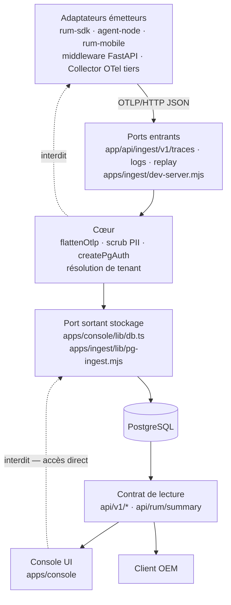
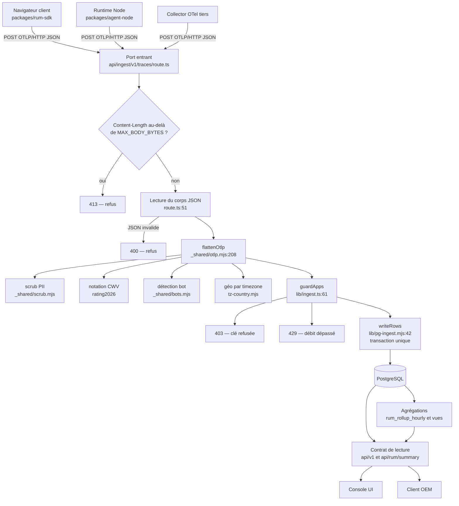
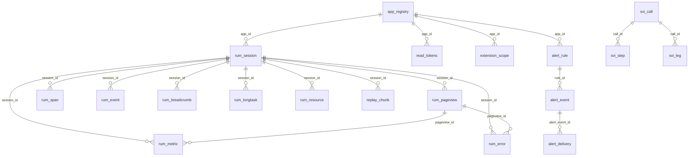
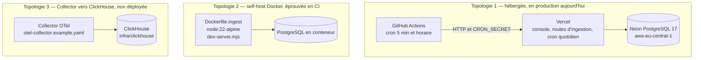
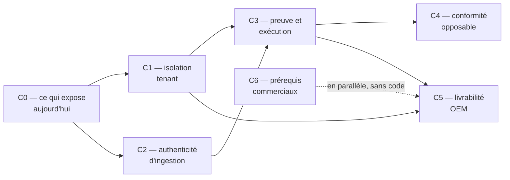

# Dossier d'architecture technique — MIP RUM

## Comment lire ce document

Ce dossier développe l'[`ARCHITECTURE-SPINE.md`](architecture/architecture-poc-MIP_RUM-2026-08-25/ARCHITECTURE-SPINE.md)
— 23 invariants, `status: final`. Il ne le contredit sur aucun point. Il en donne la
réalisation, mesurée sur le code.

Trois conventions gouvernent la lecture, et elles sont non négociables.

**1. État actuel et état cible sont systématiquement distingués.** Un invariant écrit
n'est pas une propriété acquise. Le spine est la cible ; le dépôt est l'état. Chaque
section porte cette distinction explicitement, généralement sous forme de tableau à deux
colonnes. Là où l'écart est important, il est nommé, pas atténué.

**2. Aucun chiffre sans méthode.** Chaque nombre cité indique comment il a été obtenu.
Aucun pourcentage de maturité, aucun indice composite, aucune projection ne figure ici.
L'annexe A rassemble les commandes de mesure pour qu'un tiers puisse les rejouer.

**3. Une affirmation non vérifiable est présentée comme telle.** Le dossier a été construit
en relisant le code, pas en synthétisant les documents existants. Cinq revues de gate ont
été consultées ; **trois d'entre elles portaient au moins une affirmation fausse**, écartée
par vérification manuelle (annexe B). Aucune affirmation de revue n'a été reprise sans
contrôle direct sur le code, et les points que ce dossier n'a pas pu trancher sont listés
en annexe C plutôt que lissés.

**Notation.** `fichier:ligne` renvoie au dépôt à la révision indiquée en tête. « Vérifié »
signifie : lu dans le code cité, ou mesuré par une commande reproduite en annexe A.

---

## 1. Objet et périmètre

### 1.1 Ce que le produit fait

MIP RUM est un **moteur d'observabilité d'expérience utilisateur réelle** (Real User
Monitoring), conçu pour être exploité en propre ou intégré dans un produit tiers (OEM).

Il collecte, depuis les navigateurs et les runtimes serveur des applications d'un client,
de la télémétrie au format **OTLP/HTTP JSON standard**, la normalise, la débarrasse des
données personnelles, la stocke dans PostgreSQL, en dérive des agrégats, et l'expose à la
lecture par une API et par une console web.

Les signaux réellement collectés et persistés, relevés dans le parseur
`apps/ingest/supabase/functions/_shared/otlp.mjs` et dans le schéma SQL :

| Signal | Table cible | Origine |
| --- | --- | --- |
| Core Web Vitals (LCP, INP, CLS, FCP, TTFB) et leur notation | `rum_metric` | SDK web |
| Pages vues et routes normalisées | `rum_pageview` | SDK web |
| Erreurs JS, avec pile et empreinte de regroupement | `rum_error` | SDK web, SDK RN |
| Chronologie de ressources et tâches longues | `rum_resource`, `rum_longtask` | SDK web |
| Fil d'Ariane d'interactions | `rum_breadcrumb` | SDK web |
| Événements métier `track()` | `rum_event` | SDK web, SDK RN |
| Spans de trace, y compris serveur | `rum_span` | SDK web, agent Node, middleware FastAPI |
| Journaux applicatifs (signal LOGS OTel) | `rum_log` | agent Node, console |
| Enregistrement de session rrweb | `replay_chunk` | module replay du SDK web |
| Modèle d'appel SVI — voix | `svi_call`, `svi_step`, `svi_leg`, `svi_quality_sample`, `svi_queue_sample`, `svi_call_link` | émetteurs tiers, `migration-v51.sql` |

Le produit fournit également : une console de restitution (Next.js 15), une API de lecture
sous deux préfixes (`/api/v1/*` et `/api/rum/*`), un alerting sortant par webhook, des
sondes uptime, une détection d'anomalie par z-score, un export et un effacement RGPD, et
une extension navigateur MV3 qui injecte le SDK sur des domaines enregistrés.

### 1.2 Ce que le produit ne fait pas

Périmètre exclu, vérifié dans le dépôt et cohérent avec `docs/LIMITES.md` :

- **Pas de SDK mobile natif.** `packages/rum-mobile` est un SDK React Native ; il n'existe
  ni binaire iOS ni binaire Android.
- **Pas de multi-région, ni de haute disponibilité.** Une seule base, une seule région.
- **Pas de facturation, pas d'inscription en libre-service.** Écarté du périmètre par le
  spine (section *Deferred*).
- **Pas de stockage colonne en production.** Le chemin ClickHouse existe sous `infra/clickhouse/`
  — schéma, writer, bench, docker-compose — mais il n'est pas déployé.
- **Pas de propagation de trace multi-sauts backend→backend.** Le tracing distribué couvre
  un seul saut, web→FastAPI, sur un seul framework (`integrations/fastapi/mip_rum_middleware.py`).
- **Pas de certification.** Ni SOC 2, ni ISO 27001, ni CSPN. `docs/CONFORMITE.md` §8 le
  présente comme une trajectoire, pas comme un acquis, et c'est exact.
- **Pas de corrélation avec du monitoring synthétique réel.** `apps/sync-synthetic/` porte
  l'interface `SyntheticSource`, mais la source réellement câblée est un générateur de
  données de démonstration (`sync.mjs seed`). L'API DEM du client n'est pas branchée.
  Ce point est important commercialement : la démonstration bâtie sur cet axe tourne sur des
  données fabriquées, et le spine l'a consigné en réserve explicite.

### 1.3 Ce que le produit vend, et ce qui doit le prouver

Trois promesses portent l'offre. Chacune a un mécanisme, et chacune a aujourd'hui un écart
entre le mécanisme et sa preuve. C'est l'objet des sections 5, 6 et 8.

| Promesse | Mécanisme dans le code | État de la preuve |
| --- | --- | --- |
| **Réversibilité** — le backend est remplaçable | OTLP/HTTP JSON en seul contrat d'entrée ; parseur pur JS sans dépendance | Aucun test ne rejoue un export réel dans un Collector OTel standard. La conformité est affirmée, pas démontrée (AD-12). |
| **Souveraineté** — les données restent chez vous, en UE | Base en UE, aucune adresse IP stockée, scrub PII à l'ingestion, topologie self-host Docker | La résidence est réelle mais **mal déclarée** : les pages légales publiques nomment un hébergeur et une région qui ne sont plus ceux de la production (§6.1). |
| **Isolation multi-tenant** | Colonne `app_id` sur toute table tenant ; policies RLS écrites ; voie d'accès `withTenant` | La voie d'accès a **zéro appelant** et le rôle de connexion de production contourne la RLS (§5.4). L'isolation repose aujourd'hui sur la discipline SQL, pas sur un mécanisme. |

---

## 2. Vue d'ensemble

### 2.1 Paradigme

**Hexagonal — ports et adaptateurs.** Le cœur du produit — parsing OTLP, résolution de
tenant, contrat de lecture — ne connaît ni son runtime, ni son fournisseur de stockage, ni
l'émetteur qui l'alimente. C'est ce qui rend le produit livrable en OEM : un intégrateur
remplace un adaptateur, jamais le cœur.

Cette propriété est **vérifiable**, pas seulement déclarée. Le parseur
`apps/ingest/supabase/functions/_shared/otlp.mjs` (498 lignes pour la seule fonction
`flattenOtlp`, lignes 208 à 705) n'importe que trois modules frères — `tz-country.mjs`,
`scrub.mjs`, `bots.mjs` — tous en JavaScript pur. Il tourne à l'identique sous Deno et sous
Node. Il est importé aujourd'hui par le port entrant de production
(`apps/console/app/api/ingest/v1/traces/route.ts:13`), par le port entrant local et
self-host (`apps/ingest/dev-server.mjs:12`), et par 17 fichiers de tests.

> **Un piège de lecture, à connaître avant toute revue de ce dépôt.** Le chemin
> `apps/ingest/supabase/functions/` évoque des *edge functions* Supabase. Celles-ci sont
> effectivement décommissionnées — le projet Supabase a disparu le 14/08/2026
> (`DEPLOY.md:3-5`). Mais le sous-dossier `_shared/` **n'est pas** décommissionné : il
> contient le cœur OTLP, le scrub PII et les règles CORS, et il est importé par sept
> fichiers de `apps/console` (mesure A.4). C'est du code de production. Le chemin trompe,
> pas le rôle. Une revue qui applique mécaniquement la règle « supprimer le code
> décommissionné » à ce dossier détruirait le cœur du produit.

### 2.2 Les couches et la direction des dépendances



Les arêtes pointillées sont des **interdits d'architecture**, pas des observations. Ils
sont posés par le spine (AD-1, AD-2), et leur état de réalisation est le suivant :

| Interdit | Tenu aujourd'hui ? | Preuve |
| --- | --- | --- |
| Le cœur ne connaît aucun émetteur | **Oui.** `otlp.mjs` n'importe aucun paquet de `packages/`. | Lecture des imports, `otlp.mjs:1-9`. |
| La console n'atteint pas le stockage directement | **Non.** 46 fichiers de `apps/console` importent `q` depuis `lib/db.ts` et écrivent du SQL en clair. | Mesure A.1. |

Le second interdit est **l'écart structurel le plus important du dossier**. Il est traité
en §5.4 et il constitue le chantier C1.

### 2.3 Où vit chaque couche

| Couche | Répertoires | Volume indexé |
| --- | --- | --- |
| Adaptateurs émetteurs | `packages/rum-sdk`, `packages/agent-node`, `packages/rum-mobile`, `integrations/fastapi`, `apps/extension` | 25 fichiers TypeScript sous `packages/` |
| Ports entrants | `apps/console/app/api/ingest/v1/{traces,logs,replay}`, `apps/ingest/dev-server.mjs`, `apps/ingest/replay-dev-server.mjs` | 3 routes + 2 serveurs |
| Cœur | `apps/ingest/supabase/functions/_shared/`, `apps/ingest/lib/pg-ingest.mjs` | 13 fichiers, 64 symboles ; `flattenOtlp` a 18 dépendants |
| Port sortant stockage | `apps/console/lib/db.ts`, `apps/ingest/lib/pg-ingest.mjs` | `q()` a 49 arêtes entrantes indexées |
| Schéma et migrations | `apps/ingest/sql/` | `schema.sql` + **48** migrations appliquées + **1** différée |
| Contrat de lecture | `apps/console/app/api/v1/*`, `apps/console/app/api/rum/*` | 16 handlers `route.ts` sous `/api/v1`, répartis en 13 segments de premier niveau ; 1 sous `/api/rum` |
| Console | `apps/console/app`, `apps/console/lib`, `apps/console/components` | 101 + 85 + 74 fichiers indexés |

*(Volumes : graphe `graft`, 445 fichiers indexés, 2 620 symboles, 6 583 arêtes ;
décomptes de fichiers par `find`, cf. annexe A.)*

### 2.4 Pile technique

Versions **telles qu'épinglées au dépôt**. La colonne « réserve » n'est pas une opinion :
elle signale un écart mesuré entre ce qui est épinglé et ce qui s'exécute ailleurs.

| Composant | Version épinglée | Où c'est épinglé | Réserve |
| --- | --- | --- | --- |
| pnpm (workspaces) | 9.15.9 | `package.json:14` | — |
| Node.js — CI | 26 | `.github/workflows/ci.yml:42`, `:90` | **Trois versions coexistent** (voir ci-dessous) |
| Node.js — conteneur self-host | 22-alpine | `infra/docker/Dockerfile.ingest:9` | idem |
| Node.js — production | non déclarée | — | **Aucun champ `engines` dans aucun `package.json`** (mesure A.7) |
| Next.js | 15.5.19 | `apps/console/package.json` | — |
| React | 19 | `apps/console/package.json` | — |
| PostgreSQL — CI et conteneur | 15 | `.github/workflows/ci.yml:72` | **La production est en 17** (`docs/NEON_MIGRATION.md:14-16`) |
| Vitest | 4.1.8 | `package.json:19` | — |
| Playwright | 1.60.0 | `package.json:17` | — |
| Format d'échange | OTLP/HTTP JSON | — | — |

**Conséquence directe.** Trois majeures de Node et deux majeures de PostgreSQL coexistent
sans arbitrage déclaré. L'invariant AD-11 pose que les versions de runtime font partie de
la configuration expédiée : tant que cet écart existe, **la CI ne prouve pas la
production**. C'est le point 3 du chantier C3.

---

## 3. Chaîne de données — du beacon à la lecture

### 3.1 Vue d'ensemble du trajet



### 3.2 Émission — les adaptateurs

Le SDK web (`packages/rum-sdk`) construit lui-même les enveloppes OTLP
(`packages/rum-sdk/src/otlp-encode.ts`) plutôt que d'embarquer le SDK OpenTelemetry
complet. C'est un choix de taille de bundle assumé, et c'est aussi ce qui rend la
conformité OTel **testable mais non testée** : rien ne garantit aujourd'hui que l'encodage
maison satisfait un Collector standard (§8.4).

Ce que le SDK transporte, et qui est propre au produit, est porté par des attributs
préfixés `mip.` — `mip.route`, `mip.tz`, `mip.props`, `mip.api_key`, `mip.url`. C'est la
convention de nommage posée par AD-1 : aucun champ propriétaire n'étend le format.

Le SDK n'a **aucune valeur d'endpoint par défaut** : `packages/rum-sdk/src/index.ts:52-53`
refuse l'initialisation si `endpoint` ou `appId` manque. La valeur est donc fournie par
l'intégrateur — et c'est précisément là que se situe l'écart AD-4 décrit en §3.7.

### 3.3 Réception — l'ordre réel des contrôles

C'est le point le plus important de cette section, et il est en écart avec l'invariant.

**AD-5 exige** que l'identification (la clé), l'origine, puis les couches suivantes soient
évaluées **dans cet ordre et avant tout parsing du corps**, identiquement sur tout port
entrant.

**L'état réel diffère selon la route**, et les deux comportements sont lisibles à la
ligne près :

| Port entrant | Où est la clé | Ordre observé | Conforme AD-5 ? |
| --- | --- | --- | --- |
| `POST /api/ingest/v1/replay` | En-tête `x-mip-key` (`route.ts:44`) | En-têtes lus `:35-38` → `guardApps` `:42` → **puis** corps lu `:49` | **Oui** |
| `POST /api/ingest/v1/traces` | Attribut de resource `mip.api_key` dans le corps (`otlp.mjs:406`) | Corps lu `:51` → `flattenOtlp` `:55` → **puis** `guardApps` `:57` | **Non** |
| `POST /api/ingest/v1/logs` | idem traces | idem traces | **Non** |

La raison du choix historique est documentée dans `docs/INTEGRATION.md:45` : *« sendBeacon
ne porte pas de header »*. C'est exact — `navigator.sendBeacon` n'accepte pas d'en-têtes
personnalisés. La conséquence architecturale est réelle : sur le canal traces, le serveur
doit désérialiser et parcourir un corps arbitraire, potentiellement jusqu'à
`MAX_SPANS_PER_REQUEST` (20 000 spans par défaut, `otlp.mjs:209`), **avant** de savoir s'il
accepte l'émetteur. Le canal replay, lui, tranche avant.

C'est l'écart que le chantier C2 doit fermer, et il n'a pas de solution triviale : il
suppose soit d'abandonner `sendBeacon` au profit de `fetch(keepalive)`, soit d'accepter un
pré-parsing borné, soit de déplacer la clé dans l'URL. Aucune de ces options n'est
tranchée dans le dépôt.

### 3.4 Parsing et normalisation

`flattenOtlp` (`otlp.mjs:208-705`) transforme un document OTLP en un objet de tableaux de
lignes SQL — un tableau par table cible. Il fait, au passage, quatre choses qui ne sont pas
du parsing et qui sont structurantes :

1. **Il recalcule la notation Core Web Vitals**, quoi qu'envoie le SDK. Le commentaire
   `otlp.mjs:12-14` le dit explicitement : *« SOURCE DE VÉRITÉ du rating : il est recalculé
   ici à l'ingestion »*. Un émetteur ne peut donc pas mentir sur le verdict d'une métrique.
2. **Il applique le scrub PII** (§3.5).
3. **Il classe le trafic non humain** via `bots.mjs`, ce qui alimente `rum_session.is_bot`,
   exclu par défaut des agrégats.
4. **Il dérive le pays depuis le fuseau horaire** (`mip.tz` → `tz-country.mjs`), ce qui est
   le mécanisme qui permet de ne jamais stocker d'adresse IP (§6.2).

Il applique aussi une fenêtre anti-dérive d'horloge — 5 minutes dans le futur, 7 jours dans
le passé (`otlp.mjs:59-61`) — et un plafond de spans par requête, au-delà duquel les spans
excédentaires sont comptés dans `rejected` plutôt que traités (`otlp.mjs:411-412`). Les deux
plafonds de charge sont surchargeables par variable d'environnement :
`MAX_BODY_BYTES` (2 Mo par défaut) et `MAX_SPANS_PER_REQUEST` (20 000),
`_shared/limits.mjs:10` et `:13`. Une
requête peut donc être **partiellement acceptée** ; le nombre de rejets est journalisé
(`traces/route.ts:75`) mais n'est pas persisté et n'est donc pas interrogeable après coup.

### 3.5 Scrub PII

Le scrub est réalisé **côté serveur, à l'ingestion, avant écriture**, dans
`apps/ingest/supabase/functions/_shared/scrub.mjs`. Trois fonctions y sont exposées, et
elles sont appelées depuis le parseur — donc sur tous les chemins d'ingestion, sans
exception :

| Fonction | Ce qu'elle traite | Points d'appel relevés |
| --- | --- | --- |
| `scrubText` | Texte libre : messages d'erreur, piles, requêtes SQL, corps de log | `otlp.mjs:499`, `:582`, `:583`, `:763` |
| `scrubUrl` | URL et référents : retire la chaîne de requête et le fragment, puis scrube le chemin | `otlp.mjs:244`, `:250`, `:473`, `:593`, `:607`, `:608`, `:618` |
| `scrubProps` | Objets arbitraires (`mip.props`, attributs de log), récursivement | `otlp.mjs:660`, `:678`, `:781` |

Les motifs neutralisés, lus dans `scrub.mjs:27-42` : jetons `Bearer` et `Basic`, JWT, clés
préfixées (`sk-`, `pk-`, `ghp-`, `xox*-`), clés `mip_*`, adresses e-mail, adresses IPv4, et
suites de neuf chiffres ou plus. `scrub.mjs:84` ajoute une liste de **clés** sensibles
(`password`, `token`, `api_key`, `iban`, `cvv`…) dont la valeur est masquée quel que soit
son contenu.

Deux détails d'implémentation méritent d'être relevés parce qu'ils traduisent une
attention réelle, pas un scrub de façade :

- **Le scrub précède la troncature.** `otlp.mjs:581-583` : *« un secret ne doit pas survivre
  coupé en deux »*. Tronquer d'abord aurait pu laisser un fragment de jeton non reconnu par
  la regex.
- **Le scrub ne dépend pas du client.** Le SDK expose un `beforeSend`, mais le serveur ne
  s'y fie pas. C'est de la défense en profondeur au sens strict.

**Limite honnête de ce mécanisme.** Un scrub par expressions régulières est une mesure de
réduction du risque, pas une garantie. Une donnée personnelle qui ne ressemble à aucun des
motifs listés — un nom propre dans un message d'erreur, un identifiant interne de format
inhabituel — traverse. Le produit **minimise** la PII ; il ne peut pas prétendre l'éliminer,
et aucun document du dépôt ne le prétend.

### 3.6 Idempotence et écriture

L'écriture est réalisée par `writeRows` (`apps/ingest/lib/pg-ingest.mjs:42-174`), dans une
**transaction unique**, avec un `insert` multi-lignes par table (`batchInsert`, `:17-35`).

L'idempotence repose sur `span_id`, unique par table de télémétrie :

- Toutes les tables enfants portent `on conflict (span_id) do nothing` (`pg-ingest.mjs:75`,
  `:82`, `:89`, `:96`, `:103`, `:110`, `:117`, `:124`).
- `rum_session` utilise `on conflict (session_id) do update` avec `greatest` sur
  `last_seen_at` et `coalesce` sur les autres champs (`:64-68`) — un rejeu ne peut donc pas
  faire régresser une session.
- `page_count` est **dérivé** d'un `count(*)` sur `rum_pageview` plutôt qu'incrémenté
  (`:157-166`), ce qui le rend idempotent par construction.
- `replay_chunk` est dédupliqué sur `(session_id, seq)` (`:209`).
- Les tables SVI utilisent une fonction de fusion en base, `upsert_svi_call` (`:132`), dont
  le commentaire `:127-130` explique pourquoi la fusion ne peut pas vivre dans le code
  applicatif : elle doit être identique sur tous les chemins d'ingestion.

**Une seule table échappe à l'idempotence, et c'est documenté.** `rum_log` est écrite par
`writeLogs` (`:177-191`) avec une clause de conflit vide, sur une clé `bigserial` : le
commentaire `:176` l'assume — *« pas de contrainte d'idempotence »*. Un rejeu de logs
duplique donc les lignes. C'est une asymétrie réelle entre le signal LOGS et les autres.

Le rejeu est explicitement autorisé en amont : `traces/route.ts:70` enveloppe l'écriture
dans `withRetry`, ce qui n'est sûr **que** parce que la transaction est idempotente — le
commentaire `:68-69` fait le lien.

### 3.7 Résolution de l'endpoint — l'écart AD-4

AD-4 exige que l'endpoint d'ingestion soit produit par **une seule fonction de résolution**.
Aujourd'hui, il ne l'est pas. Trois sites produisent la valeur, avec **trois valeurs de
repli différentes** :

| Site | Valeur de repli | État de la cible |
| --- | --- | --- |
| `apps/console/app/layout.tsx:34` | `https://nupxrdpsliqptqnjkmgw.supabase.co/functions/v1/v1-traces` | Host **décommissionné** |
| `apps/console/app/select/new/page.tsx:229` | idem | Host **décommissionné** |
| `apps/console/app/admin/customers/[appId]/page.tsx:43` | `http://localhost:4318/v1/traces` | Adresse de **développement** |

Les trois lisent d'abord `NEXT_PUBLIC_RUM_ENDPOINT`. Le repli ne se déclenche donc que si
cette variable est absente — mais c'est exactement le cas d'un déploiement neuf, d'une
prévisualisation, ou d'un self-host mal configuré. **Conséquence opérationnelle : un client
onboardé dans ces conditions reçoit un snippet qui poste dans le vide, et n'obtient aucune
erreur exploitable** — le SDK échoue silencieusement (`packages/rum-sdk/src/index.ts:52-55` :
avertissement en console, puis `return`).

Deux détails rendent la correction évidente et peu risquée :

- `apps/console/app/select/new/page.tsx:224-226` **calcule déjà l'hôte courant** pour
  construire l'URL du SDK, et n'utilise pas cette même valeur pour l'endpoint. La règle
  posée par AD-4 — *« en l'absence de configuration explicite, la résolution rend l'hôte
  courant »* — est donc à deux lignes d'exister.
- `apps/console/app/layout.tsx:30-31` justifie encore le repli par un commentaire devenu
  faux : *« ingestion prod (edge function v1-traces, verify_jwt off) »*. L'edge function
  n'existe plus depuis le 14/08/2026.

C'est l'item C0.3, et c'est une correction de quelques lignes.

### 3.8 Agrégations et lecture

Deux mécanismes d'agrégation coexistent :

- **Un rollup horaire matérialisé**, `rum_rollup_hourly` (`migration-v12.sql:20`), alimenté
  par une fonction SQL (`:83`), déclenchée par la tâche planifiée horaire. Son usage est
  gouverné par la variable `RUM_USE_ROLLUPS`.
- **Des vues et des requêtes à la volée**, dans les 27 fichiers `apps/console/lib/queries-*.ts`.

La lecture publique passe par deux surfaces :

| Surface | Authentification | Portée tenant |
| --- | --- | --- |
| `/api/rum/summary` | Jeton porteur résolu en base (`resolveReadToken`) | **Stricte** : `route.ts:29-30` refuse en 403 si le paramètre `app` diffère de l'app du jeton |
| `/api/v1/*` | Jeton ou cookie, dans le handler (`middleware.ts:22`) | Variable selon la route |

`/api/rum/summary` est le meilleur exemple du dépôt en matière de contrat de lecture : le
jeton porte sa portée, la portée est vérifiée, la réponse est `no-store`
(`route.ts:18`, `:42`), et le débit est limité par jeton (`:32-37`). Il respecte à la lettre
la convention d'optimisation du spine — *« aucune optimisation de cache ne s'applique à une
réponse scopée par porteur sans clé de cache incluant ce porteur »*.

**Écart AD-2 à noter.** L'invariant exige que toute capacité de lecture de la console existe
aussi dans l'API publique. Aujourd'hui, la console n'appelle pas l'API : elle lit
directement la base par 46 fichiers (§5.4). L'équivalence des capacités n'est donc ni
établie ni vérifiable — et le mécanisme (appel HTTP réel, ou couche de lecture partagée en
processus) reste explicitement *Deferred* dans le spine.

---

## 4. Modèle de données

### 4.1 Structure

Le schéma vit dans `apps/ingest/sql/` : `schema.sql` pour le socle v0.1, puis **48**
fichiers `migration-v*.sql` appliqués dans l'ordre, tous idempotents.



### 4.2 Ce qui porte le tenant

**`app_id` est l'identité de tenant.** Il est dénormalisé sur toutes les tables de
télémétrie — y compris `rum_metric` et `rum_error`, où le commentaire de `schema.sql:2-3`
explique que c'est un écart délibéré au plan d'origine, requis par les agrégats par route.

Cette dénormalisation est ce qui rend possible la purge par tenant, l'effacement par tenant,
et les policies RLS de `migration-v47.sql`. C'est un bon choix.

**Trois tables tenant ne portent pas `app_id` et sont scopées par leur parent** :
`alert_event` (par `alert_rule`), `alert_delivery` (par `alert_event`), `uptime_result` (par
`uptime_check`). `migration-v47.sql:23-24` en tient compte explicitement.

### 4.3 `session_id` est une clé primaire globale — ce que cela implique (AD-22)

```sql
-- apps/ingest/sql/schema.sql:7-8
create table if not exists rum_session (
  session_id    text primary key,
```

**Vérifié.** `session_id` est la clé primaire, seul, sans `app_id`. L'espace de noms des
sessions est donc **partagé entre tous les tenants**.

Ce que cela implique, précisément :

1. **Deux tenants ne peuvent pas générer le même `session_id`** sans collision d'insertion.
   Ce n'est pas un problème de sécurité, mais c'est un couplage inter-tenant réel dans un
   modèle qui se vend comme cloisonné.
2. **L'identifiant transite dans les URL.** `/api/replay/[sessionId]` l'expose dans le
   chemin. Un identifiant global qui traverse une frontière de confiance doit donc être
   imprédictible par construction — et il l'est : le SDK web le génère par
   `crypto.randomUUID()` (`packages/rum-sdk/src/session.ts:29-34`), avec repli sur
   `crypto.getRandomValues`. **Vérifié : c'est un générateur cryptographique, pas un
   compteur ni un hash.**
3. **Mais l'imprédictibilité ne doit jamais tenir lieu d'autorisation.** C'est la règle
   d'AD-22, et c'est là que se situe l'observation la plus fine de ce dossier :

   - Le contrôle d'appartenance existe bien sur la route de lecture replay, aux lignes
     30-34 de `apps/console/app/api/replay/[sessionId]/route.ts`. **Une affirmation de revue
     prétendant le contraire a été écartée par lecture directe** (annexe B).
   - Ce contrôle est cependant **conditionnel** : il est enveloppé dans `if (user?.apps)`
     (`route.ts:30`). Un utilisateur dont le claim `apps` vaut `null` — ce qui est le cas
     documenté d'un administrateur, `apps/console/lib/auth.ts:12` : *« null = toutes les
     apps »* — ne déclenche pas la vérification.
   - Et la requête qui récupère les chunks (`route.ts:36-40`) filtre sur `session_id` seul,
     **sans** `app_id`. Le scope est vérifié sur la session, pas sur les lignes lues.

   Autrement dit : la sûreté de ce chemin repose aujourd'hui sur la conjonction de trois
   choses — l'imprédictibilité de l'UUID, la présence d'un claim `apps` non nul, et le fait
   que `writeReplayChunk` (`pg-ingest.mjs:197-219`) reçoive le bon `app_id`. AD-22 demande
   que la vérification d'appartenance soit inconditionnelle. Elle ne l'est pas.

### 4.4 Les registres d'identité tenant — l'écart AD-15

AD-15 exige qu'**un seul registre fasse foi** et que désactiver un tenant coupe tous ses
accès en un seul geste. Aujourd'hui, quatre tables portent chacune une portion de l'identité
tenant, sans lien entre elles :

| Table | Créée par | Ce qu'elle porte | Rattachée à `app_registry.active` ? |
| --- | --- | --- | --- |
| `app_registry` | `migration-v02.sql:5` | `app_id`, `api_key_hash`, `active`, `allowed_origins`, `retention_days` | — (c'est la référence) |
| `read_tokens` | `migration-v26.sql:6` | Jeton de lecture scopé à un `app_id` | **Non** |
| `console_user` | `migration-v03.sql:18` | Comptes console et leur portée d'apps | **Non** |
| `extension_scope` | `migration-v27.sql:59` | Domaines → `app_id` pour l'extension MV3 | **Non** |

La conséquence est **démontrable à la ligne** :

```ts
// apps/console/lib/queries-read-tokens.ts:8-14
export async function resolveReadToken(token: string) {
  const [r] = await q<{ id: number; app_id: string }>(
    `select id::int as id, app_id from read_tokens where token_hash = $1 and revoked_at is null`,
    [hashToken(token)],
  );
  return r ?? null;
}
```

Aucune jointure sur `app_registry`, aucun test de `active`. En regard,
`createPgAuth.checkApiKey` (`apps/ingest/lib/pg-ingest.mjs:269`) refuse l'ingestion d'une app
inactive.

**Donc : passer `app_registry.active = false` sur un client coupe son ingestion et laisse
son jeton de lecture pleinement fonctionnel.** C'est l'écart exact que décrit AD-15, et
c'est une question qu'un auditeur acheteur pose systématiquement, sous la forme « montrez-moi
l'offboarding d'un client ».

Le JWT de console ajoute une cinquième surface : son claim `apps` est signé à la connexion
(`auth.ts:45-50`) et vaut 8 heures (`auth.ts:8`). Retirer une app à un utilisateur ne prend
donc effet qu'à l'expiration de son jeton.

### 4.5 Rétention

La rétention est **par tenant** : `app_registry.retention_days`, avec 30 jours par défaut,
appliquée par `purge_rum_tenants` (`migration-v14.sql:52`) qui appelle `purge_rum_app`
(redéfinie par `migration-v30.sql:8`) pour chaque app. C'est un modèle correct.

`purge_rum_app` couvre 12 tables. `erase_app_data` (offboarding, art. 17) en couvre 16, y
compris `sourcemap`, `syn_snapshot`, `alert_rule` et `alert_event`. `audit_log` n'est
effacée par aucune des deux — délibérément, et c'est le bon choix : le journal doit survivre
aux données qu'il référence (AD-17).

**Ce qui n'est couvert nulle part** : les six tables SVI de `migration-v51.sql` n'apparaissent
ni dans `purge_rum_app`, ni dans `erase_app_data`, ni dans le périmètre DSAR (§6.4).

---

## 5. Sécurité

### 5.1 Le point de départ : identification n'est pas authenticité

La clé d'API `mip_live_*` est **publique par construction**. Elle est injectée dans le HTML
du site client, donc lisible dans n'importe quel navigateur. Le dépôt le reconnaît lui-même,
`docs/SNIPPET_UTI.md:67` : *« exposée côté navigateur = normal, ce n'est pas un secret
fort »*.

Ce n'est pas un défaut : c'est une propriété inévitable de tout RUM navigateur, chez tous
les acteurs du marché. Le défaut serait de **la vendre comme une preuve d'origine**. Le
spine tranche : la clé **identifie** une app, elle ne l'authentifie pas.

Conséquence de méthode, directement opposable : un critère de recette qui vérifie
« clé absente → 403 » ne prouve **rien** sur l'authenticité. Il prouve que le contrôle
d'identification fonctionne. Le data-poisoning — injecter des données sous l'`app_id` d'un
tiers — reste entièrement ouvert avec une clé copiée.

### 5.2 Les quatre couches d'AD-5, et leur état réel

| # | Couche (cible AD-5) | État actuel — vérifié | Où |
| --- | --- | --- | --- |
| 1 | **Identification** — clé en en-tête, app existante et active | **Partiel.** Le contrôle existe, mais : (a) il est **désactivé par défaut** ; (b) sur traces/logs la clé voyage dans le **corps**, pas dans un en-tête. | `pg-ingest.mjs:261-275` ; `lib/ingest.ts:16` ; `otlp.mjs:406` |
| 2 | **Origine** — allowlist **par app**, refus serveur | **Absent comme contrôle.** `isAllowedOrigin` n'est appelé que depuis `corsHeaders`. Aucune route ne refuse un POST sur l'origine. De plus l'allowlist est une **union du parc** plus un socle statique contenant un domaine client en dur. | `_shared/cors.mjs:19-22`, `:39`, `:11-16`, `:50-56` |
| 3 | **Preuve d'origine forte** — jeton court signé, ou ingestion serveur-à-serveur | **Non implémenté.** Le chemin Collector existe (`infra/otel-collector.example.yaml`) mais n'est pas documenté comme voie de première classe OEM. | — |
| 4 | **Confinement** — quota, anomalie de volume, réversibilité par lot | **Partiel.** Le quota existe (`rateLimitedDurable`). La détection d'anomalie porte sur la performance, pas sur le volume d'ingestion. Aucun identifiant de lot n'existe au modèle : **la réversibilité par lot n'est pas réalisable en l'état.** | `pg-ingest.mjs:289-301` |

Sur la couche 2, le détail est instructif. `STATIC_ALLOWED_ORIGINS` (`cors.mjs:11-16`) contient
quatre entrées, dont `https://plateforme.groupement-it.com` — le domaine d'un client
nommé — et trois adresses locales. `originsFromRegistry` (`:50-56`) y ajoute, à plat, les
origines de **toutes** les apps actives. Il n'existe donc aucun moment du code où l'origine
présentée est confrontée aux origines déclarées **de l'app présentée**. Le contrôle « par
app » d'AD-5 n'a pas d'équivalent aujourd'hui : il est à écrire, pas à durcir.

### 5.3 Fail-closed — l'état d'AD-6

AD-6 pose deux règles : l'indisponibilité d'un contrôle de sécurité **refuse** la requête, et
un contrôle de sécurité a **une seule implémentation**.

**Sur la première règle**, trois chemins fail-open sont présents et documentés dans le code
lui-même :

| Chemin | Comportement en défaillance | Ligne |
| --- | --- | --- |
| Registre d'apps jamais chargé | `return null` — la requête **passe** | `pg-ingest.mjs:264-267` |
| Contrôle de débit durable en erreur SQL | `return false` — la requête **passe** | `pg-ingest.mjs:297-300` |
| Registre indisponible pour le calcul CORS | Repli sur le socle statique | `lib/ingest.ts:38-41` |

Le commentaire de `pg-ingest.mjs:228-229` assume le choix : *« indisponibilité DB au
démarrage > rejeter 100 % du trafic »*. C'est un arbitrage explicite, cohérent avec un POC,
et **incompatible avec AD-6**. Le fermer est l'étape 5 du chantier C2.

**Sur la seconde règle** — une seule implémentation — l'état est plus sérieux. Le contrôle
de clé existe en **quatre** exemplaires, et **deux d'entre eux rendent des verdicts opposés
sur la même entrée** :

| Implémentation | Cas « app active, `api_key_hash` NULL », sous `REQUIRE_API_KEY=true` | Ligne |
| --- | --- | --- |
| `createPgAuth.checkApiKey` — **production** (routes Next) | `return 'app requires an API key'` → **403** | `apps/ingest/lib/pg-ingest.mjs:271` |
| `createAuth.checkApiKey` — bibliothèque partagée | `return 'app requires an API key'` → **403** | `apps/ingest/supabase/functions/_shared/auth.mjs:74` |
| `checkApiKey` — **dev-server, self-host et E2E** | `return null` → **accepté** | `apps/ingest/dev-server.mjs:69` |
| `checkApiKey` — edge function `v1-logs` (décommissionnée) | inline, non factorisé | `apps/ingest/supabase/functions/v1-logs/index.ts:60-73` |

Le commentaire de `dev-server.mjs:58` dit encore *« api_key_hash null = legacy, pas de
vérif »* — la sémantique d'avant le durcissement E1-S1. **Un client qui exploite la
topologie Docker self-host n'a donc pas le comportement de sécurité de la topologie
hébergée**, à configuration identique. C'est l'item 1 du chantier C2, et c'est un point
qu'une due diligence trouvera.

**Un contre-exemple, à porter au crédit du dépôt.** `assertCronAuth` (`apps/console/lib/cron.ts:26-36`)
est un fail-closed exemplaire : sans `CRON_SECRET`, la route répond 503 et refuse de
s'exécuter, avec une justification écrite — *« ces endpoints purgent des données et postent
des webhooks »*. De même, `resolveAuthSecret` (`apps/console/lib/auth.ts:26-38`) **lève** en
production si `AUTH_SECRET` est absent, plutôt que de signer avec le secret de développement
versionné. Le fail-closed n'est donc pas absent de la culture du dépôt ; il est absent du
chemin d'ingestion.

### 5.4 Isolation multi-tenant — l'état réel, sans arrondi

C'est la propriété la plus vendue et la moins garantie. Elle mérite d'être décrite sans
ménagement.

**Ce qui est écrit.** `migration-v47.sql` est un travail sérieux : son en-tête (lignes 1-18)
documente le constat de juillet 2026 — 36 policies sur 38 avec un prédicat `USING (true)`,
`relforcerowsecurity` à faux sur les 35 tables, rôle applicatif avec `rolbypassrls`. La
migration remplace ces policies par un prédicat réellement scopé, adossé à une fonction
`current_app_ids()` qui lit la GUC `app.current_app_id` et **échoue fermé** si elle est
absente. `migration-v48.sql` retire ensuite à `console_ro` les droits d'écriture sur tout le
schéma, puis les rend sur 18 tables énumérées.

**Ce qui est en place.** Rien de tout cela n'a d'effet en production, pour trois raisons
cumulatives, chacune suffisante :

1. **Le rôle de connexion contourne la RLS.** La production se connecte avec `neondb_owner`,
   propriétaire des tables, donc `BYPASSRLS`. `docs/NEON_MIGRATION.md:112-113` l'indique en
   majuscules : *« rôle `neondb_owner` (⚠ pas `console_ro`) »*, et donne la mesure faite sur
   la base réelle : `neondb_owner` voit **407** lignes de `rum_session`, `console_ro` en voit
   **0**, `console_ro` avec la GUC posée en voit **23**.
2. **La GUC n'est jamais posée.** `withTenant` (`apps/console/lib/db.ts:114-135`) est
   l'unique fonction qui pose `app.current_app_id`. Elle compte **zéro appelant** — vérifié
   par le graphe de code *et* par grep exhaustif sur tout le dépôt (mesure A.2) : les trois
   seules occurrences du symbole sont sa propre définition et ses deux messages d'erreur.
3. **La console lit la base en direct.** 46 fichiers de `apps/console` importent `q` depuis
   `lib/db.ts` (mesure A.1), pour **169 sites d'appel** répartis dans 47 fichiers. Chacun
   filtre — ou non — par une clause `WHERE app_id` écrite à la main.

L'isolation multi-tenant repose donc aujourd'hui, **intégralement**, sur la présence d'un
`WHERE app_id = …` correct dans 169 requêtes écrites à la main. C'est le mode de défaillance
qu'aucune relecture ne rattrape de façon fiable à cette échelle, et c'est exactement ce
qu'AD-3 nomme.

**La répartition compte autant que le total.** Sur les 46 fichiers importateurs, **19 sont
en dehors de `lib/queries-*`** : server actions d'administration, callback OIDC, `logout`,
`goals`, tick de cron, page d'audit, route replay. Une migration qui ne traiterait que la
couche `queries-*` laisserait donc plus d'un tiers des fichiers concernés hors périmètre.
Cinq fichiers supplémentaires importent le **pool `pg` directement**, court-circuitant même
`q()` : les trois routes d'ingestion, `lib/ingest.ts` et le tick de cron.

> **Précision de mesure.** Le spine annonce *173 occurrences dans 48 fichiers, dont 21 hors
> `lib/queries-*`*. Ma propre mesure donne **169 sites d'appel dans 47 fichiers, dont 19
> importateurs hors `lib/queries-*`**. L'écart tient à la méthode de comptage (annexe A.1) —
> une regex de site d'appel ne capture pas exactement les mêmes occurrences qu'un comptage
> manuel. **L'ordre de grandeur et la conclusion sont identiques ; les deux chiffres sont
> donnés plutôt qu'un seul arbitré**, conformément au corollaire d'AD-11.

**Un point à ne pas confondre.** Les policies RLS ne sont pas « fausses » : elles sont
inertes. Le jour où le rôle bascule sur `console_ro` **sans** que les requêtes passent par
`withTenant`, la console affiche zéro ligne — c'est ce qui s'est produit en juillet 2026, et
c'est la raison pour laquelle le chantier C1 impose un ordre strict : migrer les appels
d'abord, basculer le rôle en dernier.

### 5.5 Cross-tenant légitime — l'écart AD-16

AD-16 exige qu'une portée vide ou nulle **n'autorise jamais rien**. Le dépôt contient les
deux comportements opposés, et tous deux sont « corrects » au regard de leur code local :

| Helper | Portée vide ou nulle | Comportement | Ligne |
| --- | --- | --- | --- |
| `withTenant` | tableau vide | **lève une exception** — échoue fermé | `apps/console/lib/db.ts:120-123` |
| `allowedApps` | `user.apps` nul ou vide | **rend l'app demandée** — pas de restriction | `apps/console/lib/auth.ts:89-92` |
| Route replay | `user?.apps` falsy | **saute le contrôle d'appartenance** — échoue ouvert | `apps/console/app/api/replay/[sessionId]/route.ts:30` |

Il n'existe par ailleurs aucune voie cross-tenant **nommée**. Les chemins légitimement
trans-tenants — administration, metering, purge, alerting, supervision interne — utilisent
les mêmes fonctions que les chemins scopés, sans marquage et sans journalisation dédiée.

### 5.6 Authentification et contrôle d'accès de la console

| Mécanisme | Implémentation | État |
| --- | --- | --- |
| Session | JWT HS256 (`jose`), cookie httpOnly, 8 h | `apps/console/lib/auth.ts:45-66` |
| Secret de signature | `AUTH_SECRET`, **obligatoire en production** (lève sinon) | `auth.ts:26-38` — fail-closed correct |
| SSO | OIDC, avec claims de rôle et d'apps configurables | `app/api/auth/oidc/*` |
| RBAC | `admin` / `viewer`, viewer scopé par liste d'apps | `auth.ts:10-13`, `:76-82` |
| Porte de projet | Réconciliation cookie / `?app` dans le middleware, avec redirection | `middleware.ts:71-102` |
| Garde admin | `requireAdmin`, 29 arêtes entrantes indexées | `auth.ts:76-82` |

Le middleware (`apps/console/middleware.ts`) laisse passer sans cookie sept familles de
chemins — `/api/auth/*`, `/api/metrics`, `/api/cron*`, `/api/v1`, `/api/rum`,
`/api/extension`, `/api/ingest` — chacune avec un commentaire justifiant le contournement et
nommant le contrôle qui prend le relais dans le handler. C'est une pratique saine : les
exemptions sont explicites et motivées. Elle a un corollaire à surveiller — chacune de ces
sept familles est un périmètre d'authentification distinct, et donc sept fois plus de
surface à vérifier lors d'un audit.

### 5.7 Secrets

Un inventaire par balayage des lectures d'environnement (`process.env.X`,
`Deno.env.get("X")`) sur `apps/`, `packages/` et `scripts/` ramène **54 variables
distinctes** (mesure A.6), dont **11 portent un secret** :

`ALERT_RELAY_TOKEN`, `ANTHROPIC_API_KEY`, `AUTH_SECRET`, `CONSOLE_API_TOKENS`,
`CRON_SECRET`, `DATABASE_URL`, `METRICS_TOKEN`, `MISTRAL_API_KEY`, `OIDC_CLIENT_SECRET`,
`SUPABASE_SERVICE_ROLE_KEY`, `XSOM_AI_TOKEN`.

> `AUTH_SECRET` n'apparaît pas dans le résultat brut du balayage : il est lu via un
> paramètre injecté (`auth.ts:28`, `env.AUTH_SECRET`), motif que la regex ne capture pas.
> Le chiffre de 11 est donc un **plancher**, pas un décompte exhaustif — c'est la limite de
> la méthode, et elle est signalée plutôt que masquée.

**État actuel, au regard d'AD-20** : ces secrets vivent en variables d'environnement de
plateforme. Le dépôt ne déclare, pour aucun d'eux, un propriétaire, une périodicité de
rotation, ni une procédure de rotation exerçable sans interruption. `.gitignore:8-17`
exclut bien `.env`, `.env.local`, `.env.production` et `.secrets-v02.local.md`.

**Un point à traiter, et à ne pas surinterpréter.** Une clé `mip_live_gip_…` figure en clair
dans le dépôt, à `docs/SNIPPET_UTI.md:30`, `:47` et `docs/CONSENT_UTI.md:37`. Trois faits
doivent être posés ensemble :

1. C'est **vrai** : la clé est bien versionnée à ces lignes.
2. Le dépôt est documenté comme **privé** (`docs/archive/RAPPORT_NUIT.md:40` : *« privé, CI
   verte »*). Une affirmation de revue plaçant cette clé dans un dépôt public est donc
   fausse sur sa prémisse (annexe B).
3. Cette clé est **publique par construction** de toute façon (§5.1) : elle est servie dans
   le HTML du client. La versionner ne divulgue aucun secret.

La conséquence réelle n'est donc pas une fuite, mais deux frictions opérationnelles : la
rotation de cette clé exige une modification du dépôt, et l'artefact déclenchera tout
scanner de secrets lors d'une due diligence — ce qui coûte du temps d'explication au moment
le plus coûteux.

---

## 6. Conformité RGPD

### 6.1 Résidence des données — l'écart le plus exposé

| | Ce qui est déclaré publiquement | Ce qui est vrai |
| --- | --- | --- |
| Hébergeur des données | **Supabase** | **Neon** |
| Région | **AWS `eu-west-3` — Paris** | **AWS `aws-eu-central-1` — Francfort** |
| Version PostgreSQL | non déclarée | 17 |

**Source de la déclaration** : `apps/console/lib/legal.ts:24-27`, sous un commentaire qui la
qualifie de *« factuel (l'architecture réelle du produit) »*. Cette constante alimente
`/legal/mentions` (via `HOSTS`) et `/legal/confidentialite` et `/legal/dpa` (via
`SUBPROCESSORS`) — **trois pages servies publiquement**, exemptées d'authentification par
`middleware.ts:47`.

**Source de la réalité** : `docs/NEON_MIGRATION.md:14-16` et `DEPLOY.md:21`.

Ce n'est pas une inexactitude de documentation interne : c'est une **déclaration article 13
et article 28 inexacte, publiée et opposable**. La donnée reste en UE — l'écart ne crée pas
de transfert hors UE — mais l'entité sous-traitante et la localisation nommées sont fausses
depuis le 13/08/2026.

`docs/CONFORMITE.md:9` porte la même valeur périmée, ainsi que deux affirmations devenues
fausses : *« CA Supabase épinglée côté console »* (§3), alors que `apps/console/lib/db.ts:14-18`
documente que le certificat Neon chaîne à une autorité publique et que l'épinglage a été
retiré ; et *« planifié quotidiennement (pg_cron) »* (§4), alors que `pg_cron` est
inopérant sur la base actuelle (§7.3).

C'est l'item C0.1, et il se corrige en une dizaine de lignes.

### 6.2 Absence d'adresse IP

**Vérifié, et c'est un point fort réel.** Aucune colonne de type adresse IP n'existe au
schéma. Le pays est dérivé du fuseau horaire déclaré par le navigateur (`mip.tz`, mappé par
`_shared/tz-country.mjs`), avec repli sur l'en-tête pays du CDN lorsqu'il est présent
(`traces/route.ts:62-66` — `x-vercel-ip-country` ou `cf-ipcountry`, qui sont des codes pays,
pas des adresses).

De plus, `scrub.mjs:38` neutralise activement toute adresse IPv4 qui apparaîtrait dans un
texte libre — message d'erreur, pile, URL. La propriété « zéro IP » est donc portée par deux
mécanismes indépendants, pas par une convention.

**Réserve à formuler honnêtement** : le fuseau horaire est en lui-même un élément de
signature de navigateur. Combiné à `user_hash` — dérivé du user-agent, de la langue, de la
résolution d'écran et du décalage horaire (`packages/rum-sdk/src/session.ts:19-27`) — il
constitue une pseudonymisation, pas une anonymisation au sens du considérant 26. Le dépôt
emploie d'ailleurs le terme correct : `schema.sql:11` dit *« fingerprint ANONYMISÉ »*, ce
qui est un abus de langage, tandis que `docs/CONFORMITE.md` §2 dit *« pseudonyme »*, ce qui
est juste. Le vocabulaire des deux sources devrait être aligné sur le second.

### 6.3 Consentement et signaux d'opt-out

| Mécanisme | Implémentation | État |
| --- | --- | --- |
| Consentement explicite | `requireConsent` met le SDK en tampon mémoire jusqu'à `MIPRum.consent(true)` | `packages/rum-sdk/src/consent.ts` |
| Do Not Track et Global Privacy Control | `honorDNT`, défaut **activé** | `packages/rum-sdk/src/privacy.ts` |
| Masquage des saisies en replay | Par défaut | `packages/rum-sdk/src/replay.ts` |
| Replay opt-in par app | `replay_sample_rate` en base | `app_registry` |

Le respect de DNT/GPC par défaut est un choix conservateur, plus strict que la pratique du
marché. Il est testé (`tests/unit/privacy-signals.test.ts`).

### 6.4 Droits des personnes — l'écart AD-18

**Ce qui existe.** Un export (art. 15) et un effacement (art. 17) par `user_hash`, exposés
en `/admin/privacy`, réservés aux administrateurs, tracés dans `audit_log`. L'ordre de
suppression respecte les clés étrangères et est **testé** par une propriété explicite
(`isSafeDeleteOrder`, `apps/console/lib/dsar.ts:65-71`). C'est bien fait.

**Ce qui manque.** Le périmètre DSAR est une **liste tenue à la main**
(`apps/console/lib/dsar.ts:21-32` : 10 tables enfants, plus l'ancre `rum_session` = 11
tables). Le comparer aux autres définitions de périmètre du même dépôt donne :

| Table | Dans le périmètre DSAR ? | Traitée par `purge_rum_app` ? | Porte `app_id` ? |
| --- | --- | --- | --- |
| `rum_metric`, `rum_error`, `rum_pageview`, `rum_span`, `rum_event`, `rum_breadcrumb`, `rum_longtask`, `rum_resource`, `replay_chunk`, `rum_session` | **Oui** | Oui | Oui |
| `rum_ai` | Oui | Non (déprécié par v43) | Oui |
| **`rum_log`** | **Non** | **Oui** (`migration-v30.sql:18`) | Oui |
| **`rum_rollup_hourly`** | **Non** | **Oui** (`migration-v30.sql:20`) | Oui |
| **`svi_call`, `svi_step`, `svi_leg`, `svi_quality_sample`, `svi_queue_sample`, `svi_call_link`** | **Non** | **Non** | Oui |

**Deux tables que la purge de rétention efface ne sont pas dans le périmètre d'une demande
d'effacement, et les six tables SVI ne sont dans aucun des deux.** `rum_log` est le cas le
plus net : c'est du journal applicatif, scrubbé mais pas exempt par nature, et il est
effaçable par rétention mais pas sur demande.

C'est ce que corrige AD-18 en exigeant que le périmètre soit **dérivé du schéma** — toute
table portant `app_id` et une donnée rattachable à une personne y entre automatiquement, ou
le build échoue — plutôt que maintenu en parallèle. Item 2 du chantier C4.

### 6.5 Journal d'audit — l'écart AD-17

`audit_log` existe (`migration-v03.sql:29-35`) et est alimenté depuis **12 fichiers** de
`apps/console` : gestion des utilisateurs, des clients, des jetons de lecture, des sondes
uptime, des objectifs, du périmètre d'extension, du triage d'erreurs, de l'effacement DSAR,
du login OIDC et du logout. La couverture des actes d'administration est bonne.

Trois écarts avec AD-17, tous vérifiés :

1. **Le journal est modifiable par l'application.** `migration-v48.sql:47` inscrit
   `audit_log` dans la liste des tables où `console_ro` reçoit `grant insert, update,
   delete`. AD-17 exige qu'il ne le soit pas.
2. **Les accès cross-tenant ne sont pas journalisés** — il n'existe pas de voie cross-tenant
   nommée à journaliser (§5.5).
3. **Le schéma est pauvre pour un usage d'audit** : `user_email`, `action`, `detail` (texte
   libre), `ts`. Pas d'adresse source, pas d'identifiant de corrélation, pas de portée
   d'app. Répondre à « qui a vu quoi, quand » suppose que la réponse soit dans une chaîne de
   caractères non structurée.

En revanche, `audit_log` **survit bien à la purge** : ni `purge_rum_app` ni `erase_app_data`
ne la touchent. Ce point d'AD-17 est tenu.

### 6.6 Sous-traitants

| Tiers | Reçoit-il des données ? | Déclaré dans `lib/legal.ts` (pages publiques) ? | Déclaré dans `docs/CONFORMITE.md` (dossier interne) ? |
| --- | --- | --- | --- |
| Neon | **Oui** — toutes les données | **Non** (Supabase déclaré à sa place) | Non |
| Vercel | Oui — traitement en transit | Oui, `legal.ts:32` | Oui |
| **Anthropic** | **Oui** — trois routes, transfert **hors UE** | **Non** | Oui, §7 |
| Mistral AI | Oui, si configuré | Placeholder, `legal.ts:34` | Oui, §7 |

Anthropic est câblé dans trois routes de la console — `app/api/ask/route.ts:60`,
`app/api/briefing/route.ts:64`, `app/api/assist/route.ts:93` — qui appellent
`https://api.anthropic.com/v1/messages`. L'appel n'a lieu que si `ANTHROPIC_API_KEY` est
définie (l'assistant répond 501 sinon), et le prompt est construit sur des agrégats. Il
n'en reste pas moins que **le sous-traitant n'est pas nommé sur les pages légales servies,
et que le transfert hors UE n'y figure pas** : `legal.ts:34` porte à sa place un placeholder
non résolu, `[Fournisseur LLM — Mistral AI recommandé]`.

Il faut être précis sur qui se trompe : `docs/CONFORMITE.md` §7 **nomme bien** Mistral et
Anthropic, avec la mention « US » pour ce dernier. C'est le document interne qui est juste,
et le document public qui est faux. AD-7 traite précisément ce mode de défaillance en
exigeant que **tout appel sortant vers un tiers qui reçoit des données soit un sous-traitant
déclaré**, et que l'ajouter sans l'inscrire casse le build.

### 6.7 Rôles RGPD par topologie — l'écart AD-19

Trois topologies coexistent dans le dépôt (§7.1). **Aucune ne déclare aujourd'hui qui est
responsable de traitement, qui est sous-traitant, et qui notifie une violation dans quel
délai.** `docs/DPA.md` est un modèle unique, écrit implicitement pour la topologie hébergée.

Ce que la cible exige, et pourquoi c'est structurant plutôt que rédactionnel :

| Topologie | Responsable de traitement | MIP est… | Qui notifie ? |
| --- | --- | --- | --- |
| SaaS hébergé | Le client | Sous-traitant | MIP, vers le client |
| Self-host Docker | Le client | **Fournisseur de logiciel** — pas sous-traitant du traitement | Le client seul |
| OEM intégré | L'intégrateur, ou son propre client | Sous-traitant **ultérieur**, ou fournisseur, selon le contrat | Chaîne à définir |

Livrer le même DPA dans les trois cas est une erreur juridique, pas une approximation : dans
le cas self-host, MIP n'accède à aucune donnée et signer un DPA de sous-traitant lui ferait
endosser des obligations sans capacité de les exécuter. C'est l'item 3 du chantier C4.

---

## 7. Exploitation

### 7.1 Topologies de déploiement

Trois enveloppes vivent dans le dépôt. **L'unité de livraison OEM n'est pas tranchée** — le
spine la classe explicitement en *Deferred*, en attente du premier contrat réel.



| | Topologie 1 — hébergée | Topologie 2 — self-host | Topologie 3 — ClickHouse |
| --- | --- | --- | --- |
| Artefacts | `apps/console` sur Vercel, `apps/console/vercel.json` | `infra/docker/` : `Dockerfile.ingest`, `docker-compose.yml`, `.env.example` | `infra/clickhouse/` : schéma, writer, bench, compose |
| Port d'ingestion | Routes Next `/api/ingest/v1/*` | `apps/ingest/dev-server.mjs` | Collector tiers |
| Éprouvée en CI ? | Partiellement (§8.3) | **Oui** — `.github/workflows/docker-smoke.yml` construit l'image et lève la pile à chaque PR touchant `infra/docker/**` | **Non** — bench local uniquement |
| Comportement de sécurité | `checkApiKey` v. `pg-ingest.mjs` | `checkApiKey` v. `dev-server.mjs` — **verdict différent** (§5.3) | s.o. |
| Déployée aujourd'hui | Oui | Non | Non |

Le `docker-smoke` est un vrai point d'appui commercial : *« backend dockerisé/intégrable »*
n'est pas une affirmation, c'est une propriété rejouée à chaque PR. C'est exactement ce
qu'AD-11 demande — et c'est, à ce jour, le seul endroit du dépôt où une propriété vendue est
vérifiée dans une configuration réellement expédiable.

### 7.2 Environnements — l'écart AD-21

| Environnement | Base de données | Rôle de connexion |
| --- | --- | --- |
| Production | Neon `mip-rum-poc-eu` | `neondb_owner` — propriétaire, `BYPASSRLS` |
| Prévisualisation (par PR) | **la même** — `DATABASE_URL` hérité du projet | **le même** |
| CI | PostgreSQL 15 de service, éphémère | `postgres` local |
| Développement | PostgreSQL local, port 5433 | `postgres` local |

**Chaque déploiement de prévisualisation ouvre donc un accès aux données réelles, sous le
rôle qui contourne la RLS.** C'est ce que ferme AD-21 : *« un environnement non productif ne
se connecte jamais à la base de production »*.

La correction est peu coûteuse — Neon propose des branches de base — mais elle est
**bloquante avant tout élargissement de l'équipe** : la protection actuelle est que le dépôt
est mono-contributeur et privé, ce qui est une circonstance, pas un contrôle.

### 7.3 Tâches planifiées

**Le contexte.** `pg_cron` n'est pas utilisable sur la base actuelle. `apps/console/lib/cron.ts:3-8`
explique la mécanique exacte : l'extension existe côté fournisseur mais ne s'installe que
dans la base `postgres` du projet, jamais dans `neondb` ; les blocs `cron.schedule(...)` des
migrations sont tous gardés par un test d'existence de l'extension et **sautés
silencieusement**. Sans le relais décrit ci-dessous, purge, rollups, metering, SLO et
alertes ne tournent pas du tout.

**Le relais actuel :**

| Cadence | Déclencheur | Route | Contenu |
| --- | --- | --- | --- |
| Quotidien, 03:17 UTC | Vercel Cron (`apps/console/vercel.json`) | `/api/cron/daily` | `purge_rum_tenants(30)`, `meter_tenant_usage()` |
| Horaire, à :05 | GitHub Actions (`.github/workflows/cron.yml:30`) | `/api/cron/hourly` | rollups, nouvelles erreurs, anomalies |
| Toutes les 5 min | GitHub Actions (`cron.yml:28`) | `/api/cron/tick` | alertes, SLO, uptime, livraison des webhooks |

Toutes sont protégées par `Authorization: Bearer $CRON_SECRET`, fail-closed
(`lib/cron.ts:26-36`), et `runSteps` (`:44-61`) isole les étapes : une purge qui casse
n'emporte pas le metering du même tick, et la réponse est 207 en cas d'échec partiel.

**Trois fragilités, toutes vérifiées, et qui se cumulent :**

1. **Aucune trace durable d'exécution.** `runSteps` écrit uniquement sur la sortie standard
   (`:56`, `:59`). **Aucune table du schéma ne journalise l'exécution d'une tâche
   planifiée** — recherche sur `cron_run`, `job_run`, `task_run`, `last_run` dans les 49
   fichiers SQL : aucun résultat (mesure A.5). Il est donc impossible de répondre en base à
   « quand la dernière purge a-t-elle tourné ». C'est le manquement que nomme AD-8 :
   *« un manquement RGPD sans symptôme »*.
2. **Le déclencheur GitHub Actions s'auto-désactive.** `cron.yml:15-16` le documente : un
   dépôt resté 60 jours sans activité voit ses workflows planifiés désactivés, sans alerte.
   Les alertes, le SLO et l'uptime s'arrêtent alors en silence.
3. **Une garde de dépôt à vérifier d'urgence.** `cron.yml:53` conditionne l'exécution à
   `github.repository == 'jt33120/mip-rum'`. Or le remote de ce dépôt de travail est
   `https://github.com/jt33120/poc-MIP_RUM` (mesure A.8). **Si le dépôt déployé porte bien
   ce second nom, la condition est fausse à chaque déclenchement et aucune tâche planifiée
   ne s'exécute** — sans erreur, sans job rouge, sans symptôme. Je n'ai pas pu joindre
   l'API GitHub depuis cet environnement pour trancher le nom canonique ; **c'est la
   première vérification à faire** et elle prend une minute.

   Une incohérence connexe, mesurable, elle : `cron.yml:10` justifie le choix de GitHub
   Actions par *« gratuit et sans limite de minutes sur ce dépôt (public) »*, alors que
   `docs/archive/RAPPORT_NUIT.md:40` décrit le dépôt comme **privé**. Sur un dépôt privé,
   les minutes d'Actions sont décomptées : le raisonnement de coût qui a présidé au choix
   repose sur une prémisse que le dépôt lui-même contredit.

### 7.4 Supervision — l'écart AD-9

**Ce qui existe :**

- Un endpoint Prometheus `/api/metrics`, protégé par `METRICS_TOKEN`.
- Des sondes uptime configurables (`uptime_check`, `uptime_result`), exécutées par le tick.
- Un alerting par webhook, avec traçabilité en base (`alert_delivery`).
- Du dogfooding : la console instrumente ses propres routes (`withServerTrace`) et ses
  propres requêtes (`recordDbSpan`, appelé depuis `db.ts:93`).

**Ce qui manque, et pourquoi c'est structurel.** Tout ce qui précède est hébergé sur la
plateforme applicative et adossé à la base qu'il surveille. Une panne d'ingestion, une
indisponibilité de la base, ou une désactivation du workflow planifié **emporte
simultanément le produit et sa supervision**. C'est ce qui s'est produit en août 2026 : une
panne totale d'ingestion pendant plusieurs semaines, sans alerte.

AD-9 exige un **battement de cœur externe**, hébergé hors de la plateforme applicative et
hors de la base, vérifiant de bout en bout qu'un beacon émis ressort en lecture. Il n'existe
pas aujourd'hui. C'est l'item 2 du chantier C3, et c'est probablement le meilleur rapport
coût/valeur du dossier : quelques dizaines de lignes, et la fin d'une classe entière de
pannes invisibles.

### 7.5 Sauvegarde et restauration — l'écart AD-14

**État actuel, sans détour** : la sauvegarde repose sur les mécanismes natifs du fournisseur
de base. Le dépôt ne contient **aucune procédure de restauration documentée, aucun RPO,
aucun RTO déclaré, et aucune trace d'une restauration ayant été exécutée et chronométrée**.
Recherche effectuée sur `DEPLOY.md`, `docs/`, `infra/` : rien.

Pour un produit dont l'argument commercial est « vos données chez vous », c'est l'écart le
plus difficile à défendre en due diligence — plus encore que l'isolation, parce qu'il ne se
répare pas par un correctif : il exige un exercice réel, tracé.

AD-14 pose la formulation juste : la restauration est une **fonctionnalité**, pas une
procédure d'exploitation. Elle se teste et se chronomètre. Corollaire du même invariant :
l'export des données d'un tenant doit être documenté et sans frais de sortie, faute de quoi
la réversibilité vendue n'est pas exerçable. `erase_app_data` existe ; son symétrique
`export_app_data` n'existe pas.

---

## 8. Qualité et preuve

### 8.1 La règle qui gouverne cette section

AD-11 : **une propriété vendue est testée dans la configuration expédiée.** Un test qui
choisit lui-même son rôle, sa configuration ou son endpoint ne prouve rien sur la
production. Les versions de runtime font partie de cette configuration.

Corollaire, appliqué à ce document : **un chiffre n'est publié qu'avec son dénominateur et
sa méthode.**

### 8.2 Les chiffres réels, mesurés

Suite exécutée dans cet environnement le **25/08/2026**, sur **Node v22.22.2**, après
`pnpm install --frozen-lockfile` :

| Suite | Commande | Résultat |
| --- | --- | --- |
| Unitaires | `pnpm test:unit` (vitest 4.1.8) | **68 fichiers, 650 tests, 650 réussis, 0 échec** — 5,90 s |
| Middleware Python | `python3 -m unittest discover -s integrations/fastapi` | **7 tests, OK** |
| Bout en bout | `pnpm test:e2e` (Playwright 1.60.0) | **non exécutée ici** — requiert PostgreSQL et Chromium. **5 fichiers de spécification, 21 déclarations `test(`** (comptage par grep) |
| Isolation tenant | `pnpm test:isolation` | **non exécutée ici** — requiert PostgreSQL. Analysée en §8.5 |
| Modèle SVI | `pnpm test:svi` | **non exécutée ici** — requiert PostgreSQL |

**Ce que ces chiffres disent, et ne disent pas.** 650 tests unitaires verts est un volume
sérieux pour un dépôt de cette taille, et la couverture fonctionnelle est large : le parseur
OTLP est importé par 17 des 68 fichiers de tests, l'auth d'ingestion en a deux, le scrub un,
les requêtes de console une vingtaine. Ce que ce nombre ne dit pas, c'est **quelle fraction des propriétés
vendues** il couvre. C'est l'objet des trois sous-sections suivantes.

**Une réserve de méthode sur la mesure elle-même** : je l'ai exécutée sur Node 22, la CI sur
Node 26, et la production sur le défaut non déclaré de la plateforme. Les trois chiffres
peuvent différer. C'est précisément le problème qu'AD-11 nomme — et l'illustration en est
que ce dossier ne peut pas lui-même produire un chiffre pleinement opposable.

### 8.3 Ce qui est testé, et où sont les trous

| Propriété | Testée ? | Où / pourquoi pas |
| --- | --- | --- |
| Parsing OTLP → lignes SQL | **Oui, densément** | **17 fichiers de `tests/unit` importent `_shared/otlp.mjs`**, dont 6 portent son nom (`otlp*.test.ts`) |
| Idempotence par `span_id` | Oui | `tests/unit/pg-ingest.test.ts`, et vérifiée en migration (`NEON_MIGRATION.md`) |
| Scrub PII | Oui | `tests/unit/scrub.test.ts` |
| Décisions de `checkApiKey` | Oui — **mais sur les deux implémentations séparément** | `tests/unit/pg-ingest.test.ts:44+`, `tests/unit/ingest-auth.test.ts:37+`. Aucun test ne compare les deux, donc **la divergence de §5.3 n'est vue par aucun test** |
| Fail-open sur registre non chargé | Oui — **le comportement fail-open est verrouillé par un test** | `ingest-auth.test.ts:79`, `pg-ingest.test.ts:86` |
| Fenêtre CORS | Oui | `tests/unit/backend-hardening.test.ts:185-196` |
| Ordre de suppression DSAR | Oui | `isSafeDeleteOrder`, testé |
| Isolation tenant en base | Oui, **mais pas en configuration expédiée** | §8.5 |
| **Le port d'ingestion de production** | **Non** | §8.4 |
| Conformité OTel de bout en bout | **Non** | §8.4 |
| Restauration | **Non** | §7.5 |

Le quatrième point mérite d'être souligné : les tests **verrouillent** le comportement
fail-open comme comportement attendu. Le fermer (chantier C2) exigera donc de modifier des
tests verts, ce qui est le bon ordre des choses — mais signifie qu'aucun signal de la CI
n'attire aujourd'hui l'attention sur ce comportement.

### 8.4 Le port d'ingestion déployé n'est pas testé de bout en bout

C'est l'écart AD-11 le plus direct, et il est vérifiable en deux commandes.

Playwright lève quatre serveurs (`playwright.config.ts:18-58`). Celui qui reçoit les beacons
est `node apps/ingest/dev-server.mjs`, sur le port 4318 (`:20-21`). **Les routes
`/api/ingest/v1/*` — celles qui sont déployées — ne reçoivent aucune requête de la suite
E2E** : une recherche de `api/ingest` dans `tests/` ne remonte qu'un commentaire
(`tests/unit/pg-ingest.test.ts:2`), aucune requête (mesure A.3).

Autrement dit : **la suite de bout en bout valide un port entrant qui n'est pas celui de la
production**, et c'est précisément le port dont §5.3 montre qu'il rend un verdict de
sécurité différent. Les gardes 403 et 429 du handler déployé ne sont exercées par aucun test.

Le même raisonnement s'applique à la conformité OTel. AD-12 exige qu'un test rejoue un
export réel dans un **Collector OTel standard** et vérifie la structure obtenue. Aucun test
du dépôt ne lance de Collector. Le fichier `infra/otel-collector.example.yaml` existe, mais
il n'est cité par aucun workflow. La promesse de réversibilité — la plus porteuse
commercialement — est aujourd'hui **affirmée par lecture du code, pas démontrée**. Le spine
rappelle que l'invalidation par un prospect technique s'est déjà produite une fois.

Un cas concret illustre le risque de recopie : les seuils Core Web Vitals existent en
**quatre** exemplaires, dont un **périmé** :

| Emplacement | Seuil LCP |
| --- | --- |
| `apps/ingest/supabase/functions/_shared/otlp.mjs:16` | `[2500, 4000]` |
| `packages/rum-sdk/src/vitals.ts:18` | `[2500, 4000]` |
| `apps/console/lib/rating.ts:6` | `[2500, 4000]` |
| **`scripts/validate-s4.mjs:25`** | **`[2000, 2500]`** — barème abandonné |

Un script de validation valide donc contre un barème que le produit n'utilise plus. C'est
l'item C0.4.

### 8.5 Le test d'isolation prouve une propriété que la production ne porte pas

`scripts/verify-tenant-isolation.mjs` est un bon test — il applique tout le schéma, insère
deux tenants symétriques, vérifie qu'aucune policy `USING (true)` résiduelle ne subsiste
(`:72-82`), et lit **sans aucun `WHERE app_id`** pour que seul RLS puisse filtrer.

Il a un défaut, et il est structurel :

```js
// scripts/verify-tenant-isolation.mjs:37
await c.query("do $$ begin if not exists (select 1 from pg_roles where rolname='console_ro') then create role console_ro nologin; end if; end $$;");
// :88
await c.query("set role console_ro");
```

**Le test crée lui-même le rôle `console_ro`, puis s'y place.** Or la production ne se
connecte pas avec `console_ro` : elle se connecte avec `neondb_owner`, qui contourne la RLS
(§5.4). Le test démontre donc que *les policies fonctionnent sous le rôle qu'elles visent*,
ce qui est vrai et utile — mais pas que *la production est isolée*, ce qui est faux.

C'est l'exemple canonique d'AD-11 : un test qui choisit lui-même son rôle produit un vert
opposable qui ne couvre pas la production. Reprendre ce test est l'item 5 du chantier C3, et
il ne peut être fait qu'après la bascule de rôle du chantier C1.

### 8.6 Ce que la CI exécute réellement

Trois workflows : `ci.yml`, `cron.yml`, `docker-smoke.yml`.

`ci.yml` enchaîne deux jobs : unitaires (build SDK, synchro de l'extension, vitest, tests
Python) et E2E (schéma + 48 migrations sur PostgreSQL 15, isolation sur base dédiée, modèle
SVI sur base dédiée, seed, Playwright).

**Un point de méthode important, et mesuré.** Le répertoire `scripts/` contient **31
scripts de vérification** (`verify-*.mjs`, `validate-*.mjs`). **Deux d'entre eux sont
exécutés par la CI** : `verify-tenant-isolation.mjs` et `verify-svi-modele.mjs`, via
`test:isolation` et `test:svi` (`ci.yml:124`, `:137`). Les 29 autres — dont
`verify-conformite.mjs`, `verify-console-ro.mjs`, `verify-rollups.mjs`,
`verify-alerting.mjs`, `verify-health.mjs` — ne sont lancés par aucun pipeline.

Cela a une conséquence directe sur l'opposabilité de la documentation existante :
`docs/CONFORMITE.md` §4 et §5 affirment *« Vérifié : scripts/verify-conformite.mjs »*.
C'est exact au sens où le script existe et a été exécuté une fois. Ce n'est pas une preuve
au sens d'AD-11, parce que rien ne le rejoue et que rien ne devient rouge s'il cesse de
passer.

### 8.7 Une entorse assumée à une convention du spine

Le spine pose : *« Une migration hors du glob appliqué par la CI n'existe pas : il n'y a pas
de dossier "en attente" »*.

Le dépôt en contient un : `apps/ingest/sql/pending/migration-v44-drop-deprecated-ai.sql`.
Son en-tête (lignes 1-13) explique le raisonnement — c'est une suppression **irréversible**
de tables, qui doit attendre une période de stabilisation, et la placer dans le glob
l'appliquerait automatiquement au prochain déploiement.

Ce raisonnement est bon. La convention est bonne aussi. Il faut donc dire les deux : **la
convention n'est pas tenue aujourd'hui**, pour une raison défendable, et la trajectoire est
soit d'appliquer la migration, soit de remplacer le dossier « en attente » par un mécanisme
explicite (une migration gardée par un drapeau, par exemple), pas de laisser un dossier hors
séquence de façon durable.

---

## 9. Limites connues et trajectoire

### 9.1 Les trois questions ouvertes du spine

Ce sont des questions dont la réponse n'est pas dans le dépôt, et qu'aucun travail de
lecture ne peut trancher.

| Question | Ce qu'on sait | Ce qui bloque | Sur le chemin critique de |
| --- | --- | --- | --- |
| **Capacité réelle en cloud** | Les seules valeurs du dépôt (~10⁶–10⁷ events, `docs/LIMITES.md`) sont un **stock**, pas un débit. La seule mesure de débit (~4 000 events/s) est **locale** (`scripts/load-bench.mjs`). | Jamais mesurée en conditions d'hébergement réel. | Le **premier client payant**. Tant qu'elle est inconnue, aucune capacité ne peut être annoncée (AD-11), et le palier justifiant ClickHouse ne peut pas être situé. |
| **Parité des runtimes** | Trois versions de Node, deux majeures de PostgreSQL, aucun `engines` (§2.4). | La réponse dépend de ce que la plateforme d'hébergement commerciale supportera. | La **validité de la CI comme preuve** (AD-11). |
| **Ordonnancement des tâches planifiées** | `pg_cron` inopérant sur la base actuelle ; relais par cron de plateforme et GitHub Actions (§7.3). | Le constat date d'août ; la capacité du fournisseur a pu évoluer. À rejouer avant de choisir. | AD-8 et AD-9. |

### 9.2 Les décisions différées

Le spine les classe explicitement en *Deferred*, avec pour chacune la raison pour laquelle
elle peut attendre. Deux d'entre elles sont cependant **bloquantes pour une vente**, ce qui
n'est pas la même chose que bloquantes pour un build :

| Décision différée | Bloquante pour |
| --- | --- |
| **Licence et frontière open-core** | **La signature.** Le dépôt n'a aucun fichier `LICENSE` — vérifié : `ls LICENSE*` ne remonte rien à la racine — et `packages/rum-sdk` est servi en clair chez les clients. Sans licence, un intégrateur ne peut légalement ni déployer ni revendre. Un juriste d'acheteur bloque le dossier à la première lecture. |
| **Plan d'hébergement autorisant l'usage commercial** | **La conformité contractuelle immédiate** (AD-13, item C0.2). |
| Mécanisme d'AD-2 — appel HTTP ou couche partagée | Le chantier C5 |
| Unité de livraison OEM parmi les trois topologies | Le premier contrat |
| Dialecte de stockage ClickHouse | Rien, tant que la capacité est inconnue |
| SaaS multi-tenant, inscription, facturation | Rien — hors périmètre déclaré |
| Sémantique d'`org` au-dessus d'`app_id` | Rien — extension compatible |

### 9.3 Le découpage d'exécution — C0 à C6

Le découpage complet vit dans [`CHANTIERS.md`](CHANTIERS.md). Il est résumé ici avec ce que
chaque chantier ferme et ce qu'il débloque. **Aucune estimation en durée ne figure ici ni
là-bas** : le dépôt est mono-contributeur, aucune capacité n'est déclarée, et les estimations
du plan précédent se sont révélées fausses d'un facteur trois sur le seul chantier qu'on ait
pu mesurer. Chaque chantier est borné par des **conditions de sortie vérifiables**, pas par
un pourcentage.



| Chantier | Ferme | Section de ce dossier | Débloque |
| --- | --- | --- | --- |
| **C0 — ce qui expose aujourd'hui** | AD-7, AD-13, AD-4, AD-12 | §6.1, §3.7, §8.4 | Rien de neuf — **ferme deux expositions actives** : une déclaration RGPD publique inexacte et un hébergement en violation de ses conditions d'usage. |
| **C1 — isolation tenant** | AD-3, AD-15, AD-16, AD-21, AD-22 | §5.4, §5.5, §4.3, §4.4, §7.2 | Tout tenant payant, et le pentest d'isolation d'un audit acheteur. |
| **C2 — authenticité d'ingestion** | AD-5, AD-6, AD-23 | §5.2, §5.3, §3.3 | La défense contre le data-poisoning, et une réponse tenable à la question « comment savez-vous que ces données viennent bien de mon site ». |
| **C3 — preuve et exécution** | AD-8, AD-9, AD-11, AD-12 | §7.3, §7.4, §8 | L'audit acheteur, et **le droit de citer les propriétés du produit en rendez-vous**. |
| **C4 — conformité opposable** | AD-17, AD-18, AD-19, AD-20 | §6.4, §6.5, §6.7, §5.7 | Le dossier DPO, et un DPA qui correspond à la topologie livrée. |
| **C5 — livrabilité OEM** | AD-1, AD-2, AD-10, AD-14 | §3.8, §7.5 | L'intégration par un tiers sans accès privilégié. |
| **C6 — prérequis commerciaux** | Aucun AD — aucun code | §9.2 | La signature. C6.1 (licence) et C6.2 (capacité mesurée) sont des préalables au contrat, pas à la livraison. |

**L'ordre n'est pas une hiérarchie de valeur, c'est un ordre de dépendance.** Deux
enchaînements sont contraints et méritent d'être justifiés :

- **C1 avant C2** : poser quatre couches de refus sur quatre registres d'identité divergents
  (§4.4) produirait quatre comportements. L'authenticité s'appuie sur un registre qui fasse
  autorité.
- **C3 avant C4 et C5** : la conformité et la livrabilité se vendent sur des preuves. Un
  journal d'audit dont on ne peut pas prouver qu'il s'exécute, ou une restauration jamais
  testée, ne valent rien en due diligence — et AD-11 interdit de les citer.

Un troisième point, moins évident : **AD-23 s'applique à tout C2 et à la fin de C1.** Le
parc installé est en partie collé en dur chez des clients qui ne peuvent pas être mis à jour
à la demande. Chaque contrôle susceptible de refuser du trafic aujourd'hui accepté doit donc
passer par trois étapes — inventaire de ce qui serait refusé, observation (le contrôle
journalise sans refuser, jusqu'à compteur nul pendant une durée déclarée), puis activation
avec rollback documenté. Quatre couches de refus valent quatre occasions de couper le client
qui sert de preuve commerciale.

### 9.4 Synthèse — les cinq écarts qu'un auditeur trouvera en premier

Classés par ce qu'ils coûtent à expliquer, pas par gravité technique.

1. **Les pages légales publiques nomment le mauvais hébergeur et omettent un sous-traitant
   hors UE** (§6.1, §6.6). C'est le premier document qu'un DPO demande, il est faux sur deux
   points, il est servi publiquement, et la correction fait une dizaine de lignes.
2. **L'isolation multi-tenant repose sur la discipline, pas sur un mécanisme** (§5.4). Trois
   verrous existent — RLS écrite, voie d'accès typée, rôle restreint — et les trois sont
   ouverts simultanément. C'est le premier point qu'un acheteur teste.
3. **Le contrôle de clé rend deux verdicts opposés selon la topologie** (§5.3). À
   configuration identique, l'hébergé refuse ce que le self-host accepte.
4. **Le port d'ingestion déployé n'est exercé par aucun test de bout en bout** (§8.4), et le
   test d'isolation prouve une propriété que la production ne porte pas (§8.5). La CI est
   verte ; elle ne couvre pas ce qui est vendu.
5. **Aucune exécution planifiée ne laisse de trace interrogeable, et la garde de dépôt du
   déclencheur est peut-être fausse** (§7.3). La purge RGPD est une obligation légale dont
   on ne peut pas prouver qu'elle tourne.

Aucun de ces cinq points n'est un défaut de conception. Ce sont tous des écarts entre un
dépôt qui a évolué vite et une architecture qui vient d'être écrite pour le rattraper. Le
spine les nomme ; les chantiers C0 à C4 les ferment ; ce dossier les mesure.

---

## Annexe A — Méthode de mesure

Commandes exécutées à la racine du dépôt, révision `5cb941c`, le 25/08/2026. Elles sont
reproductibles telles quelles.

**A.1 — Sites d'appel et importateurs de `q()`**
```bash
# 169 sites d'appel dans 47 fichiers
grep -rnE '(^|[^A-Za-z0-9_$.])q\s*(<[^>]*>)?\s*\(' apps/console --include="*.ts" --include="*.tsx" | wc -l
# 46 fichiers importent q depuis lib/db ; 19 hors lib/queries-*
grep -rlE 'import\s*\{[^}]*\bq\b[^}]*\}\s*from\s*"[^"]*db"' apps/console --include="*.ts" --include="*.tsx" | grep -vc "lib/queries-"
```
La différence avec le décompte du spine (173 / 48 / 21) tient à la méthode : une regex de
site d'appel ne capture pas exactement les mêmes occurrences qu'un comptage manuel
(appels multi-lignes, occurrences en commentaire). Les deux chiffres sont publiés.

**A.2 — Appelants de `withTenant`**
```bash
grep -rn "withTenant" --include="*.ts" --include="*.tsx" --include="*.mjs" . | grep -v node_modules
# 3 occurrences, toutes dans apps/console/lib/db.ts (définition + 2 messages d'erreur)
```
Recoupé par le graphe de code : `withTenant · apps/console/lib/db.ts:L114-L135 — no indexed callers`.

**A.3 — Couverture E2E du port d'ingestion de production**
```bash
grep -rn "api/ingest" tests/
# 1 seul résultat, un commentaire dans tests/unit/pg-ingest.test.ts:2 — aucune requête
```

**A.4 — Importateurs du cœur partagé dans la console**
```bash
grep -rln 'from "ingest/' apps/console --include="*.ts" --include="*.tsx" | wc -l   # 7
```

**A.5 — Absence de journal d'exécution planifiée**
```bash
grep -rn "cron_run\|job_run\|task_run\|last_run" apps/ingest/sql/*.sql   # aucun résultat
```

**A.6 — Inventaire des variables d'environnement**
```bash
grep -rhoE 'process\.env\.[A-Z0-9_]+|Deno\.env\.get\("[A-Z0-9_]+"\)' apps packages scripts \
  --include="*.ts" --include="*.tsx" --include="*.mjs" | sed -E 's/process\.env\.//; s/Deno\.env\.get\("//; s/"\)//' | sort -u
# 54 variables distinctes ; 11 portant un secret, AUTH_SECRET ajouté à la main (lu via paramètre injecté)
```

**A.7 — Absence de champ `engines`**
```bash
grep -rn '"engines"' --include="package.json" . | grep -v node_modules   # aucun résultat
```

**A.8 — Nom du dépôt distant**
```bash
git remote -v   # origin  https://github.com/jt33120/poc-MIP_RUM
grep -n "github.repository ==" .github/workflows/cron.yml   # :53  'jt33120/mip-rum'
```

**A.9 — Suites de tests**
```bash
pnpm install --frozen-lockfile
pnpm test:unit                                          # 68 fichiers, 650 tests, 650 réussis
python3 -m unittest discover -s integrations/fastapi     # 7 tests, OK
```

**A.10 — Décomptes de fichiers**
```bash
ls apps/ingest/sql/migration-v*.sql | wc -l   # 48
ls apps/ingest/sql/pending/ | wc -l           # 1
ls scripts/*.mjs | wc -l                      # 31
grep -n "scripts/" package.json               # 2 exécutés par la CI
```

---

## Annexe B — Affirmations de revue écartées par vérification

Cinq revues ont été produites lors du gate d'architecture. Trois portaient au moins une
affirmation fausse. Elles sont consignées ici non pour discréditer les revues — dont
l'essentiel des constats a résisté à la vérification — mais parce qu'un dossier de due
diligence doit dire ce qu'il a réfuté autant que ce qu'il a confirmé.

| Affirmation | Verdict | Vérification |
| --- | --- | --- |
| Une clé d'API est committée **dans un dépôt public** | **Fausse sur la prémisse** | La clé est bien versionnée (`docs/SNIPPET_UTI.md:30`, `:47`, `docs/CONSENT_UTI.md:37`). Mais le dépôt est documenté comme **privé** (`docs/archive/RAPPORT_NUIT.md:40`), et cette clé est publique par construction de toute façon (§5.1). La conséquence réelle est opérationnelle, pas une divulgation. |
| Un correctif Next.js de sévérité critique est **publié demain** | **Non vérifiable, et incohérente** | Un correctif daté du lendemain de la revue ne peut pas être une constatation. Les advisories citées n'ont pas été confirmées. **Aucune affirmation de version issue du web n'est reprise dans ce dossier** ; seules les versions épinglées au dépôt le sont (§2.4). |
| Injection cross-tenant sur `/api/replay/[sessionId]` — **la route ne contrôle pas la propriété** | **Fausse telle qu'énoncée** | Le contrôle existe, `route.ts:30-34` : la route résout le propriétaire de la session et répond 404 si l'app n'est pas dans le périmètre du lecteur. **Nuance retenue et documentée en §4.3** : ce contrôle est conditionnel (`if (user?.apps)`) et la lecture des chunks n'est pas filtrée par `app_id`. Le constat de fond d'AD-22 est fondé ; la formulation de la revue ne l'était pas. |

**Règle appliquée dans tout ce dossier** : aucune affirmation de revue n'a été reprise sans
relecture du code cité. Lorsque la vérification a confirmé le fond mais infirmé la
formulation — cas du replay — les deux sont dits.

---

## Annexe C — Ce que ce dossier n'a pas pu vérifier

Points laissés ouverts plutôt que tranchés à l'estime. Chacun est vérifiable, aucun ne l'a
été depuis cet environnement.

| Point | Pourquoi | Comment trancher |
| --- | --- | --- |
| **Nom canonique du dépôt GitHub** | Pas d'accès à l'API GitHub depuis cet environnement. Le remote local dit `poc-MIP_RUM`, `cron.yml:53` attend `mip-rum`. | `gh repo view` ou l'onglet Actions : si aucun run planifié n'apparaît, la garde est fausse. **À faire en premier** (§7.3). |
| **Visibilité effective du dépôt** | Idem. Le dépôt est documenté privé (`RAPPORT_NUIT.md:40`) et `cron.yml:10` le suppose public. | Même commande. Détermine si les minutes d'Actions sont décomptées. |
| **Actualité des versions par rapport au marché** | Aucune vérification web n'a été faite pour ce dossier. Les versions de §2.4 sont celles épinglées au dépôt, rien de plus. | Confronter aux calendriers de support amont avant toute décision de mise à niveau. |
| **Disponibilité actuelle de `pg_cron` chez le fournisseur** | Le constat du dépôt date d'août 2026 ; la capacité peut avoir évolué. | Tenter `create extension pg_cron` sur la base cible. Conditionne AD-8 et AD-9. |
| **Résultat réel des suites E2E, isolation et SVI** | Requièrent PostgreSQL et Chromium, non disponibles ici. Seuls les comptages statiques sont donnés. | `pnpm test:e2e`, `pnpm test:isolation`, `pnpm test:svi` sur un poste équipé. |
| **Comportement sous charge en hébergement réel** | Jamais mesuré, par personne. C'est la question ouverte C6.2. | Un test de charge en conditions réelles. Prérequis à toute annonce de capacité (AD-11). |
| **Existence d'une sauvegarde restaurable** | Le dépôt ne contient ni procédure, ni RPO, ni RTO, ni trace d'exercice. | Exécuter une restauration et la chronométrer (AD-14, §7.5). |
