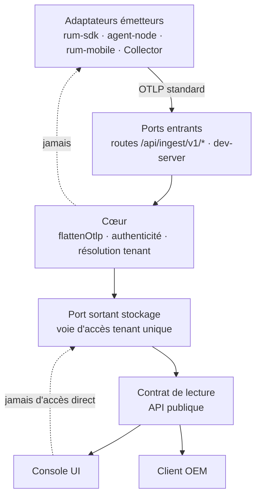
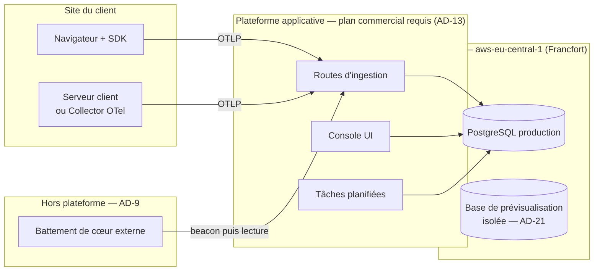

# Architecture Spine — MIP RUM

## Design Paradigm

**Hexagonal (ports & adaptateurs).** Le cœur — parsing OTLP, résolution de tenant, contrat de
lecture — ne connaît ni son runtime, ni son stockage, ni son émetteur. C'est ce qui rend le
produit livrable en OEM : un intégrateur remplace un adaptateur, jamais le cœur.

| Couche | Rôle | Où elle vit aujourd'hui |
| --- | --- | --- |
| **Cœur** | Parsing OTLP, authenticité, résolution de tenant, contrat de lecture | `apps/ingest/lib/`, `apps/ingest/supabase/functions/_shared/` |
| **Ports entrants** | Réception des beacons | `apps/console/app/api/ingest/v1/*`, `apps/ingest/dev-server.mjs` |
| **Port sortant — stockage** | Persistance et lecture scopées | `apps/console/lib/db.ts` |
| **Adaptateurs émetteurs** | Ce qui produit de l'OTLP | `packages/rum-sdk`, `packages/agent-node`, `packages/rum-mobile`, Collector OTel tiers |
| **Consommateurs** | Ce qui lit les données | `apps/console` (UI), clients OEM — **au même rang** |

`apps/ingest/supabase/functions/_shared/` porte `flattenOtlp` et est importé par six fichiers de
la console : **c'est du code de production**, quelle que soit son adresse dans l'arborescence. Les
edge functions Supabase qui l'entouraient sont décommissionnées ; la bibliothèque partagée, non.
Le chemin trompe — pas le rôle.

## Invariants & Rules

### Direction des dépendances



Les arêtes pointillées sont des **interdits** : le cœur ne connaît aucun émetteur, et la
console n'atteint jamais le stockage autrement que par le contrat de lecture.

### AD-1 — OTLP est le seul contrat d'entrée `[ADOPTED]`

- **Binds :** tous les adaptateurs émetteurs, tous les ports entrants, le cœur.
- **Prevents :** un format propriétaire qui franchirait une frontière de module et rendrait
  fausse la promesse de réversibilité vendue au client.
- **Rule :** aucune donnée n'entre dans le cœur autrement qu'en OTLP/HTTP JSON standard. Tout
  champ propre à MIP est porté par un attribut préfixé `mip.`, jamais par une extension du format.
  **Exception nommée, et unique : le canal replay** (`/api/ingest/v1/replay`), qui transporte du
  rrweb compressé avec des en-têtes `x-mip-*`. Elle est admise parce que le replay n'a pas
  d'équivalent OTLP, et elle est **bornée** : ce canal n'alimente que `replay_chunk`, aucune
  donnée qui en provient ne rejoint le chemin de traces, et un client OEM peut le désactiver sans
  perdre le reste. Toute autre exception exige un nouvel AD.

### AD-2 — La Console ne possède aucune capacité de lecture absente de l'API publique

- **Binds :** `apps/console` (48 fichiers portant des lectures), le contrat de lecture, les
  clients OEM.
- **Prevents :** une API OEM structurellement incomplète, parce qu'un chemin privilégié
  réservé à la console masque ce qui lui manque.
- **Rule :** toute requête que la console sait exprimer, l'API publique sait l'exprimer. Une
  capacité de lecture ajoutée à la console sans son équivalent dans le contrat public est un
  défaut, pas une optimisation. Le mécanisme (appel HTTP ou couche partagée en processus) est
  *Deferred* ; l'équivalence des capacités ne l'est pas.

### AD-3 — Voie d'accès tenant unique et typée, RLS en filet

- **Binds :** les **173 occurrences de lecture réparties dans 48 fichiers** d'`apps/console`,
  dont **21 fichiers hors `lib/queries-*`** (server actions d'administration, callback OIDC,
  `logout`, `goals`, cron tick) ; la voie d'écriture tenant de `apps/ingest/lib/` ; `db.ts` ;
  les migrations v47/v48/v51.
- **Prevents :** la fuite inter-tenants par oubli d'un `WHERE app_id` — le mode de défaillance
  qu'aucune relecture ne rattrape de façon fiable à cette échelle.
- **Rule :** toute lecture ou écriture scopée tenant passe par une fonction unique qui pose la
  GUC `app.current_app_id` dans sa transaction. L'accès brut — y compris l'import direct du pool —
  est **inaccessible** pour une requête tenant : l'oubli est une erreur de compilation, pas une
  revue à refaire. **Le chemin d'écriture est couvert au même titre que le chemin de lecture.**
  La RLS redevient un filet réel — rôle de connexion restreint — une fois l'adoption à 100 %, et
  pas avant : c'est la bascule prématurée qui a vidé la console en juillet 2026.
- **État de départ :** l'implémentation existe (`withTenant`) et compte **zéro appelant**. Le
  chantier est une migration, pas une écriture.

### AD-4 — Un seul endpoint d'ingestion faisant autorité

- **Binds :** l'onboarding self-serve, le layout de la console, l'écran admin client, les
  valeurs par défaut du SDK, la documentation d'intégration.
- **Prevents :** la divergence constatée — trois sites, trois valeurs de repli, dont deux
  pointant un host décommissionné et une pointant `localhost`.
- **Rule :** l'endpoint est produit par une seule fonction de résolution. Aucun host n'est
  écrit en dur ailleurs. En l'absence de configuration explicite, la résolution rend l'hôte
  courant — jamais un host tiers, jamais une valeur de développement.

### AD-5 — Identification n'est pas authenticité : défense en profondeur ordonnée

- **Binds :** tous les ports entrants, le registre d'apps, la documentation d'intégration OEM.
- **Prevents :** le data-poisoning ; l'illusion qu'une clé publiée dans le HTML du client
  constitue une preuve d'origine ; et deux ports entrants qui composeraient les couches
  différemment.
- **Rule :** la clé `mip_live_*` **identifie** une app ; elle ne l'authentifie pas. L'authenticité
  repose sur quatre couches, dans **cet ordre d'évaluation, identique sur tout port entrant**, et
  **avant tout parsing du corps** :
  1. **Identification** — clé présentée en **en-tête**, jamais dans le corps ; l'app doit exister
     au registre et être active.
  2. **Origine** — allowlist **par app**, jamais une union du parc. Un POST depuis une origine non
     déclarée est refusé côté serveur, pas seulement absent des en-têtes CORS. *Ne s'applique
     qu'aux émetteurs navigateur* : un Collector serveur-à-serveur n'envoie pas d'`Origin`, et il
     est identifié par la couche 3.
  3. **Preuve d'origine forte, pour qui l'exige** — jeton court signé émis par le serveur du
     client, ou ingestion serveur-à-serveur via Collector OTel (voie documentée de première classe
     pour l'OEM : aucun secret ne transite par un navigateur).
  4. **Confinement** — quota par app, détection d'anomalie de volume, et réversibilité.

  Un critère de recette qui ne teste que « clé absente → 403 » ne prouve rien sur cet invariant.
- **Déploiement :** ces couches durcissent un parc déjà installé, dont une partie est collée en
  dur chez des clients. Toute activation suit AD-23.

### AD-6 — Fail-closed sur tout chemin de sécurité

- **Binds :** authenticité d'ingestion, limitation de débit, authentification des tâches planifiées.
- **Prevents :** la fenêtre d'attaque au démarrage à froid ou sous pression de la base ; et la
  situation actuelle où le même contrôle de clé existe en trois copies rendant des verdicts
  opposés sur une app sans clé.
- **Rule :** l'indisponibilité d'un contrôle de sécurité refuse la requête. Registre non chargé
  → 503, jamais 200. Échec du contrôle de débit → refus, jamais passage. **Un contrôle de sécurité
  a une seule implémentation** ; une deuxième copie est un défaut, pas une adaptation locale.
  L'exception est un **mode dégradé unique, nommé une seule fois dans tout le dépôt**, activé par
  une variable explicite, journalisé à chaque requête qu'il laisse passer, et jamais le défaut.

### AD-7 — Source unique pour les faits d'infrastructure et les faits légaux

- **Binds :** `apps/console/lib/legal.ts`, les pages `/legal/*`, le DPA, la documentation de
  déploiement.
- **Prevents :** une déclaration RGPD inexacte et opposable — l'état actuel, faux sur deux
  points : l'hébergeur (Supabase / Paris déclaré, Neon / Francfort réel) et un sous-traitant
  manquant (Anthropic, câblé dans trois routes, absent de la liste).
- **Rule :** l'hébergeur, la région et la liste des sous-traitants sont dérivés d'une constante
  d'infrastructure unique. **Tout appel sortant vers un tiers qui reçoit des données est un
  sous-traitant déclaré** ; en ajouter un sans l'inscrire casse le build. Un changement
  d'hébergeur casse le build tant que la déclaration légale n'est pas mise à jour.

### AD-8 — Toute exécution planifiée est prouvable

- **Binds :** purge de rétention, metering, évaluation des alertes, sondes uptime, agrégations.
- **Prevents :** un manquement RGPD sans symptôme — l'état actuel, où plus rien ne garantit que la
  purge s'exécute, et où son absence ne produit ni erreur, ni alerte, ni test rouge.
- **Rule :** chaque tâche planifiée écrit une trace horodatée de son exécution, **dans une forme
  unique et commune** — sans quoi l'alerte « absence d'exécution » n'est pas constructible.
  **L'absence d'exécution est une alerte, pas un silence.** Aucune obligation légale ou
  contractuelle ne dépend d'un déclencheur dont on ne peut pas prouver qu'il a tourné.

### AD-9 — La supervision du produit est indépendante de son infrastructure

- **Binds :** la surveillance de l'ingestion, le dogfooding, l'alerting.
- **Prevents :** ce qui s'est produit en août — un produit d'observabilité en panne totale
  d'ingestion pendant des semaines sans que sa propre supervision, hébergée sur la même
  infrastructure, ne le signale.
- **Rule :** un battement de cœur externe, hébergé hors de la plateforme applicative et hors de
  la base de données, vérifie de bout en bout qu'un beacon émis ressort en lecture. Le dogfooding
  interne le complète, il ne le remplace pas.

### AD-10 — Le parc SDK déployé a une politique de versions déclarée

- **Binds :** `packages/rum-sdk`, `packages/agent-node`, `packages/rum-mobile`, les ports entrants,
  les calculs d'anomalie et de score de santé.
- **Prevents :** un correctif de sécurité indéployable chez les clients qui ont collé un snippet,
  et des comparaisons statistiques silencieusement fausses de part et d'autre d'un changement de
  sémantique.
- **Rule :** l'ingestion déclare quelles versions de SDK elle accepte et pendant combien de temps.
  Tout changement de sémantique d'une mesure ou d'un identifiant marque une **césure datée**, dans
  une forme unique lisible par tous les consommateurs ; aucun calcul comparatif ne franchit une
  césure sans le signaler.

### AD-11 — Une propriété vendue est testée dans la configuration expédiée

- **Binds :** l'intégration continue, les artefacts d'audit, le discours commercial.
- **Prevents :** le faux vert opposable — aujourd'hui, le test d'isolation fixe lui-même son rôle
  de connexion et prouve donc une propriété que la production ne porte pas.
- **Rule :** un test qui choisit lui-même son rôle, sa configuration ou son endpoint ne prouve rien
  sur la production. Toute propriété citée en rendez-vous ou en audit est couverte par un test qui
  s'exécute dans la configuration réellement déployée, ou elle n'est pas citée. **Les versions de
  runtime sont partie intégrante de cette configuration** : une majeure de Node ou de Postgres qui
  diffère entre CI, image de conteneur et production invalide la preuve.
- **Corollaire — les chiffres aussi.** Un pourcentage d'avancement, une capacité, un délai
  n'est publié qu'avec son dénominateur et sa méthode. À défaut, on publie des **conditions de
  sortie vérifiables**, pas un pourcentage.

### AD-12 — La conformité OTel est prouvée de bout en bout, pas affirmée

- **Binds :** les adaptateurs émetteurs, les ports entrants, la promesse de réversibilité.
- **Prevents :** l'invalidation de la promesse porteuse par un prospect technique — c'est déjà
  arrivé une fois, un export OTLP produisant autant de traces que de spans alors que la ligne
  était notée conforme.
- **Rule :** un test rejoue un export réel dans un Collector OTel standard et vérifie la structure
  obtenue. Les seuils et barèmes partagés — Core Web Vitals en tête — sont dérivés d'une **source
  unique**, jamais recopiés. Il en existe aujourd'hui quatre copies, dont une périmée.

### AD-13 — Le socle d'exécution supporte la cadence annoncée et l'usage commercial

- **Binds :** l'hébergement, la planification des tâches, les engagements de latence d'alerte,
  la mise en vente elle-même.
- **Prevents :** un écart entre ce qui est vendu et ce que le plan d'hébergement permet — ou
  autorise.
- **Rule :** aucune latence annoncée commercialement ne peut dépendre d'un plan d'hébergement qui
  ne la permet pas. La cadence réelle des tâches planifiées est une caractéristique produit
  documentée, pas une conséquence subie de la facturation. **Le plan d'hébergement doit autoriser
  l'usage commercial** : le plan Hobby de Vercel est restreint à un usage personnel non commercial,
  et sa définition du commercial couvre explicitement le cas d'un consultant rémunéré pour écrire
  le code. C'est un prérequis de vente au même titre que la licence.

### AD-14 — La restauration est une fonctionnalité, pas une procédure d'exploitation

- **Binds :** le stockage, le déploiement self-host, l'engagement contractuel de souveraineté.
- **Prevents :** l'incident de données irréversible et contractuellement indéfendable chez un
  client — pour un produit dont l'argument est « vos données chez vous ».
- **Rule :** la sauvegarde et la **restauration** sont testées et chronométrées, avec un RPO et un
  RTO déclarés. L'export des données d'un tenant est documenté et sans frais de sortie : la
  réversibilité vendue doit être exerçable.

### AD-15 — Un registre d'identité tenant fait autorité

- **Binds :** `app_registry`, les jetons de lecture, le claim `apps` des JWT, la portée de
  l'extension, les quotas, les allowlists d'origines.
- **Prevents :** le désalignement constaté — quatre registres concurrents, si bien que désactiver
  un client coupe son ingestion mais **pas** son jeton de lecture.
- **Rule :** `app_id` est l'unique identité de tenant, et un seul registre en fait foi. Tout
  attribut porté par un tenant — clé, origines autorisées, quota, jeton de lecture, portée
  d'extension, rétention — s'y rattache et hérite de son état. **Désactiver un tenant coupe tous
  ses accès en un seul geste**, en lecture comme en écriture. Aucun composant ne maintient sa
  propre liste de tenants.

### AD-16 — Le cross-tenant légitime est nommé, jamais improvisé

- **Binds :** administration, metering, agrégations globales, supervision interne, tâches planifiées.
- **Prevents :** deux échappatoires opposées et toutes deux conformes — aujourd'hui, un helper
  traite une portée nulle comme « toutes les apps » (échoue **ouvert**) pendant qu'un autre refuse
  une portée vide (échoue **fermé**).
- **Rule :** l'accès cross-tenant existe et se déclare. Il passe par une voie **distincte et
  explicitement nommée**, réservée à des appelants énumérés, et il est journalisé (AD-18). **Une
  portée vide ou nulle n'autorise jamais rien** : l'absence de portée est un refus, sur tout
  chemin, sans exception.

### AD-17 — Journal d'audit des accès et des actes sensibles

- **Binds :** administration, DSAR, gestion des jetons, accès cross-tenant, modes dégradés.
- **Prevents :** l'impossibilité de répondre à « qui a vu quoi, quand » — la première question
  d'un audit acheteur et d'une notification de violation.
- **Rule :** tout acte sensible — accès cross-tenant, export ou effacement DSAR, création ou
  révocation de jeton, activation d'un mode dégradé, changement de rétention — écrit une entrée
  d'audit horodatée, attribuée, et non modifiable par l'application. Le journal survit à la purge
  des données qu'il référence.

### AD-18 — Les droits des personnes sont exerçables, et leur périmètre dérive du schéma

- **Binds :** export DSAR (art. 15), effacement (art. 17), rétention, toute table portant une
  donnée rattachable à une personne.
- **Prevents :** un refus de droit RGPD — l'état actuel, où la liste des tables DSAR est tenue à
  la main, omet des tables que le SQL de purge traite pourtant, et ignore entièrement les six
  tables SVI.
- **Rule :** AD-8 prouve qu'on efface **à temps** ; celui-ci exige de savoir effacer **sur
  demande**. Le périmètre DSAR est **dérivé du schéma**, pas maintenu en parallèle : toute table
  portant `app_id` et une donnée rattachable à une personne y entre automatiquement, ou le build
  échoue. Une migration qui supprime une table référencée par le DSAR est bloquée tant que le
  périmètre n'est pas mis à jour.

### AD-19 — Les rôles RGPD sont une propriété de l'enveloppe de déploiement

- **Binds :** le SaaS hébergé, le self-host, la livraison OEM, le DPA, la notification de violation.
- **Prevents :** un DPA qui décrit le mauvais rôle — en OEM et en self-host, le client est
  responsable de traitement et MIP n'est pas toujours sous-traitant du même périmètre.
- **Rule :** chaque topologie de déploiement déclare qui est responsable de traitement, qui est
  sous-traitant, et qui notifie une violation dans quel délai. Le DPA généré correspond à la
  topologie livrée, pas à une topologie par défaut.

### AD-20 — Les secrets ont un domicile et un cycle de vie déclarés

- **Binds :** ingestion, console, tâches planifiées, self-host, image de conteneur.
- **Prevents :** l'absence totale de doctrine — neuf secrets vivent aujourd'hui en variables
  d'environnement en clair, sans rotation déclarée ni chiffrement documenté.
- **Rule :** tout secret a un lieu de stockage nommé, un propriétaire, et une procédure de
  rotation exerçable sans interruption de service. Le chiffrement au repos et en transit est
  déclaré pour chaque topologie, self-host compris. Aucun secret ne figure dans le dépôt, ni dans
  une image de conteneur, ni dans un artefact de build.

### AD-21 — Les environnements sont isolés par leurs données

- **Binds :** previews, développement, CI, production.
- **Prevents :** l'état actuel — les déploiements de prévisualisation héritent du `DATABASE_URL`
  de production sous le rôle propriétaire des tables, donc chaque branche ouvre un accès aux
  données réelles avec le rôle qui contourne la RLS.
- **Rule :** un environnement non productif ne se connecte jamais à la base de production. La
  séparation est portée par la configuration d'environnement, pas par la discipline. Un
  environnement qui ne peut pas être isolé n'est pas déployé.

### AD-22 — Les identifiants exposés sont imprédictibles et scopés

- **Binds :** `session_id`, identifiants de replay, jetons de lecture, tout identifiant traversant
  une URL ou un en-tête.
- **Prevents :** la dépendance silencieuse à l'obscurité — `session_id` est une clé primaire
  **globale**, donc un espace de noms partagé entre tenants.
- **Rule :** tout identifiant qui traverse une frontière de confiance est imprédictible par
  construction. Un identifiant global n'est jamais à lui seul une autorisation : l'appartenance au
  tenant est vérifiée à chaque accès, indépendamment de la difficulté à deviner l'identifiant.

### AD-23 — Un durcissement qui refuse se déploie par étapes observables

- **Binds :** AD-5 (authenticité), AD-6 (fail-closed), AD-3 (bascule du rôle), toute activation
  d'un contrôle qui peut rejeter du trafic existant.
- **Prevents :** la coupure de tenants le jour de la bascule — le parc est en partie collé en dur
  chez des clients qui ne peuvent pas être mis à jour à la demande.
- **Rule :** tout contrôle susceptible de refuser du trafic aujourd'hui accepté passe par trois
  étapes : **inventaire** de ce qui serait refusé, **observation** (le contrôle journalise ce
  qu'il refuserait sans refuser) jusqu'à ce que le compteur soit à zéro pendant une durée
  déclarée, puis **activation**, avec un rollback documenté. AD-5 rend cette règle plus
  nécessaire, pas moins : quatre couches de refus valent quatre occasions de couper un client.

## Consistency Conventions

| Concern | Convention |
| --- | --- |
| Nommage | Attributs de télémétrie propres au produit préfixés `mip.` ; tables tenant portant systématiquement `app_id` ; migrations numérotées `migration-v<n>.sql`, appliquées dans l'ordre, idempotentes. Une migration hors du glob appliqué par la CI n'existe pas : il n'y a pas de dossier « en attente ». |
| Données & formats | OTLP/HTTP JSON en entrée ; horodatages en nanosecondes sur le fil, en UTC en base ; idempotence par `span_id` ; aucune adresse IP stockée, à aucun étage. |
| État & transverse | Accès tenant exclusivement par la voie unique d'AD-3 ; scrub PII à l'ingestion, jamais en aval ; secrets fail-closed (AD-6) ; toute tâche planifiée journalisée (AD-8). |
| Frontières | Le cœur ne dépend d'aucun runtime ni d'aucun fournisseur. Le code d'un adaptateur **effectivement décommissionné** est supprimé — mais une bibliothèque partagée encore importée n'est pas décommissionnée, quelle que soit son adresse dans l'arborescence. |
| Preuve | Une propriété affirmée dans un document commercial est traçable jusqu'à un test qui s'exécute en configuration expédiée (AD-11). |
| Optimisation | Aucune optimisation de cache ne s'applique à une réponse scopée par porteur sans clé de cache incluant ce porteur. Un en-tête `no-store` sur une route authentifiée est un invariant, pas une négligence à corriger. |
| Vocabulaire de planification | Les identifiants d'épics sont uniques dans tout le dépôt. Deux documents ne réutilisent jamais la même étiquette pour des contenus différents — c'est le cas aujourd'hui entre `PRODUCT_REVIEW_BMAD.md` et `MARKET_SCAN_BMAD.md`, tous deux porteurs d'un E1–E7 divergent. |

## Stack

Versions telles qu'épinglées au dépôt. Trois d'entre elles sont en écart avec la production ou
hors support et sont traitées en questions ouvertes plutôt que masquées ici.

| Name | Version épinglée | Réserve |
| --- | --- | --- |
| pnpm (workspaces) | 9.15.9 | branche en fin de support |
| Node.js (CI) | 26 | aucun `engines` déclaré ; conteneur en 22, production sur le défaut de la plateforme |
| Next.js | 15.5.19 | la majeure courante est 16.x |
| React | 19 | — |
| PostgreSQL — CI et conteneur | 15 | la production (Neon) est en 17 |
| Vitest | 4.1.8 | — |
| Playwright | 1.60.0 | — |
| OpenTelemetry — format d'échange | OTLP/HTTP JSON | — |

## Structural Seed

### Enveloppe de déploiement et d'exploitation



Trois topologies coexistent aujourd'hui dans le dépôt — hébergée, Docker self-host éprouvée en
CI, et Collector vers ClickHouse. **L'unité de livraison OEM n'est pas tranchée** (cf. Deferred),
mais AD-19 exige déjà que chacune déclare ses rôles RGPD, et AD-21 que ses environnements non
productifs aient leur propre base.

### Arborescence — ce qui est structurant

```text
poc-MIP_RUM/
  packages/
    rum-sdk/         # adaptateur émetteur navigateur — servi en clair chez les clients
    agent-node/      # adaptateur émetteur backend Node
    rum-mobile/      # adaptateur émetteur React Native
  apps/
    ingest/
      lib/                       # CŒUR — authenticité, résolution tenant, écriture scopée
      supabase/functions/_shared/ # CŒUR — flattenOtlp ; importé par la console (nom trompeur)
      sql/                       # schéma et migrations ordonnées
      dev-server.mjs             # port entrant local et self-host
    console/
      app/api/ingest/v1/   # ports entrants de production
      app/api/              # contrat de lecture public
      lib/db.ts             # port sortant stockage — voie unique AD-3
      lib/legal.ts          # dérivé de la constante d'infra — AD-7
    sync-synthetic/  # utilitaire — hors cœur (cf. Deferred)
    extension/       # adaptateur d'injection MV3
```

## Deferred

| Décision | Pourquoi elle peut attendre |
| --- | --- |
| **Mécanisme d'AD-2** — appel HTTP réel ou couche de lecture partagée en processus | L'invariant est l'équivalence des capacités, pas le transport. À trancher à l'implémentation, au vu du coût de latence sur les pages denses. |
| **Unité de livraison OEM** — image, paquet, ou service hébergé | Trois topologies vivent dans le dépôt. Le choix dépend du premier contrat réel ; AD-19 et AD-21 s'appliquent d'ici là à chacune. |
| **Licence et frontière open-core** | Décision juridique et commerciale — mais **bloquante pour toute vente OEM**, au même titre qu'AD-13 : le dépôt n'a aucun fichier `LICENSE`, et `packages/rum-sdk` est servi en clair chez les clients. À trancher avant le premier contrat, pas avant le premier sprint. |
| **Dialecte de stockage ClickHouse** | AD-1 et le port sortant gardent la porte ouverte. Le palier de volume qui le justifie ne peut pas être situé tant que la capacité réelle est inconnue. |
| **SaaS multi-tenant, signup, billing** | Hors de l'objectif OEM déclaré. Le scan marché le classe en forte baisse de priorité. |
| **Corrélation synthétique ↔ RUM** | Positionnement écarté au profit du moteur générique. `apps/sync-synthetic/` reste un utilitaire hors cœur. Réserve consignée : la démo commerciale qui s'appuie sur cet axe tourne sur des données de seed, pas sur l'API DEM réelle — l'affirmer en rendez-vous relève d'AD-11. |
| **Sémantique d'`org` au-dessus d'`app_id`** | AD-15 fixe l'identité ; y ajouter un niveau de regroupement est une extension compatible, pas une reprise. |

## Questions ouvertes

- **Capacité réelle en cloud — jamais mesurée.** Les seules valeurs du dépôt (~10⁶–10⁷ events) sont
  un **stock**, pas un débit, et la seule mesure de débit (~4 000 events/s) est locale. Tant que
  cette valeur est inconnue, aucune capacité ne peut être annoncée (AD-11), et le palier
  déclenchant le dialecte ClickHouse ne peut pas être situé. **Sur le chemin critique du premier
  client payant**, pas du build.
- **Parité des runtimes.** Trois versions de Node et deux majeures de Postgres coexistent sans
  `engines` déclaré. AD-11 l'interdit ; quelle version fait foi reste à trancher, et la réponse
  dépend de ce que la plateforme d'hébergement commerciale supportera.
- **Ordonnancement des tâches planifiées.** Le constat d'août — pas de `pg_cron` — mérite d'être
  rejoué : la capacité aurait évolué côté fournisseur. Le choix entre ordonnanceur en base et
  ordonnanceur de plateforme conditionne AD-8 et AD-9.
