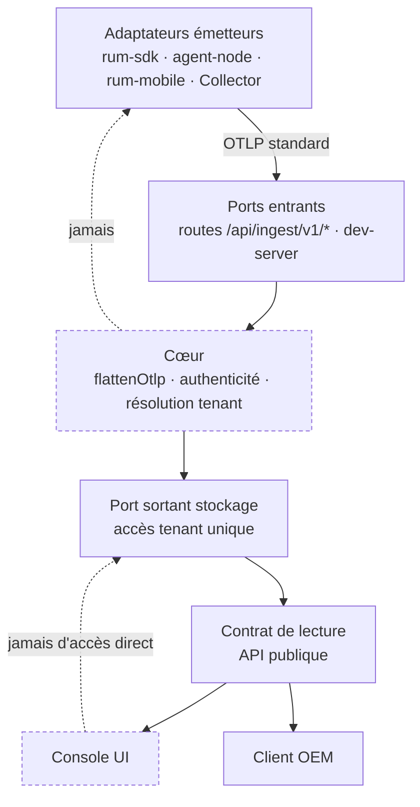
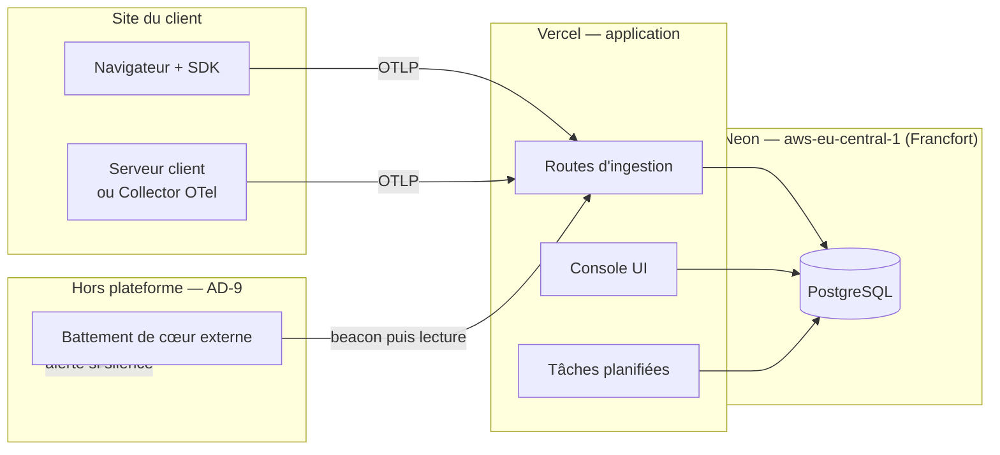

# Architecture Spine — MIP RUM

## Design Paradigm

**Hexagonal (ports & adaptateurs).** Le cœur — parsing OTLP, résolution de tenant, contrat de
lecture — ne connaît ni son runtime, ni son stockage, ni son émetteur. C'est ce qui rend le
produit livrable en OEM : un intégrateur remplace un adaptateur, jamais le cœur.

| Couche | Rôle | Où elle vit aujourd'hui |
| --- | --- | --- |
| **Cœur** | Parsing OTLP, authenticité, résolution de tenant, contrat de lecture | `apps/ingest/lib/`, `apps/ingest/supabase/functions/_shared/otlp.mjs` |
| **Ports entrants** | Réception des beacons | `apps/console/app/api/ingest/v1/*`, `apps/ingest/dev-server.mjs` |
| **Port sortant — stockage** | Persistance et lecture scopées | `apps/console/lib/db.ts` |
| **Adaptateurs émetteurs** | Ce qui produit de l'OTLP | `packages/rum-sdk`, `packages/agent-node`, `packages/rum-mobile`, Collector OTel tiers |
| **Consommateurs** | Ce qui lit les données | `apps/console` (UI), clients OEM — **au même rang** |

Le parseur `flattenOtlp` est du JavaScript pur qui tourne en Deno comme en Node : c'est
l'actif de portabilité le plus fort du dépôt, et le fondement matériel d'AD-1.

## Invariants & Rules

### Direction des dépendances



Les arêtes pointillées sont des **interdits** : le cœur ne connaît aucun émetteur, et la
console n'atteint jamais le stockage autrement que par le contrat de lecture.

### AD-1 — OTLP est le seul contrat d'entrée `[ADOPTED]`

- **Binds :** tous les adaptateurs émetteurs, tous les ports entrants, le cœur.
- **Prevents :** un format propriétaire qui franchirait une frontière de module et rendrait
  fausse la promesse de réversibilité vendue au client.
- **Rule :** aucune donnée n'entre dans le cœur autrement qu'en OTLP/HTTP JSON standard.
  Un émetteur tiers (Collector OTel) doit pouvoir remplacer n'importe quel SDK maison sans
  modification côté ingestion. Tout champ propre à MIP est porté par un attribut préfixé
  `mip.`, jamais par une extension du format.

### AD-2 — La Console ne possède aucune capacité de lecture absente de l'API publique

- **Binds :** `apps/console` (les 49 sites d'appel de lecture), le contrat de lecture, les
  clients OEM.
- **Prevents :** une API OEM structurellement incomplète, parce qu'un chemin privilégié
  réservé à la console masque ce qui lui manque.
- **Rule :** toute requête que la console sait exprimer, l'API publique sait l'exprimer. Une
  capacité de lecture ajoutée à la console sans son équivalent dans le contrat public est un
  défaut, pas une optimisation. Le mécanisme (appel HTTP ou couche partagée en processus) est
  *Deferred* ; l'équivalence des capacités ne l'est pas.

### AD-3 — Voie d'accès tenant unique et typée, RLS en filet

- **Binds :** les 49 appelants de `q()` dans `apps/console/lib/queries-*.ts`, `db.ts`, les
  migrations v47/v48/v51.
- **Prevents :** la fuite inter-tenants par oubli d'un `WHERE app_id` — le mode de défaillance
  qu'aucune relecture ne rattrape de façon fiable sur 49 sites.
- **Rule :** toute lecture ou écriture scopée tenant passe par une fonction unique qui pose la
  GUC `app.current_app_id` dans sa transaction. L'accès brut est **inaccessible** pour une
  requête tenant — l'oubli est une erreur de compilation, pas une revue à refaire. La RLS
  redevient un filet réel — rôle de connexion restreint — une fois l'adoption à 100 %, et pas
  avant : c'est la bascule prématurée qui a vidé la console en juillet 2026.

### AD-4 — Un seul endpoint d'ingestion faisant autorité

- **Binds :** l'onboarding self-serve, le layout de la console, l'écran admin client, les
  valeurs par défaut du SDK, la documentation d'intégration.
- **Prevents :** la divergence constatée aujourd'hui — trois sites, trois valeurs de repli,
  dont deux pointant un host décommissionné et une pointant `localhost`.
- **Rule :** l'endpoint est produit par une seule fonction de résolution. Aucun host n'est
  écrit en dur ailleurs. En l'absence de configuration explicite, la résolution rend l'hôte
  courant — jamais un host tiers, jamais une valeur de développement.

### AD-5 — Identification n'est pas authenticité : défense en profondeur

- **Binds :** tous les ports entrants, le registre d'apps, la documentation d'intégration OEM.
- **Prevents :** le data-poisoning, et l'illusion — entretenue par le plan précédent — qu'une
  clé publiée dans le HTML du client puisse constituer une preuve d'origine.
- **Rule :** la clé `mip_live_*` **identifie** une app ; elle ne l'authentifie pas. L'authenticité
  repose sur quatre couches cumulatives :
  1. **Allowlist d'origines par app** — obligatoire. Un POST depuis une origine non déclarée est
     rejeté même avec une clé valide.
  2. **Collector OTel serveur-à-serveur** — documenté comme voie d'intégration de première classe
     pour l'OEM : aucun secret ne transite par un navigateur.
  3. **Jeton court signé** émis par le serveur du client — optionnel, pour qui exige une preuve
     d'origine en contexte navigateur.
  4. **Quotas par app, détection d'anomalie de volume, et réversibilité** — tout lot identifiable
     doit pouvoir être purgé.

  Un critère de recette qui ne teste que « clé absente → 403 » ne prouve rien sur cet invariant.

### AD-6 — Fail-closed sur tout chemin de sécurité

- **Binds :** authenticité d'ingestion, limitation de débit, authentification des tâches planifiées.
- **Prevents :** la fenêtre d'attaque au démarrage à froid ou sous pression de la base — aujourd'hui
  ouverte volontairement et commentée dans le code, donc invisible à la relecture.
- **Rule :** l'indisponibilité d'un contrôle de sécurité refuse la requête. Registre non chargé
  → 503, jamais 200. Échec du contrôle de débit → refus, jamais passage. Toute exception à cette
  règle est un mode POC nommé, activé explicitement, et jamais le défaut.

### AD-7 — Source unique pour les faits d'infrastructure et les faits légaux

- **Binds :** `apps/console/lib/legal.ts`, les pages `/legal/*`, le DPA, la documentation de
  déploiement.
- **Prevents :** une déclaration RGPD inexacte et opposable — l'état actuel, où les pages publiques
  nomment Supabase / Paris alors que les données vivent sur Neon / Francfort depuis le 13 août.
- **Rule :** l'hébergeur, la région et la liste des sous-traitants sont dérivés d'une constante
  d'infrastructure unique. Un changement d'hébergeur casse le build tant que la déclaration légale
  n'est pas mise à jour. Aucune valeur légale n'est saisie deux fois.

### AD-8 — Toute exécution planifiée est prouvable

- **Binds :** purge de rétention, metering, évaluation des alertes, sondes uptime, agrégations.
- **Prevents :** un manquement RGPD sans symptôme — l'état actuel, où plus rien ne garantit que la
  purge s'exécute, et où son absence ne produit ni erreur, ni alerte, ni test rouge.
- **Rule :** chaque tâche planifiée écrit une trace horodatée de son exécution. **L'absence
  d'exécution est une alerte, pas un silence.** Aucune obligation légale ou contractuelle ne
  dépend d'un déclencheur dont on ne peut pas prouver qu'il a tourné.

### AD-9 — La supervision du produit est indépendante de son infrastructure

- **Binds :** la surveillance de l'ingestion, le dogfooding, l'alerting.
- **Prevents :** ce qui s'est produit en août — un produit d'observabilité en panne totale
  d'ingestion pendant des semaines sans que sa propre supervision, hébergée sur la même
  infrastructure, ne le signale.
- **Rule :** un battement de cœur externe, hébergé hors de la plateforme applicative et hors de
  la base de données, vérifie de bout en bout qu'un beacon émis ressort en lecture. Le dogfooding
  interne le complète, il ne le remplace pas.

### AD-10 — Le parc SDK déployé a une politique de versions déclarée

- **Binds :** `packages/rum-sdk`, `packages/agent-node`, `packages/rum-mobile`, les ports entrants,
  les calculs d'anomalie et de score de santé.
- **Prevents :** deux défaillances distinctes — un correctif de sécurité indéployable chez les
  clients qui ont collé un snippet, et des comparaisons statistiques silencieusement fausses
  entre des mesures d'avant et d'après un changement de sémantique.
- **Rule :** l'ingestion déclare quelles versions de SDK elle accepte et pendant combien de temps.
  Tout changement de sémantique d'une mesure ou d'un identifiant marque une césure datée dans les
  données ; aucun calcul comparatif ne franchit une césure sans le signaler.

### AD-11 — Une propriété vendue est testée dans la configuration expédiée

- **Binds :** l'intégration continue, les artefacts d'audit, le discours commercial.
- **Prevents :** le faux vert opposable — aujourd'hui, le test d'isolation fixe lui-même son rôle
  de connexion et prouve donc une propriété que la production ne porte pas.
- **Rule :** un test qui choisit lui-même son rôle, sa configuration ou son endpoint ne prouve rien
  sur la production. Toute propriété citée en rendez-vous ou en audit est couverte par un test qui
  s'exécute dans la configuration réellement déployée, ou elle n'est pas citée.

### AD-12 — La conformité OTel est prouvée de bout en bout, pas affirmée

- **Binds :** les adaptateurs émetteurs, les ports entrants, la promesse de réversibilité.
- **Prevents :** l'invalidation de la promesse porteuse par un prospect technique — c'est déjà
  arrivé une fois, un export OTLP produisant autant de traces que de spans alors que la ligne
  était notée conforme.
- **Rule :** un test rejoue un export réel dans un Collector OTel standard et vérifie la structure
  obtenue. Les seuils et barèmes partagés entre SDK, ingestion et console sont dérivés d'une source
  unique, jamais recopiés aux trois endroits.

### AD-13 — Le socle d'exécution supporte la cadence annoncée

- **Binds :** l'hébergement, la planification des tâches, les engagements de latence d'alerte.
- **Prevents :** un écart entre ce qui est vendu et ce que le plan d'hébergement permet — aujourd'hui,
  des alertes annoncées à 15 minutes livrées à l'heure, sur un déclencheur qui s'éteint après
  60 jours d'inactivité du dépôt.
- **Rule :** aucune latence annoncée commercialement ne peut dépendre d'un plan d'hébergement qui
  ne la permet pas. La cadence réelle des tâches planifiées est une caractéristique produit
  documentée, pas une conséquence subie de la facturation.

### AD-14 — La restauration est une fonctionnalité, pas une procédure d'exploitation

- **Binds :** le stockage, le déploiement self-host, l'engagement contractuel de souveraineté.
- **Prevents :** l'incident de données irréversible et contractuellement indéfendable chez un
  client — pour un produit dont l'argument est « vos données chez vous ».
- **Rule :** la sauvegarde et la **restauration** sont testées et chronométrées, avec un RPO et un
  RTO déclarés. L'export des données d'un tenant est documenté et sans frais de sortie : la
  réversibilité vendue doit être exerçable.

## Consistency Conventions

| Concern | Convention |
| --- | --- |
| Nommage | Attributs de télémétrie propres au produit préfixés `mip.` ; tables tenant portant systématiquement `app_id` ; migrations numérotées `migration-v<n>.sql`, appliquées dans l'ordre, idempotentes. |
| Données & formats | OTLP/HTTP JSON en entrée ; horodatages en nanosecondes sur le fil, en UTC en base ; idempotence par `span_id` ; aucune adresse IP stockée, à aucun étage. |
| État & transverse | Accès tenant exclusivement par la voie unique d'AD-3 ; scrub PII à l'ingestion, jamais en aval ; secrets fail-closed (AD-6) ; toute tâche planifiée journalisée (AD-8). |
| Frontières | Le cœur ne dépend d'aucun runtime ni d'aucun fournisseur ; le code d'un adaptateur décommissionné est supprimé du dépôt, pas laissé en place. |
| Preuve | Une propriété affirmée dans un document commercial est traçable jusqu'à un test qui s'exécute en configuration expédiée (AD-11). |

## Stack

| Name | Version |
| --- | --- |
| pnpm (workspaces) | 9.15.9 |
| Node.js (CI) | 26 |
| Next.js | 15 |
| React | 19 |
| PostgreSQL (Neon, `aws-eu-central-1`) | 15+ |
| Vitest | 4.1.8 |
| Playwright | 1.60.0 |
| OpenTelemetry — format d'échange | OTLP/HTTP JSON |

## Structural Seed

### Enveloppe de déploiement et d'exploitation



L'enveloppe porte trois contraintes que le spine rend explicites : la région de stockage est
**Francfort** et c'est elle qui gouverne la déclaration légale (AD-7) ; la cadence des tâches
planifiées est une caractéristique produit (AD-13) ; et le battement de cœur vit **hors** de
Vercel et de Neon, sinon il tombe avec ce qu'il surveille (AD-9).

### Arborescence — ce qui est structurant

```text
poc-MIP_RUM/
  packages/
    rum-sdk/         # adaptateur émetteur navigateur
    agent-node/      # adaptateur émetteur backend Node
    rum-mobile/      # adaptateur émetteur React Native
  apps/
    ingest/
      lib/           # CŒUR — parsing OTLP, authenticité, résolution tenant
      sql/           # schéma et migrations ordonnées
      dev-server.mjs # port entrant local et self-host
    console/
      app/api/ingest/v1/   # ports entrants de production
      app/api/              # contrat de lecture public
      lib/db.ts             # port sortant stockage — voie unique AD-3
      lib/legal.ts          # dérivé de la constante d'infra — AD-7
    sync-synthetic/  # utilitaire — hors cœur (cf. Deferred)
    extension/       # adaptateur d'injection MV3
```

## Deferred

| Décision | Pourquoi elle peut attendre |
| --- | --- |
| **Mécanisme d'AD-2** — appel HTTP réel ou couche de lecture partagée en processus | L'invariant est l'équivalence des capacités, pas le transport. Le transport se tranche à l'implémentation, au vu du coût de latence sur les pages denses. |
| **Licence et frontière open-core** | Décision juridique et commerciale, pas architecturale — mais **bloquante pour toute vente OEM**, et aujourd'hui non posée : le dépôt n'a aucun fichier LICENSE. À trancher avant le premier contrat, pas avant le premier sprint. |
| **Dialecte de stockage ClickHouse** | AD-1 et le port sortant gardent la porte ouverte. Le palier de volume qui le justifie n'est pas atteint — et la capacité réelle en cloud n'a jamais été mesurée (cf. question ouverte). |
| **SaaS multi-tenant, signup, billing** | Hors de l'objectif OEM déclaré. Le scan marché le classe d'ailleurs en forte baisse de priorité. |
| **Corrélation synthétique ↔ RUM** | Positionnement écarté par Julian au profit du moteur générique. `apps/sync-synthetic/` reste un utilitaire hors cœur. Condition de révision consignée au memlog. |
| **Sémantique d'`org` au-dessus d'`app_id`** | AD-3 fixe la voie d'accès ; y ajouter un niveau de regroupement est une extension compatible, pas une reprise. |

## Questions ouvertes

- **Capacité réelle en cloud — jamais mesurée.** Les seules valeurs du dépôt (~10⁶–10⁷ events) sont
  un **stock**, pas un débit, et la seule mesure de débit (~4 000 events/s) est locale. Tant que
  cette valeur est inconnue, aucune capacité ne peut être annoncée à un prospect, et le palier qui
  déclencherait le dialecte ClickHouse ne peut pas être situé. **Bloquant pour toute promesse
  chiffrée ; non bloquant pour le build.**
