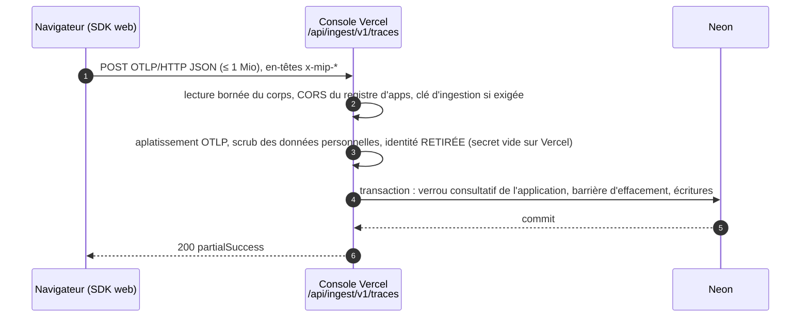
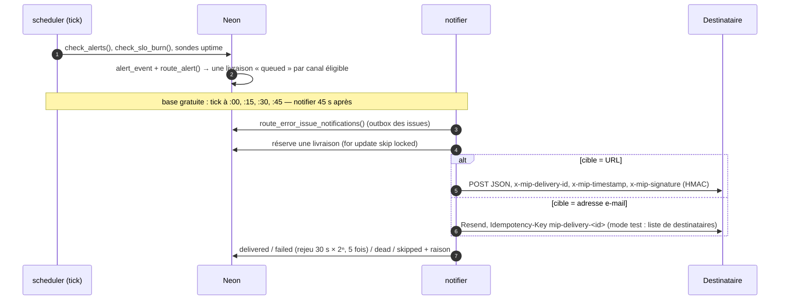

# Les trajets de la donnée

> Deux trajets suffisent à comprendre le backend : celui d'une **mesure**, du navigateur du visiteur à la base, et celui d'une **alerte**, de la base au destinataire. Chacun est décrit tel qu'il tourne au 24/09/2026, puis tel qu'il tournera une fois les services déployés. Vue d'ensemble : [overview.md](overview.md).

## 1. Le trajet d'une mesure

### Aujourd'hui : la console reçoit et écrit



Le relais vers le collector est livré (P3) et **éteint** : `platform_flag.ingest_relay_pct` vaut 0, et ni `CONSOLE_INGEST_RELAY_URL` ni `EDGE_PROXY_SECRET` ne sont posées sur Vercel.

### Avec le relais : la console reçoit, le collector écrit

```mermaid
sequenceDiagram
  autonumber
  participant N as Navigateur (SDK web)
  participant V as Console Vercel
  participant C as collector (Railway)
  participant B as Neon
  N->>V: POST OTLP (même URL qu'avant : aucun client ne change)
  V->>V: tirage du pourcentage (platform_flag, cache 30 s), disjoncteur fermé ?
  V->>C: corps OCTET POUR OCTET, en-têtes par liste exacte,<br/>x-mip-edge-auth (secret) + x-mip-edge-country (pays seul, JAMAIS l'IP) — délai 8 s
  C->>C: bord de confiance en temps constant ; identité hachée (HMAC, secret Railway seul)
  C->>B: même transaction qu'avant, sous une échéance DURE de 4 s
  B-->>C: commit
  C-->>V: réponse signée x-mip-collector: 1
  V-->>N: la réponse du collector, telle quelle
```

**Les délais s'emboîtent** : collector 4 s < relais 8 s < fonction Vercel 30 s (`maxDuration`). Le collector répond donc toujours avant que le relais n'abandonne, 503 compris.

**Qui décide du repli.** Une réponse **signée** (`x-mip-collector: 1`) est celle du collector : elle est rendue telle quelle, sans repli, quel que soit son statut — lui seul sait ce qu'il a écrit. Une réponse **non signée** vient du routeur Railway :

- 404, 405, 502, 504 ou erreur réseau : la requête n'a atteint aucun collector, **repli local** (la console écrit, identité retirée) ;
- délai de 8 s dépassé : **503 + `retry-after`**, sans repli (le collector a peut-être écrit).

Un disjoncteur par instance coupe le relais 60 s après 5 échecs en 30 s. Le geste d'urgence est unique : `update platform_flag set value = '0' where key = 'ingest_relay_pct'`, effectif en 30 s. Mode d'emploi : [docs/operations/relais-ingestion.md](../operations/relais-ingestion.md).

**Le cas qu'aucun délai ne tranche** : le collector a envoyé le COMMIT, la base l'a validé, la réponse se perd. Le collector ne peut pas savoir ; il rend 503 « outcome unknown » et le journalise. Le SDK rejoue : les traces et métriques sont idempotentes (`on conflict`), les logs n'ont pas de clé naturelle — c'est leur seule source de doublon, mesurée à 1 ou 2 cas sur 42 au banc sous 10 s de latence injectée.

### Ce qui borne le débit

Chaque lot prend **le verrou consultatif de son application** puis fait ~15 allers-retours vers la base. À ~10 ms par aller-retour (Amsterdam → Francfort), une application admet environ **0,58 lot/s de pic** ([banc du 24/09](../operations/banc-collecteur-2026-09-24.md)). C'est suffisant au trafic actuel ; une fonction SQL en un aller-retour (× 17 à × 57) est obligatoire avant qu'un client dépasse quelques visiteurs simultanés.

### Les autres capteurs

| Capteur | Point d'entrée | Particularité |
|---|---|---|
| Rejeu de session (rrweb) | `/api/ingest/v1/replay` → `/v1/replay` | chunk gzip de 2 Mio au plus, `x-mip-seq` obligatoire (400 sinon), stocké en base (`replay_chunk.body`, [ADR-0009](adr/0009-blobs-en-postgres.md)) |
| Source maps de CI | `/api/sourcemaps` → `/v1/sourcemaps` | jeton d'upload dédié par application, 20 Mio ; [guide d'intégration](../integration/sourcemaps-ci.md) |
| Extension MV3 | même route que le SDK | injecte le SDK par domaine enregistré |
| SDK mobile, agent Node | même route | livrés, jamais lancés en production |

## 2. Le trajet d'une alerte

### La décision, puis la livraison



- **Qui décide, qui livre.** Le scheduler **décide** (règles, SLO, uptime) et met en file ; le notifier **livre**. Tant que `SCHEDULER_DELIVERY` vaut `on`, le tick livre aussi ; le notifier le remplace dans le même apply qui pose `off`.
- **Les nouvelles erreurs** n'attendent pas le scheduler : l'ingestion écrit une notification dans l'outbox des issues (`error_issue_notification`) à la seconde, et c'est la passe du notifier qui la route vers `route_alert`.
- **Aucun double envoi** : chaque livraison est réservée ligne par ligne et marquée dans sa transaction ; deux livreurs (le scheduler et le notifier pendant la bascule, deux répliques) se partagent les lignes. Un rejeu après une réponse perdue porte le même `x-mip-delivery-id` (webhook) ou la même clé d'idempotence (Resend).
- **Rien ne sort vers le réseau privé** : chaque webhook passe par `safe-fetch` (IP littérales, réseaux privés, `*.railway.internal`, métadonnées cloud refusés) ; une cible refusée est soldée `skipped`, jamais rejouée.
- **Avant le 24/09/2026, aucun e-mail d'alerte n'était jamais parti** : sur Neon, `route_alert` (v50) soldait l'e-mail `skipped` en SQL. Depuis migration-v88, la ligne reste en file et le notifier l'envoie.

### Latence d'une alerte, de bout en bout

| Étape | Offre gratuite (aujourd'hui) | Offre payante (cible) |
|---|---|---|
| mesure écrite → décision | jusqu'à 15 min (tick) | jusqu'à 5 min |
| décision → livraison | 45 s (passe alignée) | ≤ 15 s |
| nouvelle erreur → livraison | jusqu'à 15 min | ≤ 15 s |

La vitrine affiche la cadence **publiée** par le scheduler (`platform_flag.scheduler_tick_min`), pas une valeur écrite dans le code : [ADR-0014](adr/0014-base-gratuite.md).

## 3. Le trajet d'une lecture

| Qui lit | Aujourd'hui | Cible |
|---|---|---|
| Opérateur (console) | le serveur Vercel interroge Neon directement (`apps/console/lib/queries*`) | la console appelle `console-api` (piste C) ; plus aucun accès à la base depuis Vercel à M4 |
| Machine (partenaire, CI, front tiers) | API v1 : route de la console, `Authorization: Bearer` | service `api`, rôle base `mip_api` en lecture seule (P4) |
| Agent IA (MCP) | `mcp` → API v1 de la console, avec le jeton de l'appelant | `mcp` → `api` par le réseau privé Railway |
