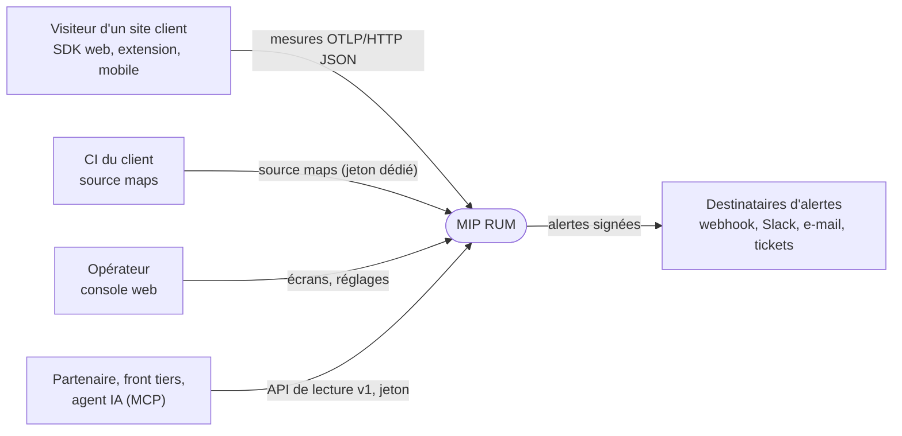
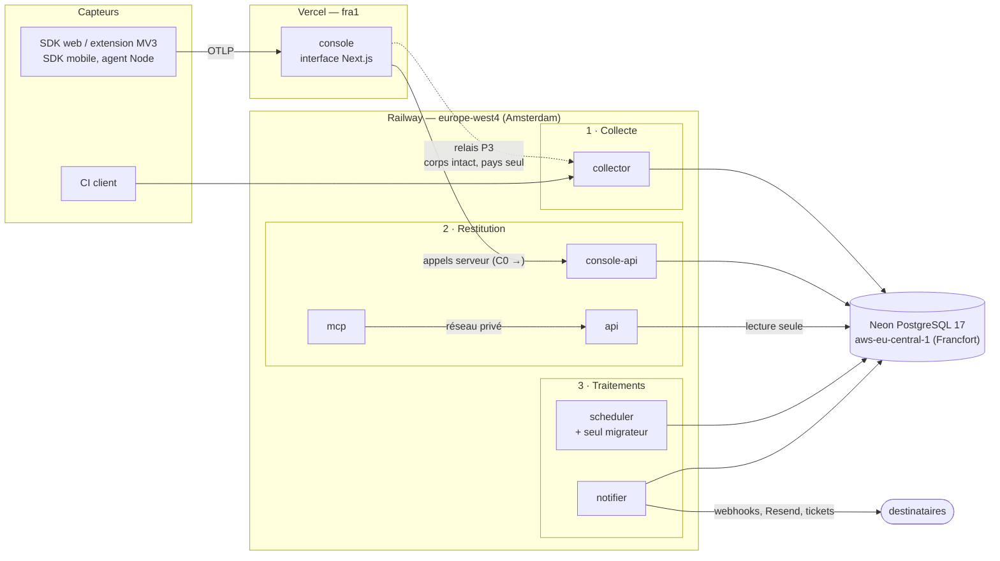

# Architecture du backend MIP RUM

> **Cible et état au 24/09/2026.** Ce document dit où va le backend et où il en est, service par service. Ce qui tourne réellement en production, relevé par les API des hébergeurs, reste dans [docs/TOPOLOGIE_BACKEND.md](../TOPOLOGIE_BACKEND.md). Les trajets d'une mesure et d'une alerte sont dans [data-flow.md](data-flow.md), les décisions dans [adr/](adr/README.md), l'exploitation dans le [runbook](../operations/runbook.md).

## En une phrase

**Vercel sert l'interface, Neon stocke, Railway fait tout le reste** : collecter, traiter, livrer, et servir l'API aux machines. À la fin de la piste C (jalon M4), la console Vercel n'a plus ni accès à la base ni secret d'identité ; elle appelle `console-api`.

## Contexte (C4, niveau 1)

## Conteneurs (C4, niveau 2) — la cible

Le vocabulaire du canevas Railway suit le trajet de la donnée : **Capteurs → Collecte → Restitution → Traitements**. Un groupe n'est qu'un cadre sur le canevas ; il ne change ni le réseau, ni les variables, ni le déploiement (`.railway/railway.ts`).

## Les services, et où ils en sont

| Service | Groupe | Rôle en une phrase | Exposition | État au 24/09/2026 |
|---|---|---|---|---|
| `collector` | 1 · Collecte | Point d'entrée de tout ce que poussent les capteurs : traces et logs OTLP, rejeu, source maps de CI. Hache l'identité, écrit sous la barrière d'effacement. [README](../../services/collector/README.md) | public, domaine généré | code fusionné (P2) ; **non déployé** — son IaC (#284) attend le retour de la base |
| `api` | 2 · Restitution | Contrat de lecture versionné (OpenAPI) pour les machines ; rôle base en lecture seule. | public + privé | à venir (P4) ; l'API v1 est aujourd'hui une route de la console |
| `console-api` | 2 · Restitution | Backend de la console : identité, sessions, écrans, écritures, administration, RGPD. Seul client : le serveur Vercel. | public, garde par secret client | à venir (piste C, C0 → C12) |
| `mcp` | 2 · Restitution | Passerelle MCP pour agents IA ; relaie le jeton de l'appelant, **aucun accès à la base**. [README](../../services/README.md) | public, domaine généré | **déployé** |
| `scheduler` | 3 · Traitements | Travaux planifiés sous bail (alertes, SLO, uptime, agrégats, purge, comptage) ; **seul migrateur**, au pré-déploiement. [README](../../services/scheduler/README.md) | privé | **déployé** ; en échec au pré-déploiement tant que la base est suspendue (quota, jusqu'au 1er octobre) |
| `notifier` | 3 · Traitements | Livre ce que la plateforme a décidé de dire : webhooks signés, e-mails Resend, tickets. Seul détenteur des secrets sortants. [README](../../services/notifier/README.md) | privé | code en revue (#287) ; IaC avec #284 |
| console | Vercel | Interface Next.js. Jusqu'à M4 elle lit et écrit encore la base directement, et reçoit les mesures (route `/api/ingest/v1/*`). | public | **déployée** ; relais vers le collector livré, éteint (`platform_flag.ingest_relay_pct` = 0) |

## Principes, et la décision qui les porte

1. **Vercel = interface.** À M4, ni `DATABASE_URL` ni secret d'identité sur Vercel — une garde de build le vérifiera (C12). D'ici là, chaque lot en retire un : le relais e-mail et ses clés sont partis en P5 ; `IDENTITY_HASH_SECRET` y est vide (relevé du 23/09) et le restera, le secret neuf ne vit que sur Railway.
2. **Un service = un dossier, une image, un README au même gabarit.** Le point d'entrée ne fait que câbler ; la logique vit dans `packages/*` ; le processus (configuration refusée en bloc, sondes, arrêt propre, pool, boucles) dans `@mip/service-kit`. [services/README.md](../../services/README.md)
3. **Seul le scheduler migre**, en pré-déploiement, schéma compatible N et N+1. [ADR-0004](adr/0004-migrations.md)
4. **L'infrastructure passe par la revue** : `.railway/railway.ts`, plan sur la PR, apply du plan relu dans un environnement GitHub protégé. [ADR-0007](adr/0007-iac-railway.md)
5. **Un seul déclencheur** pour les travaux planifiés, sous bail. [ADR-0008](adr/0008-scheduler-unique.md)
6. **Sûreté multi-réplique écrite noir sur blanc** : bail (scheduler), `for update skip locked` (livraisons, outbox, tickets), verrou consultatif par application (écritures d'ingestion et effacements).
7. **Le MCP n'atteint pas la base**, structurellement. [ADR-0006](adr/0006-mcp-sans-base.md)
8. **La base reste sur l'offre gratuite**, en mode dégradé assumé et affiché. [ADR-0014](adr/0014-base-gratuite.md)

## Qui détient quel secret

La règle : un service ne porte que les secrets dont il se sert. Ceux des nouveaux services viennent de **variables partagées** Railway, créées avant eux (`ctx.shared.X`).

| Secret | Vercel (console) | collector | scheduler | notifier | api / console-api (à venir) |
|---|---|---|---|---|---|
| `DATABASE_URL` (propriétaire) | oui, **jusqu'à C12** | oui | oui (+ `MIGRATION_DATABASE_URL`) | oui | rôles dédiés (`mip_api`, `mip_console`, `mip_identity`) |
| `IDENTITY_HASH_SECRET` + empreinte | **jamais** | oui | — | — | `console-api` (recherche RGPD, C10) |
| `EDGE_PROXY_SECRET` | oui, tant que le relais existe | oui | — | — | — |
| `RESEND_API_KEY`, `WEBHOOK_SIGNING_SECRET`, `TICKET_*` | **non** (retirés en P5) | — | — | **seul** | — |
| `METRICS_TOKEN` | — | oui | oui | oui | oui |
| `DEADMAN_URL` | — | — | oui | — | — |
| `AUTH_SECRET`, `OIDC_*` | oui, **jusqu'à C1** | — | — | — | `console-api` |

## Réseau et régions

- **Trois régions, trois sociétés de droit américain** : Vercel `fra1` (Francfort), Railway `europe-west4` (Amsterdam), Neon `aws-eu-central-1` (Francfort). La donnée reste en UE ; ce n'est pas de la souveraineté ([docs/CONFORMITE.md](../CONFORMITE.md)).
- **Réseau privé Railway** entre services (`*.railway.internal`, IPv6) : `mcp → api`, sondes internes. `safe-fetch` interdit à toute sortie « pour le compte d'un utilisateur » (sondes uptime, webhooks) d'y entrer.
- **Domaines générés** seulement (`*.up.railway.app`, `mip-rum-console.vercel.app`). Un service recréé change d'URL : l'IaC refuse toute destruction sans label `allow-destroy`.
- Latences de référence : Vercel `fra1` → Railway Amsterdam → Neon Francfort, ~8 à 10 ms par aller-retour vers la base ; c'est ce qui borne le débit d'écriture par application ([banc du 24/09](../operations/banc-collecteur-2026-09-24.md)).

## Ce que le découpage coûte, dit tel quel

- **La base gratuite** : cadences ralenties à 15 min, alertes jusqu'à 15 min après leur cause, 0,5 Go de stockage. [ADR-0014](adr/0014-base-gratuite.md)
- **Le débit d'écriture par application** : ~0,58 lot/s de pic admissible à 10 ms d'aller-retour (15 allers-retours sous le verrou d'application). Une fonction SQL en un aller-retour est obligatoire avant qu'un client dépasse quelques visiteurs simultanés.
- **Une dépendance de plus à la disponibilité** : après la piste C, la console dépend de Vercel, de Railway (une région) et de Neon. Parades : deux répliques, drainage, supervision externe sur `/live`, dead-man's switch du scheduler.
